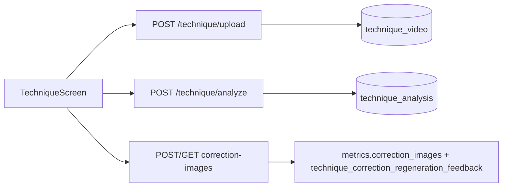
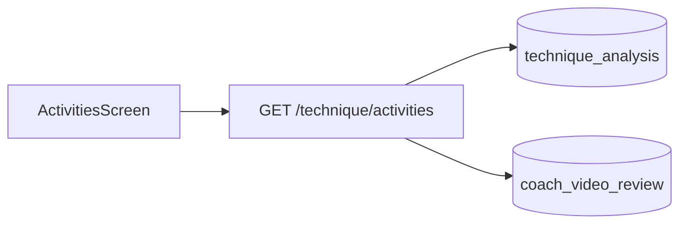
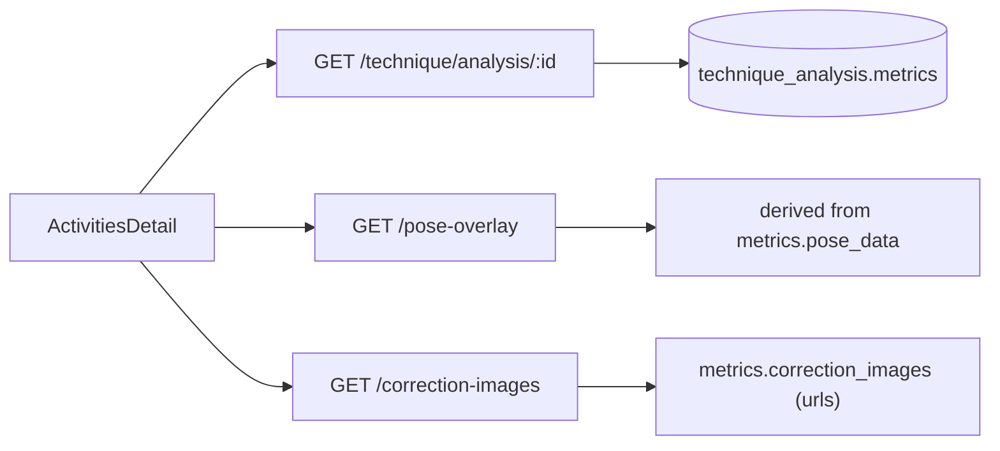
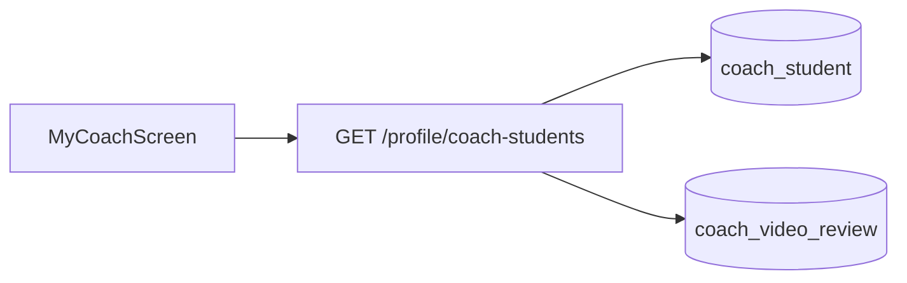
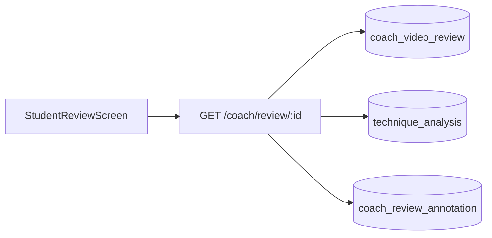
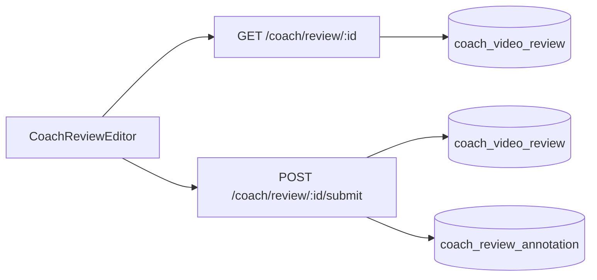
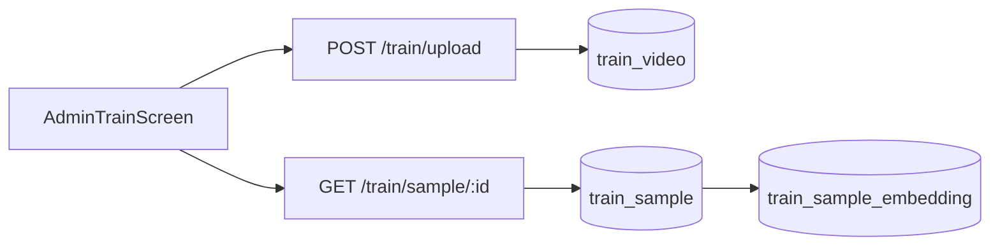
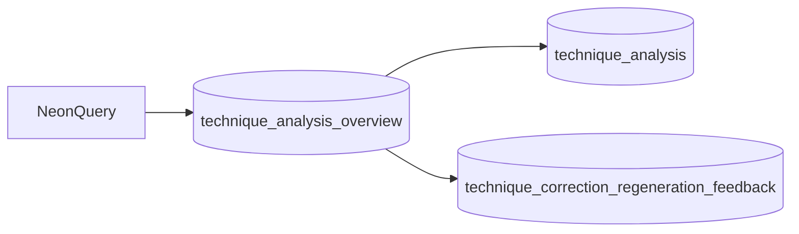

## Screens (app) → routes → DB

- **AI Coach (`app/src/screens/technique.tsx`)**: `POST /technique/upload` → `POST /technique/analyze` → `GET /technique/analysis/:id` + `GET /technique/analysis/:id/correction-images`. Stores upload in `technique_video`; stores analysis in `technique_analysis` (`metrics`, `feedbackText`); regen feedback in `technique_correction_regeneration_feedback`; coach queue (optional) in `coach_video_review`.

- **Activities list (`app/src/screens/Activities.tsx` + `app/src/context/SessionDataContext.tsx`)**: `GET /technique/activities`. Reads from `technique_analysis` (+ joins/lookup for coach review status via `coach_video_review`).

- **Activities detail (`app/src/screens/ActivitiesVideoAnalysis.tsx`)**: `GET /technique/analysis/:id` + `/pose-overlay` + `/correction-images`. Reads from `technique_analysis.metrics` (pose overlay derived) and correction images embedded in `metrics` (normalized to `/uploads/technique-corrections/...`).

- **My Coach (students) (`app/src/screens/MyCoachScreen.tsx`)**: `GET /profile/coach-students`. Reads coach/student links and pending review ids (backed by `coach_student` + `coach_video_review`).

- **Student coach review (`app/src/screens/StudentCoachReviewScreen.tsx`)**: `GET /coach/review/:id`. Reads `coach_video_review` + latest `technique_analysis` for that video; annotations from `coach_review_annotation`.

- **Coach review editor (`app/src/screens/CoachReviewEditorScreen.tsx`)**: `GET /coach/review/:id` + `POST /coach/review/:id/submit`. Writes `coach_video_review.coachFeedbackText` / `submittedAt` and `coach_review_annotation` rows (per frame comment/markup).

- **Admin Train (`app/src/screens/AdminTrain.tsx`)**: `POST /train/upload` + `GET /train/video/:id` + `GET /train/sample/:id` + `GET /train/admin/pose-landmarks-coverage`. Stores labeled clip in `train_video` (`strokeLabel` is the human title, `strokePreset` is the enum bucket); extraction in `train_sample`; k-NN vector in `train_sample_embedding`.

- **Neon-friendly analysis overview (SQL view)**: query `public.technique_analysis_overview` to inspect `feedbackText`, chosen shot label/preset, correction image urls, and latest regen feedback without downloading huge `metrics`.

