## Comfy correction images (under the hood)

- **Entry (app → API)**: App calls `POST /technique/correction-images` with `analysisId` (and optional `frameIndices`, `forceRegenerate`, `regenerationFeedback`). Server reads `technique_analysis.metrics` and writes back `metrics.correction_images_comfy` + `metrics.correction_context_comfy` (URLs + small context only).

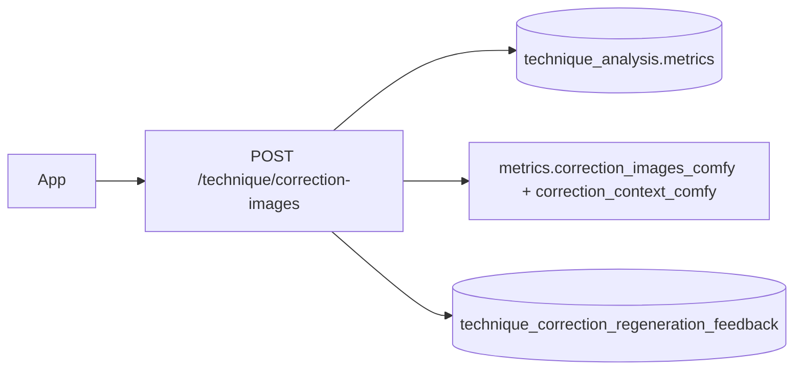

- **Pose landmarks source**: Landmarks come from `metrics.pose_data[]` (MediaPipe pose per video frame) plus `metrics.user_clips` / `metrics.impact_pose_sequence` if present. If the impact sequence is missing but clips exist, the server rebuilds it from pose rows inside the clip window.

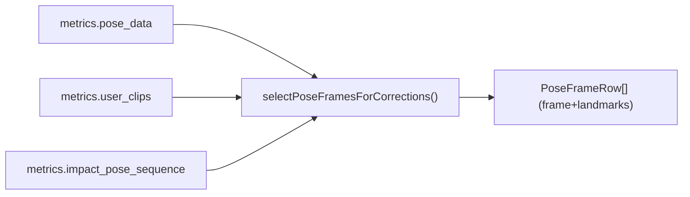

- **Which frames get images**: Server samples up to `XEVO_CORRECTION_MAX_FRAMES` across the selected motion (prefers frames near impact when available). If the client requests specific `frameIndices`, it uses those and only generates missing frames (cached frames are reused).

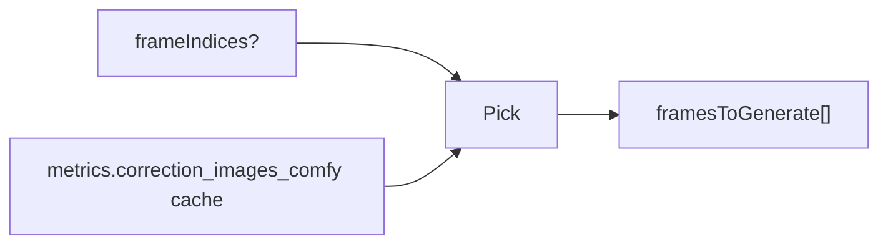

- **Still extraction (video → PNG)**: For each chosen `frame`, the server uses ffmpeg `extractFrame(videoPath, frameNumber)` to get a PNG buffer from the original uploaded mp4. Those extracted stills are the “before” images.

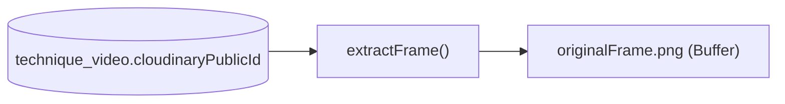

- **AI “suggestions” → joint targets**: The correction job turns the AI Coach text (`en.diagnosis`, `en.recommendations`, plus a detection hint) into **joint deltas** (`LandmarkDelta[]`). It computes a robust fallback delta set from the impact frame, then tries per-frame deltas and falls back to impact deltas if a per-frame delta call fails.

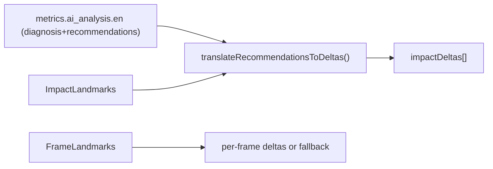

- **Shot + handedness (for prompt correctness)**: The server classifies shot type + handedness (LLM) and then merges it with higher-trust hints: user profile dominant hand + pose-based `racket_hand` consensus. This prevents mirrored corrections and keeps the prompt aligned with the actual striker hand.

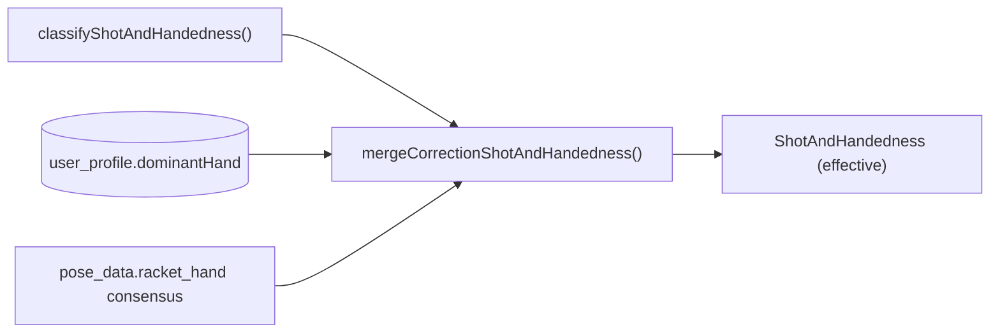

- **Optional pro-library target (makes “ideal” concrete)**: If retrieval has a top neighbor, the server loads pro pose sequence (`train_sample.poseSequence`) and can pull a pro reference frame from the pro video. Pro landmarks produce extra “pro gap” deltas which are merged into the coach deltas (so the edit moves toward a real pro exemplar).

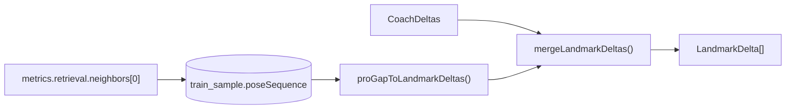

- **Prompt that drives the edit (Qwen workflow)**: For Comfy “qwen” workflows, the server builds a long structured prompt including: scene invariants, top priority moves, diagnosis/recommendations, shot/handedness, raw landmark JSON, and per-joint `current → target` deltas. This is the “brain” that tells the image model what to change while keeping identity/background fixed.

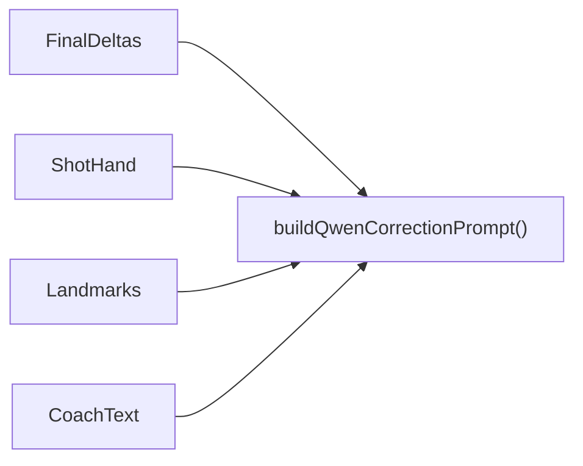

- **Mask (where to inpaint)**: Server creates an inpaint mask from pose landmarks (convex hull → dilation → blur) so Comfy edits mostly the player silhouette, not the court/background. Mask size is matched to the workflow’s megapixels scaling so the mask aligns with the latent resolution.

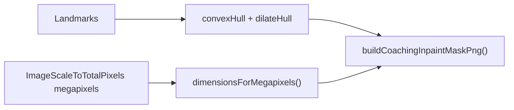

- **Workflow template + node patching**: The server loads a Comfy API workflow JSON (e.g. `server/workflows/qwen_image_edit_plus_gguf_correction.api.json`) then patches specific node IDs from env: load-image nodes, prompt node, optional mask node, openpose/controlnet strength, ksampler denoise, and megapixels. It then uploads the frame image (and optional ref + mask) to Comfy and queues the workflow.

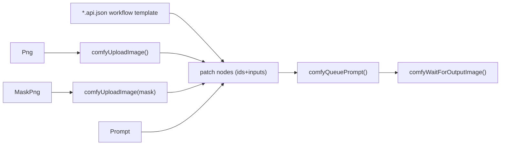

- **Output handling + storage**: Comfy returns a generated image which the server fetches and converts to a data URI, then normalizes/persists it to disk under `/uploads/technique-corrections/<analysisId>/...`. The URL pairs are cached back into `technique_analysis.metrics.correction_images_comfy` so future requests can return instantly.

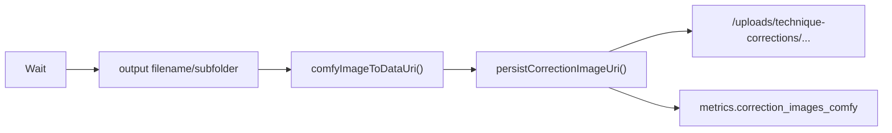

- **User feedback capture (regen)**: When the user types feedback in the regen modal, the server stores it in `technique_correction_regeneration_feedback.message` with a coaching snapshot (diagnosis, shot_context, recs, frame_indices).

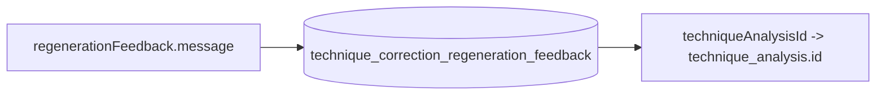

