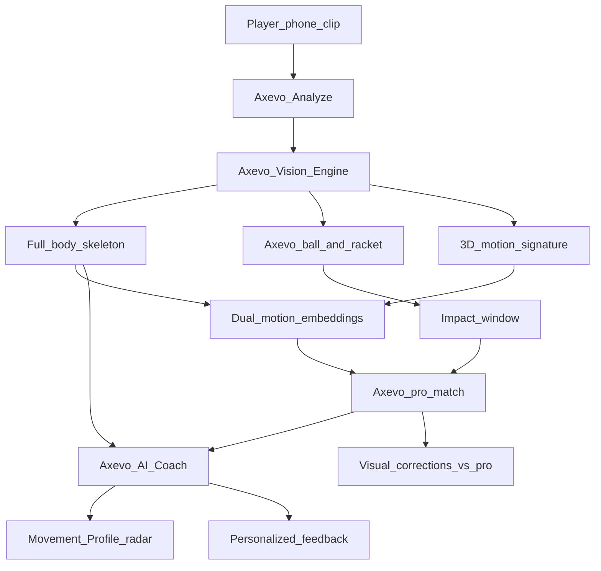
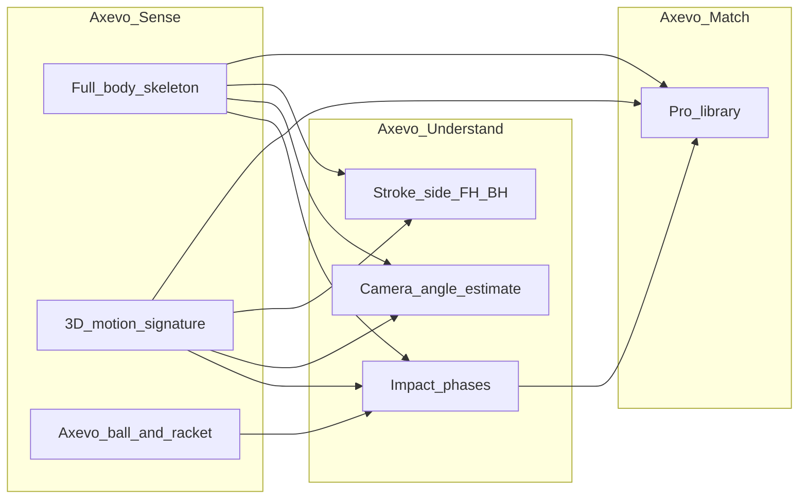
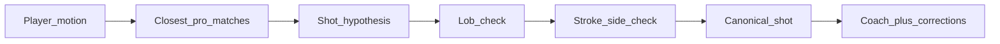
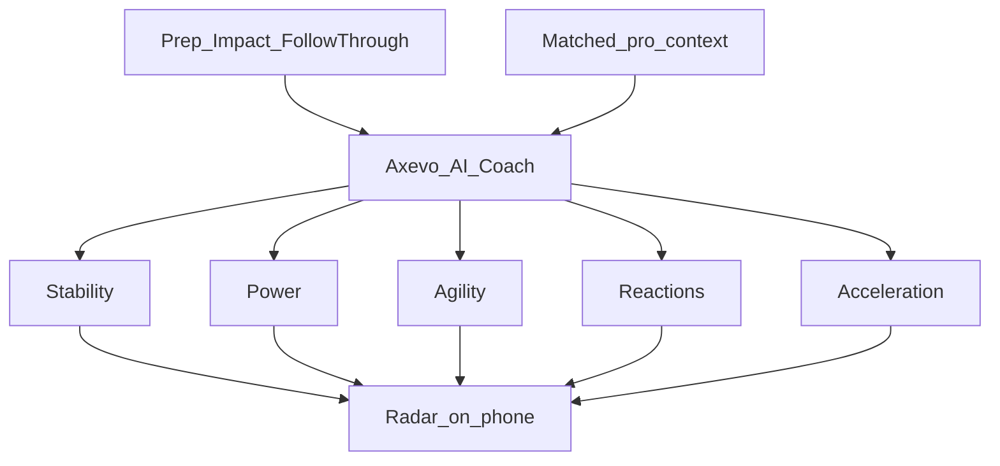
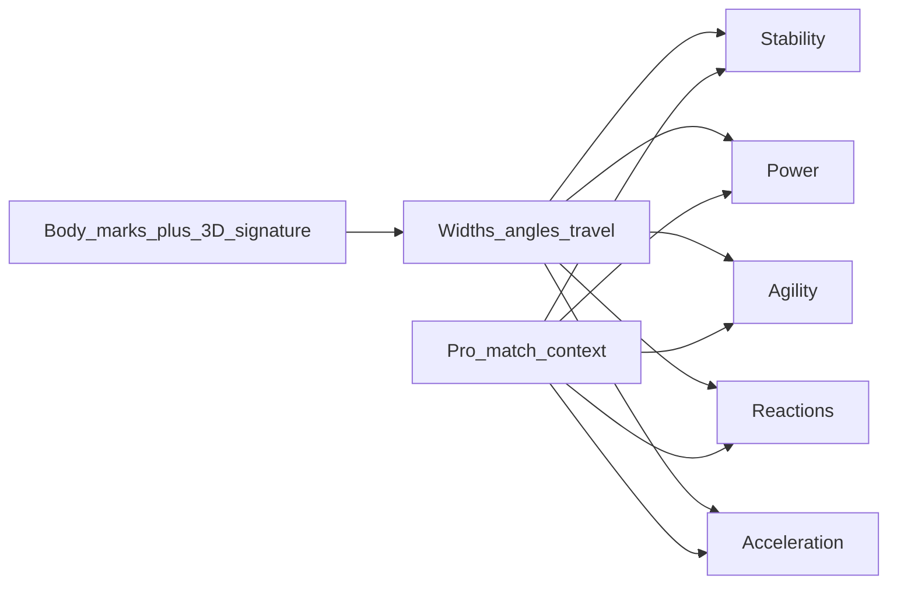
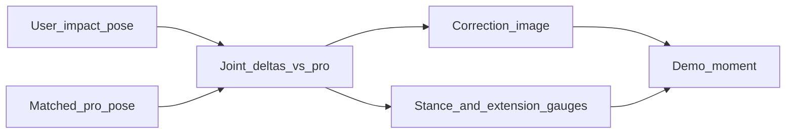
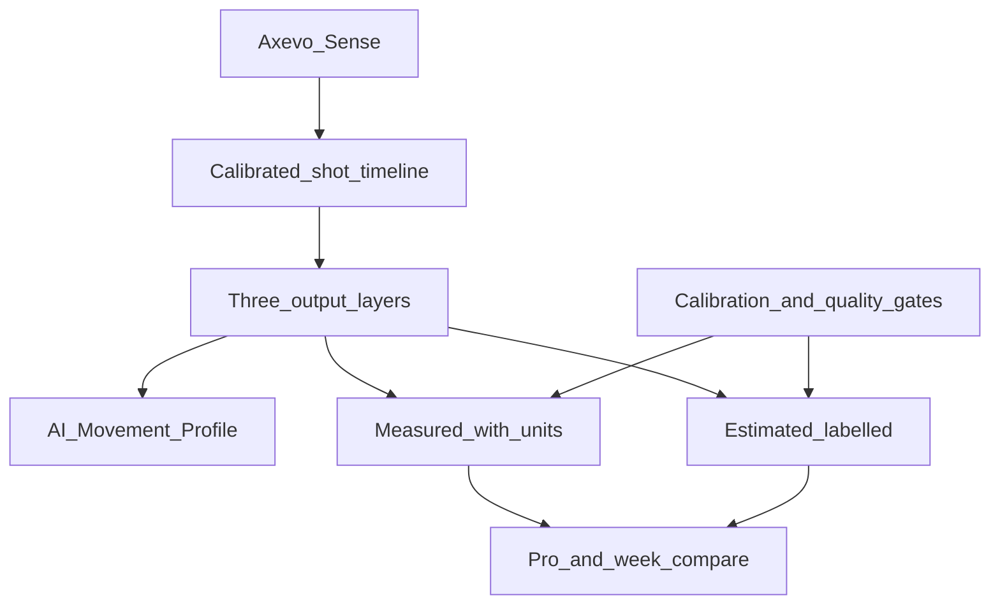
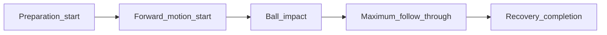

# Axevo AI Coach, Investor Tech Pitch

**One phone clip in. Pro-matched coaching, movement profile, and visual corrections out.**

This is the production story of how Axevo sees a padel swing, finds the right professional reference, and turns motion into coaching the player can feel, and investors can explain, including a measurement system with units, confidence, and pro comparison.

---

## The one-liner

Axevo is not a video filter. It is a **computer-vision coaching stack**: full-body tracking + ball and racket awareness + a living pro library + an AI coach that scores how the athlete *moves* through contact.

---

## Act 1, Axevo sees the athlete in high resolution

### Body: full athletic skeleton (every frame)

Axevo tracks a complete body map across the clip, shoulders, elbows, wrists, hips, knees, ankles, and more. That is the **primary movement evidence**: how the player loads, hits, and recovers.

### Context: ball, racket, impact timing

Axevo's vision layer locks onto the **ball** and **racket** and pins **when contact happens**. Coaching is anchored on a real swing window, preparation → impact → follow-through, not a random middle frame.

### Depth of motion: 3D motion signature (live in production)

On top of the on-screen skeleton, Axevo builds a richer **3D motion signature** used to match professionals, including cues such as:

- Elbow configuration through the swing  
- Torso lean / orientation  
- Wrist height relative to the body  

**Investor takeaway:** Axevo did not stop at "stick figures." It runs a **dual representation**, a human-readable body map for coaching, plus a deeper motion signature for finer pro matching.

---

## Act 2, How Axevo finds the right pro (the moat)

Most AI sports apps guess from a video caption. Axevo **retrieves**.

Every indexed pro clip lives in Axevo's motion library. The player's swing is encoded the same way. Axevo searches for the closest professional movements across both body-map and 3D-signature channels, then refines with production-grade signals:

| Signal | What it does for the product |
|---|---|
| **Dual motion match** | Finds pros whose *movement shape* matches the player, not just the shot name |
| **Camera-angle awareness** | Prefers library clips filmed from a similar viewpoint (front / side / behind / diagonal) so the match is visually fair |
| **Forehand / backhand geometry** | Wrist-vs-body geometry as a safety net so FH and BH are not swapped by lookalike neighbors |
| **Lob / ball rise** | Ball trajectory confirms high-arc shots when the library vote is close |

**Investor takeaway:** the product gets smarter as the **pro library grows**. More tagged angles, more shots, better neighbors, a data flywheel, not a one-shot prompt.

---

## Act 3, Movement Profile (what players see; what you sell)

The last step of AI Coach shows a **Movement Profile**, five scores investors and players instantly understand:

| Dimension | What Axevo judged in the swing | Body story |
|---|---|---|
| **Stability** | Base, balance, recovery after contact | Hips and shoulders stayed organized, the player planted through contact and reset |
| **Power** | Kinetic chain, weight transfer, racket speed through contact | Energy traveled legs → hips → torso → arm through the impact window |
| **Agility** | Footwork adjustment, split-step readiness, repositioning | The player stayed light, adjusted the feet, prepared to move again |
| **Reactions** | Readiness, timing to the ball, first movement | First displacement started early enough relative to the ball and impact |
| **Acceleration** | Explosive approach into position | The burst into the hitting space was sharp on the body scale |

### How Axevo found each score from the marks

Axevo did not invent the radar from a caption. It **read the body marks** on the skeleton and inside the 3D motion signature, computed geometry across preparation → impact → follow-through, and turned those ratios into Stability, Power, Agility, Reactions, and Acceleration, with matched pro context in the same pass.

| Score | Marks Axevo used | Math Axevo ran |
|---|---|---|
| **Stability** | Hips, shoulders, knees | Measured stance widths (`hipW`, `shoulderW`, `kneeW`) and how close the shoulder/hip ratio stayed to a balanced base through contact and recovery |
| **Power** | Shoulder, elbow, wrist + 3D elbow cue / wrist height | Measured arm-chain extension (`fore / (upper + fore)`), reach from shoulder to wrist, and how the elbow opened in the 3D signature through the impact window |
| **Agility** | Ankles, knees, hips across prep→impact | Measured foot and knee spacing changes and how quickly the base reorganized around the ball |
| **Reactions** | Contact frame + early ankles/wrists vs ball | Locked the impact frame, then measured how early the first displacement appeared before contact |
| **Acceleration** | Wrist / hip travel over time (FPS) | Measured how far key marks moved across the approach frames into contact, distance over time on the body scale |

Axevo read these marks. Axevo computed these ratios. The Movement Profile came from that motion math.

---

## Act 4, Visual corrections (proof you can show on stage)

After the shot was understood, Axevo generated **correction frames**: the player's pose against a matched pro, with concrete joint gaps and on-frame coaching cues.

On those frames Axevo already surfaced **stance / balance-style** and **arm extension / power-line-style** gauges derived from the same body geometry, a tangible "before vs pro" moment for demos and App Store screenshots.

---

## The production stack (why this is hard to copy)

| Layer | What ships | Why it matters |
|---|---|---|
| **Capture** | Phone video → Axevo analyze | Zero wearable friction |
| **Vision** | Axevo full-body tracking + ball/racket + 3D motion signature | Body + ball + richer movement DNA |
| **Library** | Pro clips with shot labels + camera angles | Match quality compounds with data |
| **Match** | Dual-channel pro search + angle awareness + FH/BH + lob | Correct shot before coaching |
| **Coach** | Movement Profile + bilingual feedback | Product moment players remember |
| **Corrections** | Pose-aligned pro visuals | Shareable proof of value |

---

## Axevo Measurement System (what CEOs pitch next)

The Movement Profile is the player-facing language of the swing. Beside it, Axevo runs a **measurement system** that returns defensible biomechanical numbers with units, phases, confidence, and comparison, shipping on the same vision stream Axevo already captures.

### Three output layers (pitch this first)

| Layer | What it is | How to talk about it |
|---|---|---|
| **AI coaching scores** | Stability, Power, Agility, Reactions, Acceleration on a 0 to 100 radar | Instant product moment, grounded in landmark math and pro context |
| **Measured biomechanics** | Angles (°), times (ms), speeds (m/s, km/h) when camera scale passes | Real-world numbers with unit, phase, method, confidence, uncertainty |
| **Estimated biomechanics** | Kinetic energy (J), joint power (W), transfer efficiency (%) | Always labelled **estimated**, never called measured force |

**CEO rule:** a number like 82 km/h or 14.2 J never appears without its unit, method, calibration status, and uncertainty.

---

### Calibrated shot timeline

For every uploaded video Axevo builds a contact-centered timeline. Today's prep → impact → follow-through window is the foundation. The full measurement timeline expands that into five anchors:

1. **Preparation start**  
2. **Forward-motion start**  
3. **Ball impact**  
4. **Maximum follow-through**  
5. **Recovery completion**  

Every metric is tied to one of these phases (or a frame inside them), so investors can say: *we measure the same moment every time.*

---

### Every metric payload (schema CEOs can recite)

Axevo returns the same envelope for each measurement:

| Field | Purpose |
|---|---|
| **metric name** | What was measured |
| **numerical value** | The number |
| **unit** | °, ms, m/s, km/h, J, W, % |
| **phase / frame used** | Which timeline anchor |
| **confidence score** | How trustworthy the reading is |
| **measurement method** | How the value was derived |
| **vs previous sessions** | Player progress when comparable |
| **vs matched professional** | Gap to the retrieved pro |
| **camera / calibration quality** | Whether scale and tracking cleared the gate |

**Example card (shot-specific):**

> Shot: Forehand drive  
> Elbow angle at impact: **146°**  
> Reference range: **138° to 152°** (handedness + shot type)  
> Difference from matched professional: **+3°**  
> Confidence: **91%**  
> Calibration: court scale passed  

---

### Metric family, ball

Axevo tracks the ball frame by frame with real timestamps, calibrates scale from known court dimensions and line positions, corrects perspective, and measures velocity across several frames before and after impact.

| Metric | Unit | What it tells the pitch |
|---|---|---|
| `incoming_ball_speed_mps` | m/s | Ball speed into contact |
| `outgoing_ball_speed_mps` | m/s | Ball speed leaving contact |
| `outgoing_ball_speed_kmh` | km/h | Same outbound speed in coach language |
| `speed_change_at_impact` | m/s | Impulse story at the hit |
| `ball_launch_angle_deg` | ° | Leave angle after contact |

**Example:** Ball speed **82 km/h**, estimated range **76 to 88 km/h**, confidence **84%**.

Capture guidance for validation setups: **60 fps** minimum, **120 to 240 fps** preferred, dual synchronized cameras or radar for highest-grade checks.

---

### Metric family, hitting arm and hand

Axevo does not use a vague “arm speed.” It returns separate segment readings.

| Metric | Unit | What it tells the pitch |
|---|---|---|
| `wrist_peak_speed_mps` | m/s | Peak smoothed wrist velocity into the hit |
| `wrist_speed_at_impact_mps` | m/s | Wrist speed on the impact frame |
| `elbow_speed_at_impact_mps` | m/s | Elbow speed at contact |
| `shoulder_speed_at_impact_mps` | m/s | Shoulder speed at contact |
| `wrist_path_length_m` | m | 3D path length ready → impact |
| `ready_to_impact_time_ms` | ms | Time from ready to contact |
| `forward_swing_time_ms` | ms | Forward-motion window duration |
| `wrist_acceleration_mps2` | m/s² | How hard the hand accelerates into the ball |

**Ready position (algorithmic):** first stable frame before preparation where wrist velocity sits below threshold and the body holds a balanced base.

**Average wrist speed** = 3D wrist path length from ready to impact ÷ elapsed time.  
**Peak wrist speed** = maximum smoothed 3D wrist velocity before impact.

---

### Metric family, force, energy, and power

Force = newtons (N). Energy / work = joules (J). Power = watts (W).

True muscular force and ground-reaction force need plates or instrumented gear. From phone video Axevo returns **clearly labelled estimates** using player mass, height, racket mass, segment-mass models, and 3D segment velocities:

| Metric | Unit | Label |
|---|---|---|
| `estimated_arm_kinetic_energy_j` | J | Estimated |
| `estimated_racket_kinetic_energy_j` | J | Estimated |
| `estimated_ball_kinetic_energy_j` | J | Estimated |
| `estimated_energy_transfer_efficiency_pct` | % | Estimated |
| `estimated_joint_power_w` | W | Estimated |

Examples of the math language CEOs can use:

- Ball kinetic energy ≈ `0.5 × ball_mass_kg × ball_speed_mps²`  
- Racket kinetic energy ≈ `0.5 × effective_racket_mass_kg × racket_head_speed_mps²`  

Always say **estimated kinetic energy**, never “measured force,” unless a physical sensor validated the reading.

---

### Metric family, shoulder, elbow, torso, hip

For each shot and each phase (Preparation, End of backswing, Acceleration, Impact, Follow-through, Recovery), Axevo returns:

| Metric | Unit |
|---|---|
| `elbow_flexion_at_ready_deg` | ° |
| `elbow_flexion_at_end_of_backswing_deg` | ° |
| `elbow_flexion_at_impact_deg` | ° |
| `elbow_flexion_at_follow_through_deg` | ° |
| `shoulder_abduction_at_impact_deg` | ° |
| `shoulder_flexion_at_impact_deg` | ° |
| `shoulder_rotation_at_impact_deg` | ° |
| `torso_rotation_range_deg` | ° |
| `hip_rotation_range_deg` | ° |
| `hip_shoulder_separation_deg` | ° |
| `maximum_trunk_lean_deg` | ° |

Target ranges are **shot-specific and handedness-specific**. A bandeja, víbora, volley, and forehand drive do not share the same ideal elbow or shoulder band.

---

### Additional measurements coaches ask for by name

| Metric | Unit | Pitch value |
|---|---|---|
| `stance_width_m` | m | Base width in metres when calibrated |
| `stance_width_relative_to_shoulder_width` | ratio | Base vs shoulder scale |
| `left_knee_flexion_deg` / `right_knee_flexion_deg` | ° | Knee load at key phases |
| `center_of_mass_displacement_m` | m | How far the body mass center traveled |
| `vertical_center_of_mass_change_m` | m | Rise / drop through the swing |
| `weight_transfer_proxy_pct` | % | Load shift proxy across the kinetic window |
| `split_step_to_impact_ms` | ms | Ready hop to contact |
| `first_movement_to_impact_ms` | ms | First move to contact |
| `recovery_time_ms` | ms | Time to finish recovery |
| `hip_peak_angular_velocity_deg_s` | °/s | How fast the hips unwind |
| `torso_peak_angular_velocity_deg_s` | °/s | How fast the trunk unwinds |
| `shoulder_peak_angular_velocity_deg_s` | °/s | How fast the shoulder line turns |
| `kinetic_chain_sequence_score` | score | Whether hips → torso → arm fired in order |

For rotation, Axevo returns **angular velocity in degrees per second**, not only “how fast the shoulder turned.”

---

### Engineering safeguards (why investors trust the numbers)

| Gate | Role |
|---|---|
| `camera_calibration_status` | Court scale / perspective quality |
| `effective_fps` | Real timing base for speeds |
| `motion_blur_score` | Whether edges are sharp enough |
| `ball_tracking_confidence` | Ball track reliability |
| `pose_landmark_confidence` | Body-mark reliability |
| `impact_frame_confidence` | Contact lock quality |
| `occlusion_score` | Whether key joints / ball were hidden |
| `measurement_uncertainty` | Explicit error band on the value |

When the recording is unsuitable, Axevo refuses a precise-looking number:

> **Result unavailable:** Ball was visible in only 3 frames after impact.  
> Use 120 fps and position the camera farther behind the court.

---

### Week-by-week comparison

Axevo stores both the raw measurement and the recording conditions:

`metric_value`, `unit`, `shot_id`, `player_id`, `handedness`, `camera_position`, `fps`, `resolution`, `confidence`, `model_version`, `timestamp`

Sessions compare only when:

- shot classification matches  
- camera quality passes threshold  
- the same metric definition and model version were used  
- confidence is high enough  

Axevo uses a **rolling median**, not a single-shot spike:

> Current week median wrist speed: **11.8 m/s**  
> Previous week: **10.9 m/s**  
> Change: **+8.3%**  
> Comparable shots: **24**  
> Confidence: **High**

---

### How today's stack already provides the value

| What Axevo already runs | How it feeds the measurement system |
|---|---|
| Full-body skeleton every frame | Joint angles, stance, path length, angular velocity |
| Ball and racket tracking + impact lock | Ball speed window, launch angle, phase anchors |
| 3D motion signature | Elbow / torso / wrist depth cues for power and chain |
| Camera-angle awareness | Fair pro match and comparable session geometry |
| Pro library match | Shot-specific reference ranges and Δ vs professional |
| Movement Profile radar | AI coaching layer on top of the same marks |
| Correction gauges | Visible stance and extension proof on stage |

Foundation already live. Deeper units, court calibration, uncertainty bands, and week-over-week medians ship on **that same stream**.

---

## 30-second investor closer

1. **Upload** a padel clip from a phone.  
2. **Axevo Vision** extracted the body, ball, impact, and a 3D motion signature.  
3. **Axevo Match** found the closest professionals, same shot family, fair camera angle, correct side of the body.  
4. **Axevo Coach** returned three layers: Movement Profile scores, measured biomechanics with units and confidence, and clearly labelled energy estimates.  
5. **Corrections** showed the gap to the pro on the frame that mattered, with week-over-week progress when sessions are comparable.

**Axevo turns one amateur clip into a pro-referenced coaching session with defensible numbers, and a compounding library that gets harder to catch every week.**
