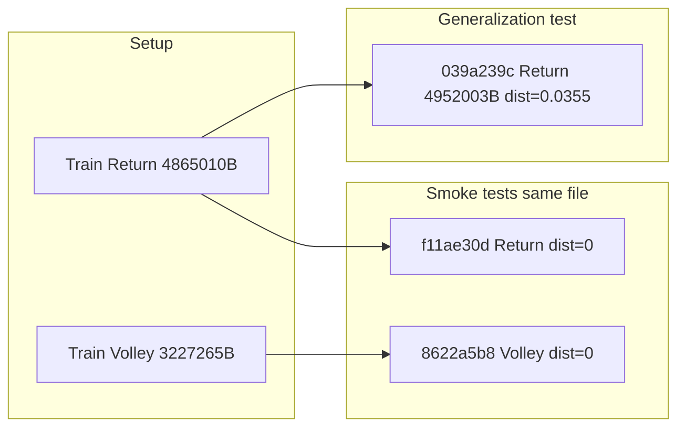

# E2E shot validation session (2026-06-24)

**Parent overview:** [SHOT-SYSTEM-VALIDATION-HANDOVER.md](./SHOT-SYSTEM-VALIDATION-HANDOVER.md) — senior dev handover (verdict, admin bench, scaling risks).

Live investigation against Neon using `DATABASE_URL` from [server/.env](../server/.env). **No credentials are stored in this doc** — rotate keys before go-live.

Artifacts: [server/scripts/_e2e_session_investigation.json](../server/scripts/_e2e_session_investigation.json), [server/scripts/_e2e_bench_results.json](../server/scripts/_e2e_bench_results.json). Last refreshed **2026-06-28** (Neon query `2026-06-28T20:34:29Z`).

Related playbook: [SHOT-RETRIEVAL-INVESTIGATION.md](./SHOT-RETRIEVAL-INVESTIGATION.md).

---

## Session summary

Three user-flow tests on **2026-06-24** with a **two-label pro library** (Forehand Return + Forehand Volley). All three UI labels were correct, but only one submission is meaningful generalization evidence.

| Phase | Analysis ID | Shot shown | File bytes | Top neighbor distance | Verdict |
|-------|-------------|------------|------------|----------------------|---------|
| **A — smoke** (same volley training file) | `8622a5b8-b76b-492d-b438-99e679ccb261` | Forehand Volley | 3,227,265 | **0.000** | Pipeline OK; same file as train |
| **B — smoke** (same return training file) | `f11ae30d-34a7-4665-86a8-a6e876626e3e` | Forehand Return | 4,865,010 | **0.000** | Pipeline OK; same file as train |
| **C — generalization** (different return video) | `039a239c-662e-4423-aeab-49dd083a1720` | Forehand Return | **4,952,003** | **0.0355** | Real cross-video match |

A fourth analyze (`5adcdd76`, volley, same 3,227,265 bytes as train) was a repeat same-file volley smoke test — not generalization. A duplicate generalization upload (`f6406c56`, same 4,952,003 bytes) reproduced the same retrieval result.



Retrieval mode in stored metrics: **`ensemble`** (10 pose + 10 mesh probes per analyze). Set `RETRIEVAL_EMBEDDING_MODE=ensemble` in [server/.env](../server/.env) and Railway to match production analyze behavior.

---

## Pro library state (Neon)

| Train sample | Label | Created | Stride | Impact frame | v2 rows | sam_v1 rows |
|--------------|-------|---------|--------|--------------|---------|-------------|
| `4132cf12-613e-4bad-8f81-517b39e6f29c` | Forehand Return | 10:27 UTC | 1 | 40 | 40 | 40 |
| `31950f20-dfe8-49c8-a7d7-412604c48a4f` | Forehand Volley | 10:54 UTC | 1 | 49 | 40 | 40 |

- pgvector extension: present. Total embedding rows: **160** (80 v2 + 80 sam_v1).
- `frameIndex` column: present (migration 0035). Multi-frame rows per spec: 39.
- Coverage audit: no thin labels at min=2 threshold.

### Train vs technique file sizes

| Kind | ID | Bytes | Label / note |
|------|-----|-------|----------------|
| train | `c9b0f9b6-…` | 4,865,010 | Forehand Return (training source) |
| technique | `a222e067-…` | 4,865,010 | Submission B — **same file** |
| train | `ba71fd6d-…` | 3,227,265 | Forehand Volley (training source) |
| technique | `75060178-…` | 3,227,265 | Submission A — **same file** |
| technique | `11971ebc-…` | **4,952,003** | Submission C — **different file** (analysis `039a239c`) |

---

## Submission A — Forehand Volley smoke (`8622a5b8`)

- **When:** 2026-06-24 11:00 UTC (after volley train sample at 10:54).
- **Impact:** frame 16, source `yolo_median`.
- **Retrieval:** ensemble; confidence **0.80**; channel_agreement **true**.
- **Top neighbor:** Forehand Volley train (`31950f20…`) distance **0.000**.
- **Interpretation:** Correct because the analyze MP4 is the same bytes as the training upload. Proves indexing + query path, not generalization.

Pose-only confidence was **0.45** (below 0.35 display threshold alone); mesh channel **0.92** carried the ensemble vote.

---

## Submission B — Forehand Return smoke (`f11ae30d`)

- **When:** 2026-06-24 11:04 UTC.
- **Impact:** frame 27, source `yolo_median`.
- **Retrieval:** ensemble; confidence **0.92**; channel_agreement **true**.
- **Top neighbor:** Forehand Return train (`4132cf12…`) distance **0.000**.
- **Interpretation:** Same-file smoke test for the second shot label.

---

## Submission C — Forehand Return generalization (`039a239c`) — why it worked

- **When:** 2026-06-24 11:16 UTC.
- **Different video:** 4,952,003 bytes vs training 4,865,010 bytes.
- **Impact:** frame 61 on a 160-frame clip, source `yolo_median`.
- **Retrieval:** ensemble; hypothesis confidence **0.81**; mesh_confidence **0.91**.

| Signal | Value |
|--------|-------|
| Predicted / display | Forehand Return |
| Top neighbor | Return train `4132cf12…` @ **0.0355** |
| #2 neighbor | Volley train `31950f20…` @ **0.2145** |
| Distance gap | **0.179** |
| Pose hypothesis | Forehand Return (conf 0.76) |
| Mesh hypothesis | Forehand Return (conf 0.65) |
| channel_agreement | **true** |
| frames_used | pose 10, mesh 10 |

**Why this is trustworthy:**

1. Non-zero distance — cannot be trivial file reuse.
2. Top hit is the correct trained Return clip, not Volley.
3. Clear margin over the only other library label (both forehand-family shots).
4. Both channels agree on the label.
5. YOLO impact alignment (not legacy clip-end frame bug).

Admin bench step `5_analysis_audit` on this ID: **pass** (100%).

---

## False positives and fragility

Even when the UI shows the right shot:

| Risk | This session |
|------|----------------|
| Same-file “success” (distance 0) | Submissions A and B — memorization, not generalization |
| Two-label library | Binary choice between similar forehand shots is easy |
| LOOCV with 2 samples | Bench LOOCV **0/2 top-1** — each sample’s only neighbor is the other label (~0.073 apart). Expected with N=1 per class; not representative of user-upload quality |
| Pose-only weakness | Volley smoke: pose conf 0.45; mesh saved the vote |
| LLM echo | `shot_context` = “Pro library match: …” — not independent validation |
| Env drift | Resolved — local `.env` and stored metrics both use `ensemble` |

---

## Admin bench results

| Step | Result | Summary |
|------|--------|---------|
| `1_library_ready` | Pass | 80 v2 · 80 sam_v1 |
| `2_loocv` | Fail (0%) | top1 0/2 — two-sample library too small; labels swap at ~0.073 |
| `5_analysis_audit` (039a239c) | Pass | Forehand Return, gap 0.179 |

---

## Scaling checklist (as library grows)

1. Train **≥2 different videos per label** before trusting LOOCV.
2. Always run two test types: **(A) same-file smoke**, **(B) different-file generalization** — only B counts.
3. After pipeline changes, **re-extract** pro clips (`POST /train/reextract`), not just embeddings backfill.
4. Run Retrieval Bench `1_library_ready` after each batch upload.
5. Watch **similar preset families** (Return vs Volley) — gap may shrink as library grows.
6. Set `RETRIEVAL_EMBEDDING_MODE=ensemble` on server/Railway to match production metrics.

---

## Reproduce (from `server/`)

```bash
pnpm exec tsx scripts/_db_sanity.mjs
pnpm exec tsx scripts/audit_retrieval_coverage.mjs
pnpm exec tsx scripts/_e2e_session_investigation.mjs
pnpm exec tsx scripts/_compare_train_technique_bytes.mjs

# Bench (local, same as admin curl)
$env:ANALYSIS_ID="039a239c-662e-4423-aeab-49dd083a1720"
$env:BENCH_STEPS="1_library_ready,5_analysis_audit"
pnpm exec tsx scripts/_run_bench_steps.mjs
```

HTTP equivalent (server running; set `ADMIN_TRAIN_SECRET` and `BETTER_AUTH_URL`):

```bash
curl -s -H "X-Admin-Train-Secret: $ADMIN_TRAIN_SECRET" \
  "$BETTER_AUTH_URL/train/admin/accuracy/bench/submissions?limit=10"

curl -s -X POST -H "Content-Type: application/json" \
  -H "X-Admin-Train-Secret: $ADMIN_TRAIN_SECRET" \
  -d '{"analysisId":"039a239c-662e-4423-aeab-49dd083a1720"}' \
  "$BETTER_AUTH_URL/train/admin/accuracy/bench/run/5_analysis_audit"
```

Neon tip: if queries fail with `ENOTFOUND`, retry — connection is intermittent from some environments.
