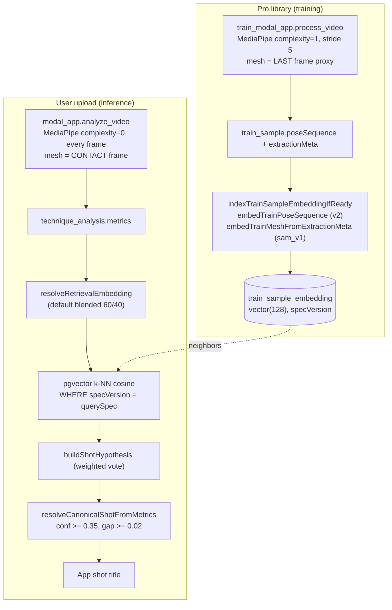

# Shot pipeline validation — end-to-end sanity check

End-to-end review of how a padel shot is identified and "called" to the user: Modal training + inference -> server embeddings -> Neon `pgvector` k-NN -> label decision -> app UI. The goal was to confirm what is correct and find the logic errors that make us sometimes show the wrong shot.

> **Analysis only.** No code, schema, env, or Modal changes were made. This document records findings and recommended fixes; implementation is a separate task.

---

## TL;DR verdict

The **plumbing is sound**: vector dimensions (128), L2 normalization, and the cosine operator/index all line up, so this is not a dimension/operator corruption problem.

The **wrong shots come from two classes of bug**:

1. **A vector-space mismatch (F1, critical):** in the default `blended` mode we search the Neon index with a *blended* query vector but the library only stores *pure-mesh* vectors. The nearest neighbors are computed in a space the library was never indexed in. This is the most likely reason "the Neon nearest neighbors are wrong."
2. **Train vs inference inconsistencies (F2-F4, high):** the pro library and the user upload are not produced the same way (MediaPipe model complexity, frame stride, and which frame represents the shot). Even with a perfect index, the query systematically lands away from the matching library clip.

Everything below is ranked, with file:line and a concrete fix.

---

## End-to-end flow

---

## What is correct (verified)

These were checked and are working as intended:

- **One vector size everywhere — `vector(128)`, no drift.** Schema `train_sample_embedding` ([server/src/db/schema.ts](../server/src/db/schema.ts):473-494) declares `vector("embedding", { dimensions: 128 })`; migrations `0011_train_sample_embedding.sql` and `0032_train_embedding_spec_unique.sql` declare `vector(128)`; `POSE_EMBEDDING_DIM = 128` and the mesh vector is also sliced to 128. `formatVectorSqlLiteral` throws on any other length, so a wrong-dim vector can never be stored or queried.
- **Normalization matches the distance metric.** Both stored and query vectors are L2-normalized, and the query uses cosine distance `<=>` ([server/src/technique/trainRetrieval.ts](../server/src/technique/trainRetrieval.ts):164,171), which matches the HNSW index built with `vector_cosine_ops` ([server/src/db/schema.ts](../server/src/db/schema.ts):485-488). For unit vectors cosine rank order is consistent.
- **Pure modes are internally consistent.** `RETRIEVAL_EMBEDDING_MODE=mediapipe_v2` (query pure MP vs stored `v2`) and `RETRIEVAL_EMBEDDING_MODE=sam_v1` (query pure mesh vs stored `sam_v1`) compare like-with-like.
- **Library indexing is wired and idempotent.** On Modal `process_video` success the server auto-indexes ([server/src/train/trainRouter.ts](../server/src/train/trainRouter.ts):334 -> `indexTrainSampleEmbeddingIfReady`, [server/src/technique/trainRetrieval.ts](../server/src/technique/trainRetrieval.ts):75-117), writing a `v2` row and (when mesh confidence is OK) a `sam_v1` row; upsert is keyed on `(trainSampleId, specVersion)` ([trainRetrieval.ts](../server/src/technique/trainRetrieval.ts):119-134). A manual backfill route also exists.
- **Label precedence is retrieval-first and gated.** `resolveCanonicalShotFromMetrics` ([server/src/train/trainShotDisplay.ts](../server/src/train/trainShotDisplay.ts):63-181) uses `shot_hypothesis.stroke_label` only when `confidence >= 0.35` and the top-2 neighbor distance gap is not ambiguous (`>= 0.02`), else falls back through neighbors -> `ai_analysis.en.shot_context` -> `"Technique"`. The LLM is steered toward the retrieved label but does not set the stored display title.

---

## Ranked findings (the bugs)

### F1 — CRITICAL: blended query vs pure-mesh index

Default `RETRIEVAL_EMBEDDING_MODE` is `blended`. The query builds `L2(0.6 * mediapipe + 0.4 * mesh)` and then searches with `specVersion = "sam_v1"` ([server/src/technique/meshEmbedding.ts](../server/src/technique/meshEmbedding.ts) `resolveRetrievalEmbedding`; [server/src/technique/trainRetrieval.ts](../server/src/technique/trainRetrieval.ts):296-316). But the library only ever stores **pure** vectors: a `v2` (pure MediaPipe) row and a `sam_v1` (pure mesh) row ([trainRetrieval.ts](../server/src/technique/trainRetrieval.ts):88-99). **No blended row is ever written.**

So in production default, a blended query vector is compared against pure-mesh library vectors — two different geometries. Cosine neighbors are effectively meaningless, which directly produces wrong shots and explains the "Neon nearest neighbors are wrong" symptom.

The admin retrieval bench shares the same structural flaw (it blends the query side but still k-NNs against stored pure `sam_v1` rows), so **bench accuracy for any intermediate mesh weight is overstated** and cannot be trusted to validate blending.

Fix options:
- Immediate mitigation: set `RETRIEVAL_EMBEDDING_MODE=mediapipe_v2` (a self-consistent mode) until blended storage exists.
- Proper fix: at index time also store a third spec (e.g. `blended`) using `blendStoredTrainVectors(v2, sam, weight)` with the same weight the query uses, and query that spec. (A single pgvector index over pure-mesh rows cannot re-blend per candidate at query time.)

### F2 — HIGH: SAM3D distribution landmine (proxy vs real)

The analyzer can be deployed with the heavy real model (`sam3d_image`, `SAM3D_ENABLED=1`), but training (`train_modal_app.py`) always uses the light `image` and therefore always produces the **mesh proxy** vector ([train_modal_app.py](../train_modal_app.py):237; mesh proxy in [sam_mesh.py](../sam_mesh.py):65-100). If real SAM is ever enabled on the analyzer, user mesh vectors come from a different distribution than the proxy mesh vectors in the library, breaking `sam_v1`/`blended` k-NN.

Today both sides use the proxy (`AllowedModels="mediapipe"`, `analyzer_image = image`), so this is latent — but it is a coupling that must be enforced: training and inference must use the **same** mesh provider, or the library must be re-indexed whenever the analyzer's provider changes.

### F3 — HIGH: train vs inference MediaPipe mismatch

The two pose extractors are configured differently:

- Training: `model_complexity=1`, processes **every 5th frame** ([train_modal_app.py](../train_modal_app.py):294,332).
- Inference: `model_complexity=0`, processes **every frame** ([modal_app.py](../modal_app.py):340-345).

Different model complexity yields different landmark coordinates for the same pose, so the user's pose embedding has a systematic offset from the library embeddings of the same shot. Fix: use identical `model_complexity` (and ideally a consistent sampling policy) on both paths, then re-index the library.

### F4 — HIGH: swing-phase mismatch (which frame is "the shot")

The library and the query do not always describe the same instant of the swing:

- Training pose/mesh use the **last** frame: pose train mode takes the last `pose_sequence` frame ([server/src/technique/poseEmbedding.ts](../server/src/technique/poseEmbedding.ts) train branch), mesh uses the last enrichment frame ([server/src/technique/meshEmbedding.ts](../server/src/technique/meshEmbedding.ts) `embedTrainMeshFromExtractionMeta`), and Modal only enriches the last frame for train ([train_modal_app.py](../train_modal_app.py):448-458).
- Inference uses the **impact/contact** frame.

If an admin-trimmed clip's last frame is not the contact moment, the library encodes a different swing phase than the query. Worse, within a single query the **pose** branch uses `impact_pose_sequence` while the **mesh** branch uses the enrichment frame closest to `impact_frame_resolved`; if those differ, the blend mixes two different instants before the search even runs. Fix: standardize on the contact/impact frame for both training and inference, and align the pose vs mesh frame within a query.

### F5 — MEDIUM: no taxonomy pre-filter in k-NN

The neighbor query filters only on `status = 'completed'` and `specVersion`; there is no category/stroke/skill filter ([server/src/technique/trainRetrieval.ts](../server/src/technique/trainRetrieval.ts):168-173). The vote is global across the whole library, so a visually similar but tactically different shot can win. Fix: optionally constrain or re-rank by category when a prior (e.g. LLM `primary_train_category` or court zone) is available.

### F6 — MEDIUM: partial sam library biases retrieval

Train samples whose last-frame `mesh_confidence < 0.4` get **no** `sam_v1` row ([server/src/technique/meshEmbedding.ts](../server/src/technique/meshEmbedding.ts) `embedTrainMeshFromExtractionMeta`). Those clips are invisible to `sam_v1`/`blended` queries, so the candidate set is biased toward easy-to-mesh poses. Fix: fall back to storing the proxy/pose vector under `sam_v1`, or track coverage and prefer `mediapipe_v2` when sam coverage is low.

### F7 — MEDIUM: missing landmarks collapse to a generic pose

Absent/occluded landmarks default to `{ x: 0.5, y: 0.5 }` ([server/src/technique/poseEmbedding.ts](../server/src/technique/poseEmbedding.ts):50-58) rather than being masked. Heavily occluded frames therefore all embed toward the same generic vector and pull unrelated neighbors. Fix: weight or drop low-visibility joints, or reject frames below a visibility floor before embedding.

### F8 — MEDIUM: client and server label resolvers disagree

The Activities list uses the gated server resolver (`deriveHumanShotLabelFromMetrics` -> `resolveCanonicalShotFromMetrics`), but:

- the detail screen re-derives the label client-side with `humanShotLabelFromStoredMetrics`, which takes `shot_hypothesis.stroke_label` **with no confidence/gap gate** ([app/src/lib/trainShotDisplay.ts](../app/src/lib/trainShotDisplay.ts):30-57, [app/src/screens/ActivitiesVideoAnalysis.tsx](../app/src/screens/ActivitiesVideoAnalysis.tsx):639-667);
- the live technique flow uses the raw `retrieval.shot_hypothesis.stroke_label` directly ([app/src/screens/technique.tsx](../app/src/screens/technique.tsx):638-691).

Result: the list and the detail screen can show different shot names for the same analysis, and the detail screen can confidently show a low-confidence (ambiguous) label the server deliberately suppressed. Fix: have the client consume the server-resolved label (or port the exact confidence/gap logic to one shared helper).

### F9 — LOW: hygiene filter runs after ORDER BY/LIMIT

Neighbors are ordered and limited in SQL, then a hygiene post-filter drops blocked preset/label combos ([server/src/technique/trainRetrievalHygiene.ts](../server/src/technique/trainRetrievalHygiene.ts), applied in [trainRetrieval.ts](../server/src/technique/trainRetrieval.ts):191). Removing top rows after the fact can promote a semantically worse match into the vote. Fix: over-fetch (already partially done with `k*6`) and apply hygiene before the final top-k slice — verify the ordering is preserved.

### F10 — LOW: observability metric is misleading

The admin `llm_disagrees_retrieval` flag compares the raw `stroke_label` against the full `en.shot_context` sentence ([server/src/adminAccuracy/evalSnapshot.ts](../server/src/adminAccuracy/evalSnapshot.ts)). After `alignAnalyzeShotContextWithRetrieval` rewrites `shot_context` to `"Pro library match: <name>."` ([server/src/technique/techniqueRouter.ts](../server/src/technique/techniqueRouter.ts):413-435), the strings never match exactly, so the metric reports disagreement even when they agree — meaning the dashboard you'd use to catch wrong shots is itself noisy. Fix: compare the canonical display label against the LLM label with the same normalization, after alignment.

---

## Recommended fix order

1. **Mitigate now (F1):** set `RETRIEVAL_EMBEDDING_MODE=mediapipe_v2` so query and index are in the same space; re-check accuracy.
2. **Fix blending properly (F1):** store a blended spec at index time (same weight as query) and search it; fix the bench to blend both sides.
3. **Align extraction (F3, F4):** same MediaPipe complexity + same frame policy (contact frame) on training and inference, then re-index the library.
4. **Enforce mesh-provider parity (F2):** training and inference must use the same mesh provider; re-index on any change.
5. **Tighten retrieval quality (F5, F6, F7):** category-aware re-rank, sam coverage fallback, occlusion handling.
6. **Unify the label resolver (F8)** and **clean up observability (F10)** so regressions are visible.

---

## How to verify / reproduce

- **LOOCV with the retrieval bench** (admin) per blend weight — but treat current blended numbers as suspect until F1 is fixed (the bench shares the bug).
- **Inspect a real analysis:** check `metrics.retrieval.embedding_source` and `spec_version` against what is actually stored; in default `blended` you will see a blended query searching `sam_v1` rows (F1).
- **SQL spot-check coverage:** compare counts of completed `train_sample` rows against `train_sample_embedding` rows per `specVersion` — a large `sam_v1` shortfall confirms F6, and any non-128 vector would have been rejected at write time (confirming the dimension invariant).
- **List vs detail:** open an ambiguous analysis on the Activities list and on the detail screen; differing titles confirm F8.
