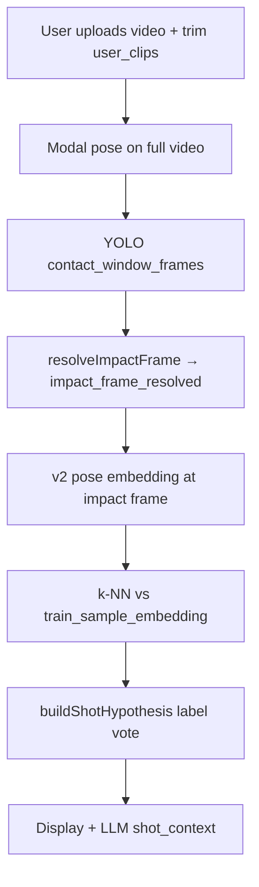

# Shot retrieval investigation playbook

**June 2026 validation context:** [SHOT-SYSTEM-VALIDATION-HANDOVER.md](./SHOT-SYSTEM-VALIDATION-HANDOVER.md) — E2E verdict, false positives, admin bench workflow, scaling risks.

Use this doc when you want to **look up what shot label the system assigned**, why, and whether the **pro library (v2 k-NN)** supports it — especially after uploading the **latest test video**. Hand this file to the agent with: *“Run the shot investigation playbook for [shot name] on the latest submissions.”*

Related: [v9.md](./v9.md) (label-only k-NN, v2 embeddings), [SHOT-YOLO-LABEL-INVESTIGATION.md](./SHOT-YOLO-LABEL-INVESTIGATION.md) (older YOLO/label notes), [guide/03-mesh-retrieval.md](./guide/03-mesh-retrieval.md) (mesh enrichment + `sam_v1` / blended k-NN, fallbacks, ops).

---

## Quick mental model



**Shot label is not read from the filename or preset alone.** It comes from the **pose vector at the resolved impact frame** compared to **labeled pro train clips** (`stroke_label` on `train_video`).

---

## What went wrong on the May 2026 lob test (case study)

Two **completed** analyses on the **same MP4** (SHA-256 `5016f4dfc14025bbed06f04b5c895652cdc90fc868c448a7d60715562fc8ef2a`, 4,872,236 bytes, 160 frames, 3s):

| Field | Run 1 (earlier) | Run 2 (later) |
|--------|-----------------|---------------|
| `analysis_id` | `622056d0-1da6-407f-a273-ded9c4e9735a` | `d6e63c01-969a-4811-b2ad-95d930864181` |
| `user_clips` | **838 → 1732 ms** (~0.9s mid-clip) | **0 → 3000 ms** (full clip) |
| Impact frame (old logic) | **92** (trim end) | **159** (end of video) |
| `stroke_label` (k-NN) | Forehand Drive 1 | Backhand Volley 1 |
| Hyp confidence | ~4.9% | ~2.0% |
| Dist to canonical **Forehand Lob** train clip | **0.315** (far) | **0.096** (closer, still not #1) |
| `frame_insights` | 0 | 5 |

**Ground truth from product:** user expected **Forehand lob**. Library has only **one** clean v2 row: `train_sample_id` `24f002ba-9ac6-457d-bfdc-a3a00a911386`, label **Forehand Lob**, preset `forehand_lob`.

**Conclusion before server fix:** Same bytes, **different trim → different impact pose → different neighbors**. Not a random flip; also **thin lob coverage** in the index.

**After server fix (re-analyze required):** Impact should use YOLO contacts (~frames 0–24) on full-clip runs (`impact_frame_source`: `yolo_median` or `yolo_global_median`), not frame 159. Mid-trim without contacts in window should use `clip_center`, not frame 92.

---

## Server fixes already in repo (no UI)

| Piece | Path |
|--------|------|
| Impact frame resolver | [`server/src/technique/resolveImpactFrame.ts`](../server/src/technique/resolveImpactFrame.ts) |
| Apply to metrics | [`server/src/technique/impactPoseContext.ts`](../server/src/technique/impactPoseContext.ts) → `applyUserClipImpactToMetrics` |
| Analyze order | [`server/src/technique/techniqueRouter.ts`](../server/src/technique/techniqueRouter.ts) — YOLO **before** impact sequence |
| k-NN filters | [`server/src/technique/trainRetrievalHygiene.ts`](../server/src/technique/trainRetrievalHygiene.ts) |
| Low-conf display | [`server/src/train/trainShotDisplay.ts`](../server/src/train/trainShotDisplay.ts) — `low_confidence_fallback` |
| Mesh enrichment (impact) | [`sam_mesh.py`](../sam_mesh.py) + [`server/src/technique/meshEmbedding.ts`](../server/src/technique/meshEmbedding.ts) — `pose_enrichment` / `sam_v1` k-NN (proxy until real SAM 3D Body on Modal) |
| Persisted debug fields | `metrics.impact_frame_resolved`, `metrics.impact_frame_source`, `metrics.retrieval.neighbor_distance_gap`, `metrics.retrieval.embedding_source`, `metrics.retrieval.mesh_used` |

### Impact resolution priority

| Priority | `impact_frame_source` | Rule |
|----------|----------------------|------|
| 1 | `yolo_median` | Median YOLO contact frame inside user clip |
| 2 | `yolo_global_median` | Contacts outside narrow clip but clip spans ≥85% of video |
| 3 | `clip_center` | Narrow clip (&lt;70% of duration), no in-clip contacts |
| 4 | `clip_end` | Legacy: `user_clips[0].endMs` |

**Important:** Old rows in Neon **do not** get new impact logic until you **re-run analyze** (or new upload).

### Retrieval display (no rerank nudges)

Bandeja/overhead **distance rerank was removed** — neighbors stay in raw pgvector order. Shot label comes from `shot_hypothesis` vote, else top neighbor, else low-confidence fallback ([`trainShotDisplay.ts`](../server/src/train/trainShotDisplay.ts)). Fix mislabels via library data / SAM mesh embeddings, not hardcoded bonuses.

---

## Admin UI (clickable tests)

**Admin → Training accuracy** runs the same checks as many scripts below, with liquid tiles (green ≥ 60%) and history in `admin_accuracy_test_run`.

- Server: `server/src/adminAccuracy/` (see README there)
- Migration: `0031_admin_accuracy_test_run.sql` — run `pnpm db:migrate` in `server/`

---

## Repeatable investigation workflow (latest video)

Prerequisites: `DATABASE_URL` in `server/.env`, server running on `http://127.0.0.1:3050` for API curls (optional but useful).

### Step 1 — Latest submissions from Neon

```bash
cd server
pnpm exec tsx scripts/_recent_submissions.mjs
```

Writes `server/scripts/_recent_submissions.json`. Uses lightweight view `technique_analysis_overview` (fast).

### Step 2 — Same file or different uploads?

```bash
pnpm exec tsx scripts/_compare_two_videos.mjs
# or pass two analysis IDs:
# edit IDS at top of scripts/_deep_compare_two.mjs
pnpm exec tsx scripts/_deep_compare_two.mjs
```

Check: `same_file_sha256`, `user_clips`, `impact_pose_sequence`, `top_neighbors`, YOLO `contact_window_frames`.

### Step 3 — Full metrics dump for specific IDs

Edit `ANALYSIS_IDS` in `server/scripts/_recent_two_detail.mjs`, then:

```bash
pnpm exec tsx scripts/_recent_two_detail.mjs
```

### Step 4 — Live API (session token from DB)

```bash
pnpm run dev   # in server/
pnpm exec tsx scripts/_curl_recent_two.mjs
# → server/scripts/_curl_recent_two.json
```

Confirms what the app would see: `shot_hypothesis`, `correction_context.frames`, activities list.

### Step 5 — Train library for a target shot (e.g. Forehand lob)

```bash
pnpm exec tsx scripts/_forehand_lob_library_check.ts
```

For **another shot**, copy this script or ask the agent to parameterize:

- Filter: `tv."strokePreset"`, `tv."strokeLabel" ILIKE '%your shot%'`
- Canonical sample id from audit output
- Re-run live k-NN: `scripts/_dist_to_forehand_lob.mjs` (change `FOREHAND_LOB_SAMPLE` and analysis IDs)

```bash
pnpm exec tsx scripts/_dist_to_forehand_lob.mjs
```

### Step 6 — Train index health (any shot)

```bash
pnpm exec tsx scripts/audit_retrieval_coverage.mjs
pnpm exec tsx scripts/audit_train_label_preset_mismatch.mjs
```

`AUDIT_MIN_TRAIN_SAMPLES=2` (default) flags thin presets (e.g. `forehand_lob` count = 1).

### Step 7 — Re-analyze after server deploy

New analyze only (UI or API):

```http
POST /technique/analyze
{ "techniqueVideoId": "...", "clips": [{ "startMs": 0, "endMs": 3000 }], "videoDurationMs": 3000 }
```

**Fair A/B:** same `clips` on the same file. Compare `impact_frame_resolved`, `retrieval.shot_hypothesis.stroke_label`, and distance to your canonical train sample.

---

## Script reference

| Script | Purpose |
|--------|---------|
| `_recent_submissions.mjs` | Last N analyses from overview view |
| `_compare_two_videos.mjs` | SHA-256, clips, frames, neighbors for two IDs |
| `_deep_compare_two.mjs` | Same + file hash + LLM snip |
| `_recent_two_detail.mjs` | Full metrics JSON for listed analysis IDs |
| `_curl_recent_two.mjs` | HTTP analysis + correction-images + activities |
| `_forehand_lob_library_check.ts` | Lob catalog + live k-NN rank for lob |
| `_dist_to_forehand_lob.mjs` | Distance to one canonical train embedding |
| `audit_retrieval_coverage.mjs` | v2 counts per preset/label |
| `audit_train_label_preset_mismatch.mjs` | Rows excluded by hygiene rules |
| `_curl_verify.mjs` | Older flagged case IDs (4-pack) |
| `_investigate_shot_yolo.mjs` | Broader completed-row YOLO/label sweep |

All under [`server/scripts/`](../server/scripts/).

---

## What to record when discussing results

Copy this table into chat after each investigation:

| Check | Value |
|-------|--------|
| Latest `analysis_id`(s) | |
| Same video SHA-256? | |
| `user_clips` | |
| `impact_frame_resolved` / `impact_frame_source` | |
| `retrieval.shot_hypothesis.stroke_label` | |
| `retrieval.shot_hypothesis.confidence` | |
| `retrieval.embedding_source` / `mesh_used` / `mesh_confidence` | |
| `retrieval.neighbor_distance_gap` | |
| Top 3 neighbors (label + distance) | |
| Distance to canonical train clip for expected shot | |
| v2 train sample count for expected shot | |
| User expected shot (ground truth) | |

---

## Interpreting k-NN

- **Lower distance** = closer pose in embedding space (not guaranteed “correct” tennis name).
- **`confidence` on hypothesis** = label **vote** margin between winning `stroke_label` and second label — can be **low** (~2–5%) even when #1 neighbor distance is tiny.
- If `confidence < 0.35` and `neighbor_distance_gap < 0.02`, UI/correction may show **`low_confidence_fallback`** (category name like “Net Play”, not a specific stroke).
- **Preset ≠ display label:** v9 uses `stroke_label` from train admin catalog only; `stroke_preset` is legacy metadata.

---

## Forehand lob–specific numbers (pre–re-analyze baseline)

Keep for regression comparison after you re-analyze with latest video:

| Query pose | Winner | Dist to Forehand Lob train |
|------------|--------|----------------------------|
| Impact frame **92** (mid-trim end) | Forehand Drive 1 @ 0.102 | **0.315** |
| Impact frame **159** (full-clip end) | Backhand Volley 1 @ 0.010 | **0.096** |

Top neighbors on full-clip run included `forehand_return_with_lob` preset at ~0.011 — lob-adjacent naming, not `Forehand Lob` label.

---

## Agent prompt template (copy/paste)

```text
Use docs/SHOT-RETRIEVAL-INVESTIGATION.md.

1. Pull the two most recent completed technique_analysis rows from Neon (overview view).
2. Confirm whether they are the same MP4 (SHA-256) and compare user_clips, impact_frame_*, retrieval neighbors.
3. For expected shot: [Forehand lob / other]: run train library check and distance to canonical v2 sample.
4. If server is up, curl analysis + correction-images for those IDs.
5. Summarize: assigned label vs expected, data gap (train count), trim/impact issues, whether re-analyze is needed.

Do not change app UI. Discuss results in the table format in the doc.
```

---

## When labels still disagree after fix

1. **Re-analyze** — metrics are immutable for old impact logic.
2. **Same trim** — compare fairly.
3. **Add v2 train clips** for that shot (admin train pipeline + `pnpm exec tsx` backfill in v9 docs).
4. **Fix mislabeled train rows** from `audit_train_label_preset_mismatch.mjs` (e.g. wrong preset on label).
5. **Confirm embedding spec** — query may use `sam_v1` / `blended` (mesh) with fallback to `mediapipe_v2` when library has no `sam_v1` rows; see [guide/03-mesh-retrieval.md](./guide/03-mesh-retrieval.md) and [`trainRetrieval.ts`](../server/src/technique/trainRetrieval.ts).

---

## Changelog

| Date | Notes |
|------|--------|
| 2026-06-03 | Initial playbook: lob case study, server impact/YOLO/hygiene fixes, script index, agent template |
