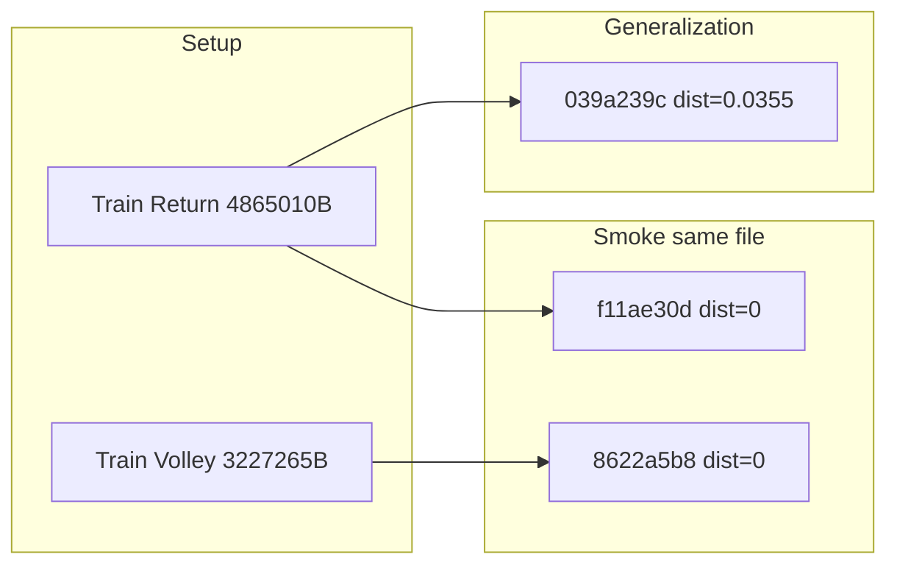
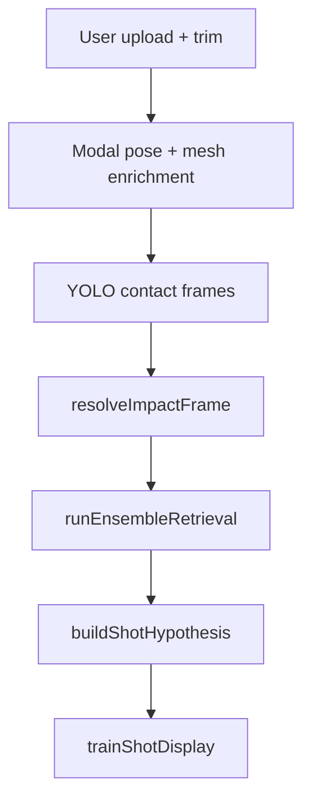

# Shot retrieval system — senior dev validation handover

**Audience:** Senior dev onboarding to shot retrieval, pro library growth, and E2E validation.

**Session under test:** 2026-06-24 user-flow with a two-label pro library (Forehand Return + Forehand Volley).

**Detailed session appendix:** [SHOT-E2E-VALIDATION-SESSION.md](./SHOT-E2E-VALIDATION-SESSION.md)

**Neon artifacts (no credentials in docs):**

- [server/scripts/_e2e_session_investigation.json](../server/scripts/_e2e_session_investigation.json) — last query `2026-06-28T20:34:29Z`
- [server/scripts/_e2e_bench_results.json](../server/scripts/_e2e_bench_results.json) — steps 1, 2, 5
- [server/scripts/_e2e_pose_mesh_compare.json](../server/scripts/_e2e_pose_mesh_compare.json) — MediaPipe + mesh landmark compare for submission C vs pro library (`2026-06-28T20:40:45Z`)

**Related docs:**

| Doc | Use when |
|-----|----------|
| [SHOT-E2E-VALIDATION-SESSION.md](./SHOT-E2E-VALIDATION-SESSION.md) | Per-submission metrics, repro commands |
| [SHOT-RETRIEVAL-INVESTIGATION.md](./SHOT-RETRIEVAL-INVESTIGATION.md) | Ongoing playbook for any shot / latest upload |
| [SHOT-PIPELINE-VALIDATION.md](./SHOT-PIPELINE-VALIDATION.md) | Code audit findings F1–F10 (predates ensemble mode) |
| [guide/03-mesh-retrieval.md](./guide/03-mesh-retrieval.md) | Architecture: Modal → pgvector → display |
| [TRAIN-DATA-CURATION-GUIDE.md](./TRAIN-DATA-CURATION-GUIDE.md) | Picking pro clips (torso-normalized separation) |
| [PER-LABEL-TEST-CHECKLIST.md](./PER-LABEL-TEST-CHECKLIST.md) | Smoke + generalization test per label |
| [OPTIONAL-NEGATIVE-TESTS.md](./OPTIONAL-NEGATIVE-TESTS.md) | Volley gen + negative tests before scale |
| [SENIOR-DEV-HANDOFF-PACKAGE.md](./SENIOR-DEV-HANDOFF-PACKAGE.md) | One-page index for senior dev |

---

## Executive verdict

The shot retrieval pipeline is **working end-to-end** for:

1. **Pipeline smoke** — same training file re-analyzed (submissions A and B); distance **0** proves indexing + query path.
2. **One real generalization case** — submission C (`039a239c`): different Return video, distance **0.0355**, clear margin over the only other label.

**Do not trust UI correctness alone.** A correct label with distance **0** means the analyze MP4 is the same bytes as a training upload (memorization), not cross-video generalization.

Production retrieval mode in stored metrics: **`ensemble`** (10 pose + 10 mesh sequence probes). Set `RETRIEVAL_EMBEDDING_MODE=ensemble` in server/Railway env.

---

## Validation status (honest summary)

| Area | Status |
|------|--------|
| Pipeline train → index → analyze → UI | **Validated** (smoke A/B, distance 0) |
| Cross-video generalization | **Once** — Return only (`039a239c`); Volley different-file **not yet tested** |
| False positives reviewed | **Yes** — distance 0, binary library, LOOCV, LLM echo, pose-only volley |
| MediaPipe + mesh forensics | **Yes** — [\_e2e_pose_mesh_compare.json](../server/scripts/_e2e_pose_mesh_compare.json) |
| Accuracy at 10–20 similar shots | **Not validated** — needs curated train data + per-label different-file tests |
| LOOCV as quality metric | **Not yet** — need ≥2 different videos per label |

**Not validated yet:** Volley generalization, intentional wrong-shot negative test, similar forehand confusion, systematic left-handed coverage. See [OPTIONAL-NEGATIVE-TESTS.md](./OPTIONAL-NEGATIVE-TESTS.md).

**Next work:** [TRAIN-DATA-CURATION-GUIDE.md](./TRAIN-DATA-CURATION-GUIDE.md) → [PER-LABEL-TEST-CHECKLIST.md](./PER-LABEL-TEST-CHECKLIST.md) → hand off via [SENIOR-DEV-HANDOFF-PACKAGE.md](./SENIOR-DEV-HANDOFF-PACKAGE.md).

---

## What we tested (corrected design)

| Phase | Analysis ID | File bytes | Top distance | What it proves |
|-------|-------------|------------|--------------|----------------|
| Setup | 2 train samples | — | — | Per-frame ensemble indexing (40 v2 + 40 sam_v1 rows each) |
| **A — smoke** | `8622a5b8` | 3,227,265 = volley train | **0** | Volley channel wired; **not** generalization |
| **B — smoke** | `f11ae30d` | 4,865,010 = return train | **0** | Return channel wired; **not** generalization |
| **C — real** | `039a239c` | **4,952,003** ≠ train 4,865,010 | **0.0355** | Cross-video match to Forehand Return |

**Also in Neon (not generalization evidence):**

- `5adcdd76` — repeat volley smoke (same 3,227,265 bytes as train)
- `f6406c56` — duplicate of C (same 4,952,003 bytes, identical retrieval)



---

## User-facing outcomes (A / B / C)

What the app showed the user and what Neon stored in `technique_analysis.metrics` (source: [\_e2e_session_investigation.json](../server/scripts/_e2e_session_investigation.json)).

| Test | Video intent | Display shot (UI title) | AI score | Hypothesis conf | Top neighbor / distance | Pose vote | Mesh vote | LLM `shot_context` | Evidence quality |
|------|--------------|-------------------------|----------|-----------------|-------------------------|-----------|-----------|-------------------|------------------|
| **A** | Same volley MP4 as train | **Forehand Volley** | 81 | 0.80 | Volley train · **0** | Volley 0.45 | Volley **0.92** | Pro library match: Forehand Volley. | Smoke — mesh carried weak pose |
| **B** | Same return MP4 as train | **Forehand Return** | 72 | 0.92 | Return train · **0** | Return 0.88 | Return 0.78 | Pro library match: Forehand Return. | Smoke — both channels strong |
| **C** | Different person, return stroke | **Forehand Return** | 78 | 0.81 | Return train · **0.0355** (Volley 0.2145) | Return 0.76 | Return 0.65 | Pro library match: Forehand Return. | **Generalization** — non-zero distance, gap 0.179 |

All three: `embedding_source: ensemble`, `channel_agreement: true`, `library_fallback: false`. The LLM follows retrieval (`llm_disagrees_retrieval: false`) — it is not an independent label check.

**Handoff one-liner:** Start here, then read [SHOT-E2E-VALIDATION-SESSION.md](./SHOT-E2E-VALIDATION-SESSION.md) for per-submission detail. Tests A/B prove the pipeline (distance 0); test C (`039a239c`) is the only generalization proof.

---

## Why submission C got it right

Analysis `039a239c-662e-4423-aeab-49dd083a1720` is the **only result worth trusting** as library generalization proof.

| Signal | Value |
|--------|-------|
| Technique video | `11971ebc…` — **4,952,003 bytes** (train Return = 4,865,010) |
| Impact | Frame **61** on 160-frame clip, source `yolo_median` |
| Mode | `embedding_source: ensemble`, 10 pose + 10 mesh probes |
| Top neighbor | Return train `4132cf12…` @ **0.0355** |
| #2 neighbor | Volley train `31950f20…` @ **0.2145** |
| Distance gap | **0.179** |
| Pose / mesh vote | Both Forehand Return (conf 0.76 / 0.65) |
| `channel_agreement` | **true** |
| Hypothesis confidence | **0.81** (above 0.35 display threshold) |
| Admin bench `5_analysis_audit` | **Pass** 100% |

**Why this is trustworthy:**

1. Non-zero distance — cannot be trivial file reuse.
2. Top hit is the correct trained Return clip, not Volley.
3. Both channels agree; mesh did not override a conflicting pose vote.
4. Clear margin over the only other library label (both forehand-family shots).
5. YOLO impact alignment — not legacy clip-end frame bug.

---

## MediaPipe and mesh points — submission C vs pro library

Pulled from Neon via [server/scripts/_e2e_pose_mesh_compare.mjs](../server/scripts/_e2e_pose_mesh_compare.mjs) (uses `DATABASE_URL` from [server/.env](../server/.env); auto-retries on `ENOTFOUND`).

### User upload (submission C, `039a239c`)

| Field | Value |
|-------|-------|
| Video bytes | 4,952,003 (different from train Return) |
| MediaPipe `pose_data` | **160 frames** (full clip, stride 1) |
| Impact frame | **61**, source `yolo_median` (24 YOLO contact frames in clip) |
| Mesh enrichment | **10 frames** (70–79), provider `sam3d`, conf 0.90–0.92 |
| Mesh at exact impact (61) | **None** — mesh window is offset from YOLO impact (expected; ensemble probes indexed window) |
| Retrieval | ensemble, 10 pose + 10 mesh probes; top neighbor Return @ **0.0355** |

**Impact-phase key joints (MediaPipe, normalized x/y/z):** compact forehand prep — both wrists forward (~x 0.31/0.30), shoulders ~0.44/0.39, hips ~0.50/0.46. See full coordinates in JSON.

### Pro library — Forehand Return train (`4132cf12`)

| Field | Value |
|-------|-------|
| Train video bytes | 4,865,010 |
| `pose_sequence` | 80 frames, stride **1**, impact frame **40** |
| Mesh enrichment | **40 frames** (20–59 window), mesh at impact conf **0.75** |
| Body at impact | Similar forehand family — wrists ~0.46/0.33, open stance |

### Pro library — Forehand Volley train (`31950f20`)

| Field | Value |
|-------|-------|
| Impact frame | **49** |
| Body at impact | **Very different geometry** — volley compact: RIGHT_WRIST x **0.81**, LEFT_WRIST x **0.69**, shoulders higher (y ~0.46–0.48) |
| Mesh at impact | conf **0.91** |

### Single-frame pose similarity at impact (MediaPipe embedding)

Computed from stored landmarks at each side's `impact_frame_resolved`:

| Compared to submission C @ frame 61 | Pose cosine distance |
|-------------------------------------|----------------------|
| Forehand Return train @ frame 40 | **0.075** (close) |
| Forehand Volley train @ frame 49 | **0.950** (far) |

Even **before** the 10-frame ensemble vote, MediaPipe body pose at impact is much closer to Return than Volley. The ensemble aggregate (distance **0.0355** vs Return, **0.2145** vs Volley) reinforces that signal across the contact window.

**Takeaway:** Submission C is not a file-identity match (different bytes), and the underlying pose/mesh geometry aligns with the Return pro clip, not the Volley clip. Volley train landmarks at impact look like a net volley (arms extended forward/up), which is visually and numerically distinct from the user's return stroke.

Re-run:

```powershell
cd server
pnpm exec tsx scripts/_e2e_pose_mesh_compare.mjs
```

---

## False positives and weak evidence

Even when the UI shows the right shot:

| Risk | This session |
|------|----------------|
| Distance 0 | Submissions A and B — same MP4 as training upload |
| Two-label library | Binary choice between similar forehand shots is easy |
| Volley smoke (A) | Pose conf **0.45**; mesh **0.92** carried the ensemble vote |
| LLM echo | `shot_context` = "Pro library match: …" — not independent validation |
| LOOCV 0/2 top-1 | Expected with N=1 sample per label; **not** a user-quality regression |

LOOCV detail: when each label has one train sample, leave-one-out leaves only the *other* label as neighbor (~0.073 apart). Both forehand shots swap predictions. Do not interpret LOOCV fail as broken retrieval until **≥2 different videos per label**.

---

## How the system works today



| Stage | Code | Notes |
|-------|------|-------|
| Analyze order | [techniqueRouter.ts](../server/src/technique/techniqueRouter.ts) | YOLO before impact sequence |
| Impact frame | [resolveImpactFrame.ts](../server/src/technique/resolveImpactFrame.ts) | `yolo_median` → `clip_center` → legacy |
| Ensemble k-NN | [trainRetrieval.ts](../server/src/technique/trainRetrieval.ts) | `runEnsembleRetrieval` — dual-channel sequence vote |
| Display gate | [trainShotDisplay.ts](../server/src/train/trainShotDisplay.ts) | conf ≥ 0.35, gap ≥ 0.02 |
| Pro train | [train_modal_app.py](../train_modal_app.py) | stride 1, YOLO on, contact-centered window |
| Embeddings | [poseEmbedding.ts](../server/src/technique/poseEmbedding.ts), [meshEmbedding.ts](../server/src/technique/meshEmbedding.ts) | 40 frames/sample, `frameIndex` column |

**Ensemble vs blended:** [SHOT-PIPELINE-VALIDATION.md](./SHOT-PIPELINE-VALIDATION.md) F1 documents a blended-query vs pure-index bug. Production now uses **`ensemble`** mode, which runs separate pose and mesh channel k-NN and aggregates votes. Do not revert to `blended` without re-indexing.

---

## Admin testing guide

### UI path

1. Open app **Admin Hub**
2. **Training accuracy** — [AdminAccuracy.tsx](../app/src/screens/AdminAccuracy.tsx) — legacy accuracy tiles; link to retrieval bench at bottom
3. **Retrieval bench** — [AdminRetrievalBench.tsx](../app/src/screens/AdminRetrievalBench.tsx):
   - Browse recent submissions (search by username)
   - Select an analysis (use `039a239c…` for generalization audit)
   - Run bench steps; green tile = score ≥ 60%

### Six bench steps

Defined in [retrievalBench.ts](../server/src/adminAccuracy/retrievalBench.ts):

| Step | Purpose | This session |
|------|---------|--------------|
| `1_library_ready` | Embedding counts + thin labels | **Pass** — 80 v2 · 80 sam_v1 |
| `2_loocv` | Leave-one-out on train library | **Fail** 0/2 — only 2 samples |
| `3_blend` | Blend weight sweep | N/A in ensemble mode |
| `4_mesh_train` | Mesh coverage on train samples | Run when adding clips |
| `5_analysis_audit` | Replay eval for selected submission | **Pass** on `039a239c` |
| `6_fallbacks` | Low-confidence / fallback paths | Run after library growth |

**Step 5 workflow:** Select submission → run `5_analysis_audit` → verify `top_k_neighbors`, `distance_gap`, `channel_agreement`, `embedding_source: ensemble`.

### HTTP API (same as UI)

Requires `ADMIN_TRAIN_SECRET` header and server at `BETTER_AUTH_URL`:

```bash
# List bench steps
curl -s -H "X-Admin-Train-Secret: $ADMIN_TRAIN_SECRET" \
  "$BETTER_AUTH_URL/train/admin/accuracy/bench/steps"

# Recent submissions
curl -s -H "X-Admin-Train-Secret: $ADMIN_TRAIN_SECRET" \
  "$BETTER_AUTH_URL/train/admin/accuracy/bench/submissions?limit=10"

# Run library ready
curl -s -X POST -H "X-Admin-Train-Secret: $ADMIN_TRAIN_SECRET" \
  "$BETTER_AUTH_URL/train/admin/accuracy/bench/run/1_library_ready"

# Run analysis audit (step 5)
curl -s -X POST -H "Content-Type: application/json" \
  -H "X-Admin-Train-Secret: $ADMIN_TRAIN_SECRET" \
  -d '{"analysisId":"039a239c-662e-4423-aeab-49dd083a1720"}' \
  "$BETTER_AUTH_URL/train/admin/accuracy/bench/run/5_analysis_audit"
```

Local script mirror (uses `DATABASE_URL` from [server/.env](../server/.env)):

```powershell
cd server
$env:ANALYSIS_ID="039a239c-662e-4423-aeab-49dd083a1720"
$env:BENCH_STEPS="1_library_ready,2_loocv,5_analysis_audit"
pnpm exec tsx scripts/_run_bench_steps.mjs
```

---

## Multi-round investigation protocol

Run after each pro-library batch or pipeline change. **Scripts auto-retry Neon** on `ENOTFOUND` / connection errors (see [server/scripts/_neon_retry.mjs](../server/scripts/_neon_retry.mjs) — up to 4 attempts, backoff 2.5s × attempt).

| Round | Script | Check |
|-------|--------|-------|
| **R1** Library health | `_db_sanity.mjs`, `audit_retrieval_coverage.mjs` | pgvector, `frameIndex`, thin labels |
| **R2** Bytes parity | `_compare_train_technique_bytes.mjs` | Same-file vs different-file uploads |
| **R2b** Pose/mesh landmarks | `_e2e_pose_mesh_compare.mjs` | MP key joints + mesh windows vs pro library |
| **R3** Submission forensics | `_e2e_session_investigation.mjs` | Full `metrics.retrieval` per analysis |
| **R4** Admin bench | `_run_bench_steps.mjs` or UI | Min steps 1 + 5; add 2_loocv when ≥2 samples/label |
| **R5** Live API | `_curl_recent_two.mjs` (optional) | App-visible shot + correction context |

Full one-liner (PowerShell, from `server/`):

```powershell
pnpm exec tsx scripts/_e2e_session_investigation.mjs
pnpm exec tsx scripts/_compare_train_technique_bytes.mjs
pnpm exec tsx scripts/_e2e_pose_mesh_compare.mjs
$env:ANALYSIS_ID="039a239c-662e-4423-aeab-49dd083a1720"
$env:BENCH_STEPS="1_library_ready,2_loocv,5_analysis_audit"
pnpm exec tsx scripts/_run_bench_steps.mjs
```

If any script fails with `getaddrinfo ENOTFOUND`, re-run that script — `_neon_retry.mjs` will retry automatically (or run again manually).

---

## Anomalies and open items

| Item | Impact | Action |
|------|--------|--------|
| `technique_analysis_overview` view missing on Neon | `_recent_submissions.mjs` may fail | Apply migration [0030](../server/drizzle/0030_technique_analysis_overview_view.sql) or use `_e2e_session_investigation.mjs` |
| LOOCV 0/2 with 2-sample library | Looks like failure in admin UI | Expected; document, don't panic |
| Blended mode F1 ([pipeline doc](./SHOT-PIPELINE-VALIDATION.md)) | Wrong neighbors if env reverted | Keep `RETRIEVAL_EMBEDDING_MODE=ensemble` |
| Pose-only fragility on volley | Would fail without mesh channel | Monitor `channel_agreement` and per-channel confidences |
| Neon DNS intermittency | Scripts fail first attempt | Retry (see R1–R4) |

---

## Scaling risk register

As you upload more pro clips and labels:

1. **≥2 different videos per label** before trusting LOOCV or reporting top-1 accuracy.
2. **Two test types per label:** (A) same-file smoke, (B) different-file generalization — **only B counts**.
3. **Similar preset families** — Return vs Volley gap (~0.18 today) may shrink as library grows; watch `neighbor_distance_gap`.
4. **Re-extract after pipeline changes** — `POST /train/reextract`, not embeddings backfill alone.
5. **Run `1_library_ready`** after every train batch upload.
6. **Monitor** `channel_agreement`, `mesh_confidence`, and whether pose-alone would have failed.
7. **Do not expand library** on distance-0 smoke tests alone.

---

## Artifact index

| Output | Path |
|--------|------|
| Full session metrics | `server/scripts/_e2e_session_investigation.json` |
| Bench step results | `server/scripts/_e2e_bench_results.json` |
| Pose/mesh landmark compare | `server/scripts/_e2e_pose_mesh_compare.json` |
| Neon retry helper | `server/scripts/_neon_retry.mjs` |
| Bytes compare (stdout) | `server/scripts/_compare_train_technique_bytes.mjs` |

**Env vars referenced (names only):** `DATABASE_URL`, `ADMIN_TRAIN_SECRET`, `BETTER_AUTH_URL`, `RETRIEVAL_EMBEDDING_MODE`, `MESH_IMPACT_WINDOW`, `POSE_SEQUENCE_WINDOW`.

**Key analysis IDs:**

- Smoke volley: `8622a5b8-b76b-492d-b438-99e679ccb261`
- Smoke return: `f11ae30d-34a7-4665-86a8-a6e876626e3e`
- **Generalization:** `039a239c-662e-4423-aeab-49dd083a1720`

**Train sample IDs:**

- Forehand Return: `4132cf12-613e-4bad-8f81-517b39e6f29c`
- Forehand Volley: `31950f20-dfe8-49c8-a7d7-412604c48a4f`
