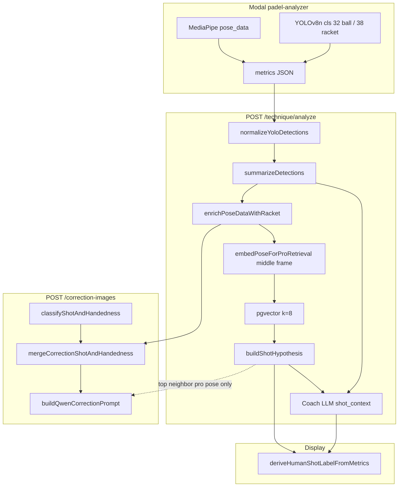
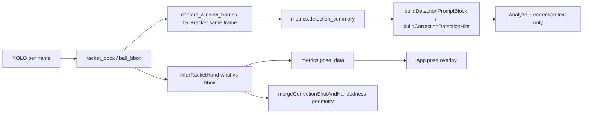
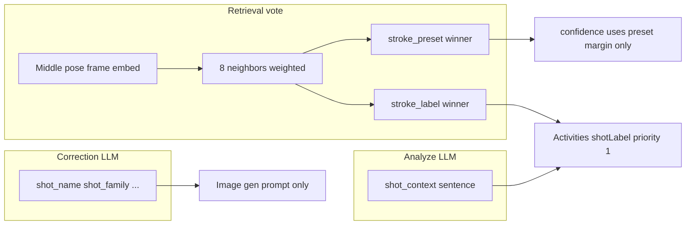

# Shot detection and label pairing — investigation

**Date:** 2026-05-30  
**Environment:** Local server (`localhost:3050`), Neon DB via `server/.env`  
**Method:** Live SQL + HTTP verification (no new unit tests, no code changes)

---

## Executive summary

Correction images and Activities titles feel “off” because **three independent systems** assign shot meaning, and **YOLO is not one of them for stroke taxonomy**.

| System | What it classifies | Used for |
|--------|-------------------|----------|
| **YOLO (Modal)** | Ball + racket boxes only | `racket_hand`, overlay, LLM *hints* (`contact_window_frames`) |
| **k-NN retrieval** | Pro-library neighbor → `shot_hypothesis` | Activities `shotLabel`, analyze LLM primary hint |
| **Analyze LLM** | Free-text `shot_context` | Coach copy, fallback display label |
| **Correction LLM** | Structured `classifyShotAndHandedness` | Comfy/Gemini prompt only (third vote) |

**Root causes confirmed on real data:**

1. **Preset vs label split** in `buildShotHypothesis` — human title and taxonomy bucket are voted separately; they often disagree (e.g. label “Por Cuatro Smash”, preset `half_volley`).
2. **YOLO contact frames ≠ user impact** on long clips — `contact_window_frames` cluster at video start while user impact is at clip end (deltas of 300–986 frames observed).
3. **Three label pipelines disagree** — Activities title, coach `shot_context`, and correction classifier frequently name different shots for the same analysis.
4. **YOLO does not fix shot type** — it only helps handedness geometry (~30–44% of pose frames have `racket_hand`); sparse racket detection pushes handedness to profile/LLM.

Theory before coding: **do not tune Comfy prompts or YOLO thresholds until label source-of-truth and contact timing are aligned.**

---

## Architecture

### End-to-end (analyze → display → corrections)



### YOLO’s actual role (not shot taxonomy)



**YOLO never writes `shot_hypothesis` or `stroke_label`.**

### Shot label pairing (three voters)



---

## Local env snapshot (verified)

| Variable | Value |
|----------|-------|
| Server | `http://localhost:3050` — HTTP 200 |
| `YOLO_DETECTION_ENABLED` | `true` |
| `YOLO_DETECTION_WRITE_ENABLED` | `true` |
| `YOLO_DETECTION_CONFIDENCE` | `0.08` |
| `YOLO_RACKET_CONFIDENCE` | `0.01` |
| `YOLO_BALL_CONFIDENCE` | `0.10` |
| `COMFYUI_BASE_URL` | `http://127.0.0.1:8188` |
| `XEVO_TEXT_PROVIDER` | `xevo` |

Recent analyses (n=30): **all** had `detection_summary.enabled=true` and non-zero `detected_frames`.  
`technique_detection_frame`: **108,378 rows** across **107 analyses** (table is populated but **never read** by server TS).

---

## Issue catalog

| ID | Issue | Severity | User surface |
|----|-------|----------|--------------|
| I1 | YOLO ≠ shot classifier; team assumptions often target wrong layer | High | Misdirected fixes |
| I2 | `contact_window_frames` vs user impact frame diverge on long videos | High | Wrong contact hints in LLM + correction prompts |
| I3 | `buildShotHypothesis` splits preset vs label votes | High | Activities title vs category vs pro neighbor |
| I4 | Middle-frame k-NN vs user trim / impact at clip end | High | Wrong pro neighbor → wrong label |
| I5 | Three label pipelines (retrieval, analyze LLM, correction LLM) | High | Title vs coach text vs image prompt |
| I6 | `racket_hand` on ~30–44% of pose frames | Medium | Handedness falls back to profile |
| I7 | `technique_detection_frame` write-only | Low | Hard to debug without SQL |
| I8 | Missing `docs/YOLO_*.md` referenced in README | Low | Ops gap |
| I9 | Coarse `strokePreset` buckets (many labels → one preset) | Medium | k-NN cannot distinguish fine shots |
| I10 | `correctLikelyFalseOverheadShotContext` only patches `shot_context` | Medium | Retrieval hypothesis unchanged |

**Key code paths:**

- YOLO ingest: `server/src/technique/techniqueRouter.ts` (~243–494)
- Hypothesis: `server/src/technique/trainRetrieval.ts` (`buildShotHypothesis`)
- Embedding frame: `server/src/technique/poseEmbedding.ts` (`embedPoseForProRetrieval` — middle frame)
- Display label: `server/src/train/trainShotDisplay.ts`
- Correction shot: `server/src/technique/correctionPrompt.ts`

---

## Hypothesis verification (pass/fail)

| # | Hypothesis | Result | Evidence |
|---|------------|--------|----------|
| H1 | Local YOLO disabled → empty detection | **FAIL** (not the issue locally) | All 30 recent rows: `yolo_enabled=true`, detections present |
| H2 | YOLO contact frames far from impact | **PASS** | See contact_delta table below; many clips 300–986 frames off |
| H3 | Sparse `racket_hand` → weak geometry handedness | **PASS** | 30–44% pose rows with `racket_hand`; corrections use `user_profile_dominant_hand` |
| H4 | Thresholds cause false “no contact” | **FAIL** (locally) | Contact lists populated; issue is **wrong frame region**, not empty YOLO |
| H5 | Preset/label split → wrong titles | **PASS** | Multiple rows: label ≠ preset semantics; top neighbor preset ≠ hyp preset |
| H6 | High conf but wrong label (middle-frame) | **PARTIAL** | Low conf common; label vote can win while preset/category wrong |
| H7 | `shot_context` contradicts `shot_hypothesis` | **PASS** | e.g. half volley vs defence_glass on same analysis |
| H8 | Correction classifier ≠ Activities title | **PASS** | e.g. Activities “Por Cuatro Smash” vs correction “Half-Volley” |

### YOLO contact vs impact frame (sample)

| Analysis ID | Impact frame | Nearest YOLO contact | Delta (frames) | Notes |
|-------------|-------------|----------------------|----------------|-------|
| `0d7313a7-…` | 59 | 58 | **1** | Short clip — YOLO aligns |
| `7ff40f54-…` | 355 | 0–23 | **332** | Long video — contact at start |
| `ee64a055-…` | 366 | 0–23 | **343** | Same pattern |
| `5a3c3f89-…` | 839 | 3–39 | **800** | Impact at end, YOLO at start |
| `80db424f-…` | 1019 | 2–33 | **986** | Same pattern |
| `633c5cbb-…` | 52 | 0–28 | **24** | Moderate drift |

**Interpretation:** On full-length uploads, YOLO “contact” frames reflect **early-rally ball+racket co-detection**, not the user-marked impact. Those frame numbers are injected into analyze and correction LLM prompts as “likely contact” — misleading on long clips.

### Preset vs label split (sample)

| Analysis ID | `stroke_label` (display) | `stroke_preset` (hyp) | Top neighbor preset | LLM `shot_context` (abbrev) |
|-------------|---------------------------|------------------------|---------------------|----------------------------|
| `0d7313a7-…` | Por Cuatro Smash | `half_volley` | `forehand_lob` | “controlled net shot (half-volley)” |
| `ee64a055-…` | Forehand Half Volley | `back_wall_forehand` | `half_volley` | “defensive glass shot (defence_glass)” |
| `7ff40f54-…` | Forehand Half Volley | `back_wall_forehand` | `half_volley` | “net play … forehand half-volley” |
| `6534b76c-…` | Vibora | `forehand_drive` | `backhand_volley` | “groundstroke return … drive or chiquita” |
| `5a3c3f89-…` | Backhand Volley 1 | `backhand_volley` | `contrapared_boast` | “backhand volley” (LLM agrees; k-NN neighbor differs) |

---

## Case studies (3+ concrete mismatches)

### Case A — `0d7313a7-b9ca-41ea-91ca-b9dc59775905`

| Source | Value |
|--------|-------|
| Activities `shotLabel` | **Por Cuatro Smash** |
| `shot_hypothesis` | label Por Cuatro Smash, preset `half_volley`, conf **0.30** |
| `shot_context` | “controlled net shot (**half-volley**)” |
| Correction classifier | **Half-Volley** (Net Play) |
| YOLO contact delta | 1 frame (short clip — timing OK) |

**Diagnosis:** Label/preset split + low retrieval confidence. Display uses retrieval label (“Smash”); LLM and correction agree on half-volley. **Image gen prompt follows correction LLM, not Activities title.**

**Hypotheses:** H5, H7, H8.

---

### Case B — `ee64a055-068e-4d43-a555-452f977f0d58`

| Source | Value |
|--------|-------|
| Activities `shotLabel` | **Forehand Half Volley** |
| `shot_hypothesis` | preset `back_wall_forehand`, category `defence_glass`, conf **0.31** |
| `shot_context` | “**defensive glass shot** (defence_glass) … back wall” |
| Top neighbor | Forehand Half Volley / `half_volley` |
| YOLO contact delta | **343 frames** |

**Diagnosis:** Preset vote (`back_wall_forehand`) drives category while label vote keeps “Half Volley”. LLM follows category/defence_glass. YOLO contact hints point at frames 0–23, not impact ~366.

**Hypotheses:** H2, H5, H7.

---

### Case C — `5a3c3f89-d5ef-44c5-902e-ca58468dabe3`

| Source | Value |
|--------|-------|
| Activities `shotLabel` | **Backhand Volley 1** |
| `shot_hypothesis` | conf **0.022** (essentially no preset margin) |
| Top neighbor | **Drop Shot backhand** / `contrapared_boast` |
| `shot_context` | “backhand volley” (LLM confident) |
| YOLO contact delta | **800 frames** |

**Diagnosis:** k-NN weak (very low confidence); label vote wins from weighted neighbors but top-1 neighbor is a different shot. LLM overrides with volley text. Retrieval should not be trusted at conf &lt; 0.35 but label still shown in Activities.

**Hypotheses:** H2, H6, H7.

---

### Case D — `6534b76c-d6f3-46f5-a91c-ce9ad4ee465e` (correction images)

| Source | Value |
|--------|-------|
| Activities `shotLabel` | **Vibora** |
| Correction classifier | generic **forehand** groundstroke |
| `shot_context` | “drive or chiquita” |
| YOLO contact delta | **861 frames** |

**Diagnosis:** Correction LLM collapses to generic forehand; Comfy prompt loses specific stroke. Top neighbor preset `backhand_volley` vs hyp preset `forehand_drive`.

**Hypotheses:** H2, H5, H8.

---

## HTTP verification (curl / fetch)

Run against local API with session bearer token from `session` table:

```bash
curl -s -H "Authorization: Bearer TOKEN" \
  "http://localhost:3050/technique/analysis/ANALYSIS_ID" \
  | jq '{hyp: .metrics.retrieval.shot_hypothesis, shot_context: .metrics.ai_analysis.en.shot_context, detection: .metrics.detection_summary}'

curl -s -H "Authorization: Bearer TOKEN" \
  "http://localhost:3050/technique/analysis/ANALYSIS_ID/correction-images" \
  | jq '.correction_context.shot_and_handedness.shot // .correction_context_comfy.shot_and_handedness.shot'
```

**Results (2026-05-30):**

- `GET /technique/analysis/:id` — **200** for Cases A–C; metrics match SQL.
- `GET /correction-images` — Case A returns correction shot **Half-Volley**; B/C have no cached correction context in comfy path.
- `GET /technique/activities` — empty for token user when analyses belong to another user (ownership filter); display labels verified via `deriveHumanShotLabelFromMetrics` in `server/scripts/_display_labels.ts`.

**Re-run helpers:**

```bash
cd server
node scripts/_investigate_shot_yolo.mjs    # SQL → scripts/_investigate_output_clean.json
node scripts/_curl_verify.mjs              # HTTP → scripts/_curl_verify.json
npx tsx scripts/_display_labels.ts         # Activities shotLabel simulation
```

---

## SQL verification runbook

```sql
-- Recent analyses + YOLO + hypothesis
SELECT id,
  metrics->'retrieval'->'shot_hypothesis' AS hyp,
  metrics->'ai_analysis'->'en'->>'shot_context' AS shot_context,
  metrics->'detection_summary'->>'enabled' AS yolo_enabled,
  metrics->'detection_summary'->'contact_window_frames' AS yolo_contact,
  metrics->'impact_pose_sequence' AS impact_seq
FROM technique_analysis
WHERE status = 'completed'
ORDER BY "createdAt" DESC
LIMIT 30;

-- racket_hand coverage
SELECT id,
  (SELECT count(*)::int FROM jsonb_array_elements(metrics->'pose_data') p
   WHERE p->>'racket_hand' IS NOT NULL) AS with_racket_hand,
  jsonb_array_length(metrics->'pose_data') AS total_pose
FROM technique_analysis
WHERE status = 'completed'
ORDER BY "createdAt" DESC LIMIT 20;

-- Per-frame YOLO (debug only; not exposed via API)
SELECT frame, label, confidence
FROM technique_detection_frame
WHERE "analysisId" = 'ANALYSIS_ID'
ORDER BY frame;
```

---

## Theory-first fix options (no code in this phase)

Ranked by evidence strength and blast radius:

### 1. Unify shot label for display + correction (high impact)

**Problem:** Activities uses `shot_hypothesis.stroke_label`; Comfy uses separate `classifyShotAndHandedness`.  
**Direction:** Single resolved shot object after analyze: prefer LLM `shot_context` when retrieval conf &lt; 0.35; else retrieval label; pass same object into correction prompt instead of re-classifying.  
**Validates:** Cases A, D.

### 2. Fix YOLO contact hint to use clip-local contact (high impact)

**Problem:** `contact_window_frames` spans full video; user impact is at `user_clips[0].endMs`.  
**Direction:** Filter contact frames to clip window; or pick contact frame nearest impact; or drop contact list from prompt when delta &gt; N frames.  
**Validates:** H2 on Cases B, C, D.

### 3. Joint preset+label in `buildShotHypothesis` (medium impact)

**Problem:** Preset winner sets category/confidence; label winner sets display string — can contradict.  
**Direction:** Require label and preset from same neighbor cluster; or derive display label from preset winner’s dominant label.  
**Validates:** H5 on Cases A, B.

### 4. Clip-window or impact embedding for k-NN (medium impact, higher risk)

**Problem:** Middle frame of full video ≠ stroke at user trim.  
**Direction:** Embed pose at impact frame or mean embedding across `user_clips` window; re-index train library consistently.  
**Validates:** H6; needs train parity check (`poseEmbedding.ts` comment warns about train/user trim mismatch).

### 5. Gate Activities label on retrieval confidence (low effort)

**Problem:** conf 0.02 still shows neighbor-derived label.  
**Direction:** If conf &lt; 0.35, show `shot_context` first sentence instead of `stroke_label`.  
**Validates:** Case C.

### 6. Wire YOLO into correction frame pick only (lower priority)

**Problem:** Correction frames sorted by impact, but YOLO not used for selection.  
**Direction:** Prefer frames with racket bbox near impact when picking `framesToGenerate` — helps pixels/handedness, **not** stroke name.

### 7. Read `technique_detection_frame` in debug API (ops)

Expose read path or admin endpoint for overlay/debug without scraping SQL.

---

## What not to do yet

- Do not lower/raise YOLO thresholds expecting better **shot names** — YOLO does not classify strokes.
- Do not tune Comfy/Qwen prompts until correction shot JSON aligns with resolved analyze shot.
- Do not add new unit tests as a substitute for clip-level verification on known-bad IDs.

---

## Related docs

- [comfy-imagegen.md](../comfy-imagegen.md) — correction image pipeline
- [Workflows/IMAGE-GEN.md](../Workflows/IMAGE-GEN.md) — runtime image gen matrix
- [arch.md](../arch.md) — screen → API → DB map

---

## Next step (implementation plan)

After review of this document, pick **one** track:

1. **Label unification** (analyze → display → correction cascade)  
2. **YOLO contact alignment** (clip-local contact hints + optional frame pick)  
3. **Retrieval hypothesis refactor** (joint vote + confidence gating)

Each track should be scoped with before/after verification on Cases A–D above.
