# Mobile codebase walkthrough — Screens → routes → DB

Vol. 1: map every user-facing screen to its API calls and Neon tables. Per-screen UI architecture and flow diagrams come in later volumes.

**Entry:** authenticated shell in `app/src/main.tsx` (`MainStack` → `MainTabsLayout` → bottom tabs). Types in `app/src/navigation/types.ts`.

> **In plain terms:** After sign-in, the app opens a shell with a top header (logo, profile, notifications) and five bottom tabs. Every tab is a different “mode” — record a shot, see history, track trends, view your profile, or (if you’re a **human reviewer**) manage your player roster.

**User flow:**

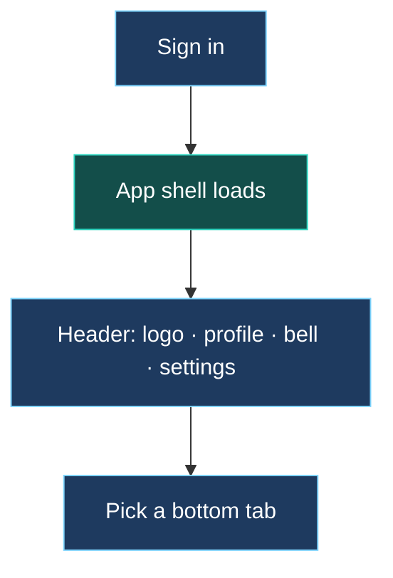

**Legend (mermaid colours):**

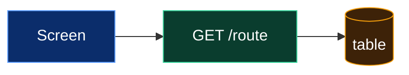

---

## Bottom tab bar (`MainTabParamList`)

> **In plain terms:** These are the main destinations players tap between. **AI Analysis** is where you film or upload a shot and get scored. **Activities** is your session history. **Progress** shows whether you’re training consistently and how scores trend. **You** is your player card — photo, ratings, and calendar. **Human Review** only appears for accounts flagged as human reviewers; it’s their player roster and agency human input queue.

**User flow:**

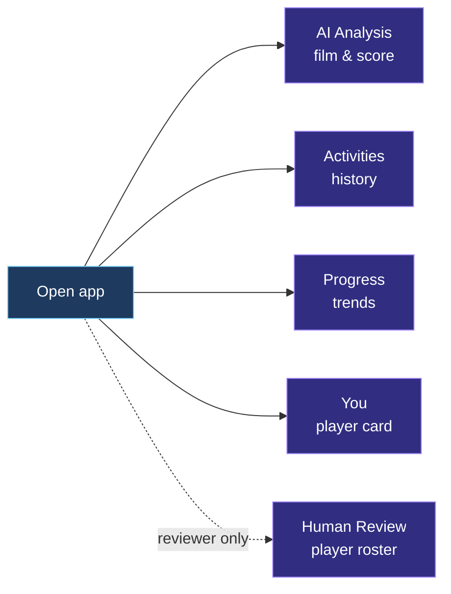

| Tab (UI label) | Route name | Screen file | Visible when |
|----------------|------------|-------------|--------------|
| AI Analysis | `AICoach` | `app/src/screens/technique.tsx` | always (default tab) |
| Human Review | `MyCoach` | `app/src/screens/MyCoachScreen.tsx` | `user_profile.coachStudentRole = 'coach'` only |
| Activities | `Activities` | `app/src/screens/Activities.tsx` | always |
| Progress | `Progress` | `app/src/screens/Progress.tsx` | always |
| You | `You` → `YouMain` | `app/src/screens/Profile.tsx` | always |

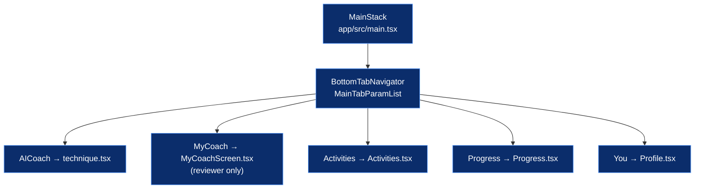

---

## Shared session layer (`app/src/context/SessionDataContext.tsx`)

> **In plain terms:** Instead of every tab hitting the server on its own, one shared layer loads your **past sessions**, **weekly pillar scores**, and **basic profile** once and hands them to Activities, Progress, and You. When you switch tabs, it quietly refreshes stale data (with a short cooldown so it doesn’t spam the API).

**User flow:**

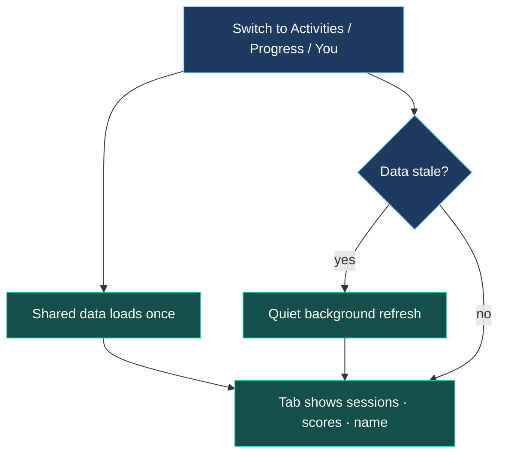

Several tabs read the same slices; refetch on tab focus (cooldown `TAB_REFETCH_COOLDOWN_MS`).

| Slice | API | DB source |
|-------|-----|-----------|
| `activities[]` | `GET /technique/activities` | `technique_analysis` + `technique_video` + `coach_video_review` + `coach_review_annotation` |
| `ratingCategories[]` | `GET /profile/rating-by-category` | `technique_analysis` (`metrics`, `status = completed`, UTC week buckets) |
| `profileName` / `profileImageUri` / `profileAreaLocation` | `GET /profile/me` | `user` + `user_profile` |

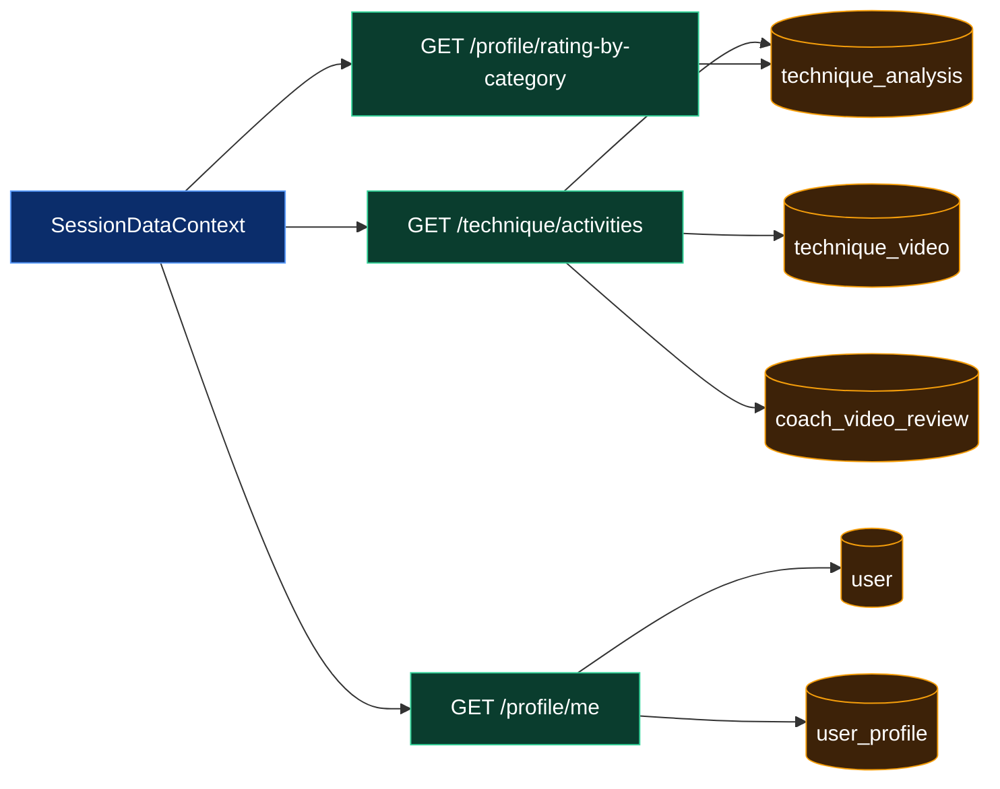

**Consumers:** `Activities.tsx`, `Profile.tsx` (`ProfileHeroScoreBlock`, `ProfileRatingDashboard`, `ActivitiesCalendarFlow`), `Progress.tsx` (activities only — charts computed client-side).

---

## AI Analysis (`app/src/screens/technique.tsx`)

> **In plain terms:** The player picks or records a padel clip, trims the moment they want judged, and taps analyze. The video uploads to the server; AI reads body pose and ball/racket motion, guesses the shot type, and returns a **score** (overall plus technique / outcome / tactics breakdown), **written feedback**, and optionally **“corrected pose” images** showing how to fix form. If they have a linked human reviewer and toggle **request agency human input**, the same upload lands in the **human review queue**. Analysis can take a few minutes — the screen polls until results are ready.

**User flow:**

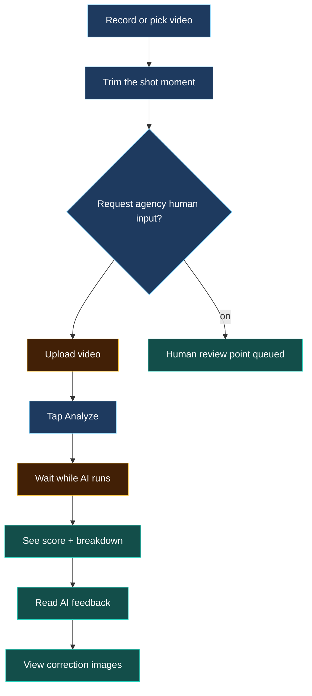

Upload → analyze → poll analysis + correction images. Optional human review queue on upload.

| Step | Client | API | Writes / reads |
|------|--------|-----|----------------|
| Upload | `uploadTechniqueVideo()` in `app/src/lib/techniqueVideoUpload.ts` | `POST /technique/upload` (`sendVideoToCoach` form field) | `technique_video`; if human-review toggle → `coach_video_review` rows via `coach_student` links |
| Reviewer banner | `loadStudentCoaches()` | `GET /profile/student-coaches` | `coach_student` → `user` |
| Analyze | `authClient.$fetch` | `POST /technique/analyze` | inserts `technique_analysis` (`status: processing`); links pending `coach_video_review.techniqueAnalysisId` |
| Results | poll | `GET /technique/analysis/:id` | `technique_analysis` (`metrics`, `feedbackText`, `status`) |
| Corrections | poll / regen | `GET` + `POST /technique/analysis/:id/correction-images` | `technique_analysis.metrics` (`correction_images*`, `correction_context*`); regen feedback → `technique_correction_regeneration_feedback` |

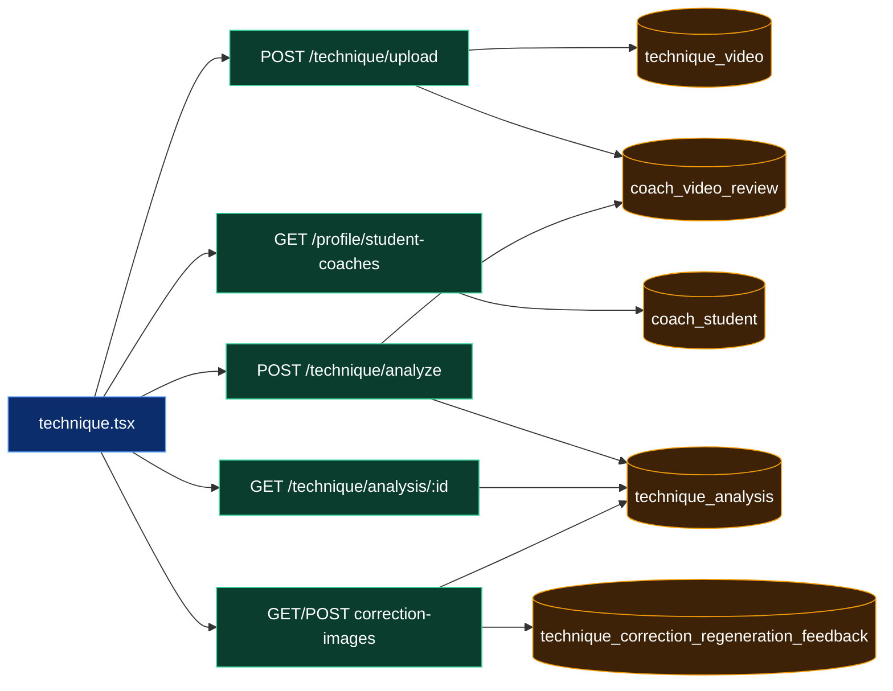

---

## Activities list (`app/src/screens/Activities.tsx` + `SessionDataContext`)

> **In plain terms:** A chronological feed of everything you’ve analyzed — date, shot name, score, and whether **agency human input** has been received on that session. Calendar and “shots” layouts are two views over the same list. Tapping a row opens the full breakdown. If you arrive from a push notification before the list has loaded, the app fetches that one analysis directly.

**User flow:**

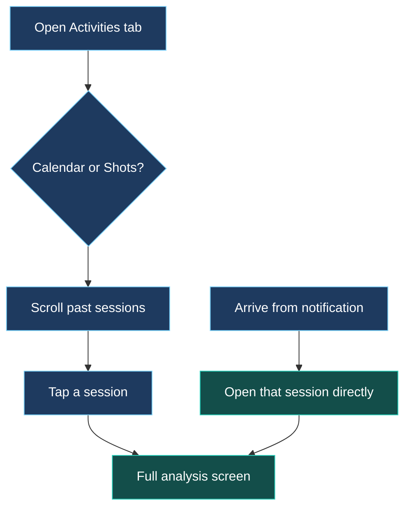

Primary list: `GET /technique/activities` (via context). Deep link `openAnalysisId` not in list → one-off `GET /technique/analysis/:id`.

Detail sub-screen: `app/src/screens/ActivitiesVideoAnalysis.tsx` (opened from list).

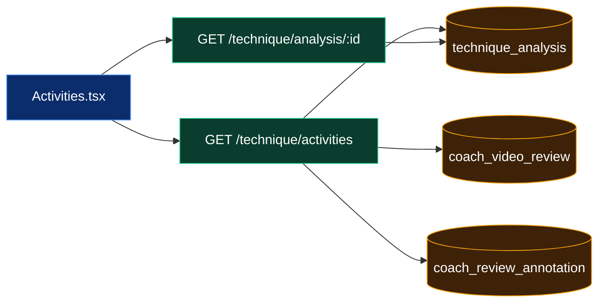

---

## Activities detail (`app/src/screens/ActivitiesVideoAnalysis.tsx`)

> **In plain terms:** Replay the clip with AI overlays — skeleton pose on the video, the numeric scores and text feedback, and side-by-side “your form vs suggested correction” stills. This is the read-only review of a session you already ran; no new analysis happens here unless you trigger a correction-image regen from elsewhere.

**User flow:**

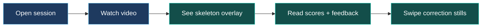

| API | Data |
|-----|------|
| `GET /technique/analysis/:id` | `technique_analysis` row + `metrics` |
| `GET /technique/analysis/:id/pose-overlay` | derived from `metrics.pose_data` |
| `GET /technique/analysis/:id/correction-images` | `metrics.correction_images*` URLs → normalized `/uploads/technique-corrections/...` |

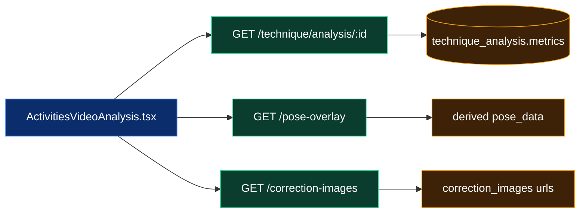

---

## Progress (`app/src/screens/Progress.tsx`)

> **In plain terms:** Answers “am I practising regularly?” and “are my scores improving?”. The **day rings** show which days this week you completed at least one analyzed session. The **line chart** plots your average score over the last 4, 8, 12 weeks or all time — you can switch between overall score and the technique / outcome / tactics breakdown. All maths happens on the phone from the same session list Activities uses; there is no separate progress endpoint.

**User flow:**

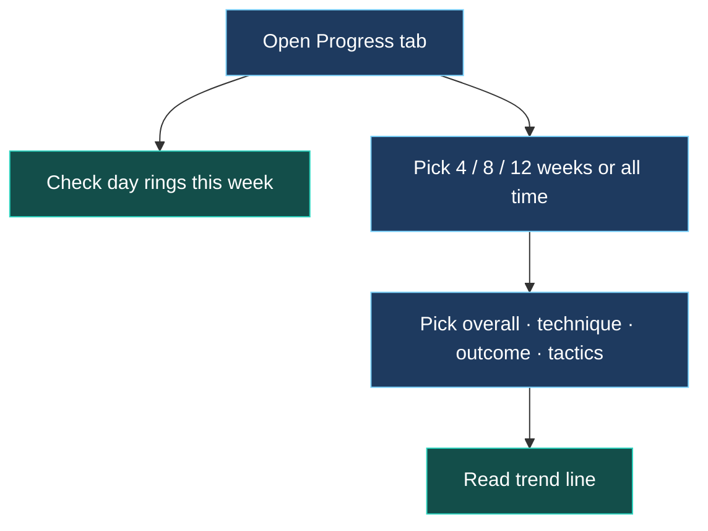

**No dedicated progress API.** Reads `activities` from `SessionDataContext` (`GET /technique/activities` → `technique_analysis`). Client aggregates:

- training-day rings (completed sessions per UTC/local week day)
- line chart (`overall` / `technique` / `outcome` / `tactics` from `ActivitySession` score fields in list payload)

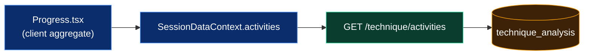

---

## You (`app/src/screens/Profile.tsx`)

> **In plain terms:** Your home player card. Top block shows name, photo, flag, and **overall score** averaged across the five game pillars (ground strokes, net play, etc.). Below that, **pillar ratings** compare this week vs last week per category. An optional **AI insight** banner summarizes what improved or slipped — computed from those weekly numbers, not a live LLM call on this screen. The bottom half is the same **activity calendar / shot list** as the Activities tab so you can jump into past sessions without leaving your profile.

**User flow:**

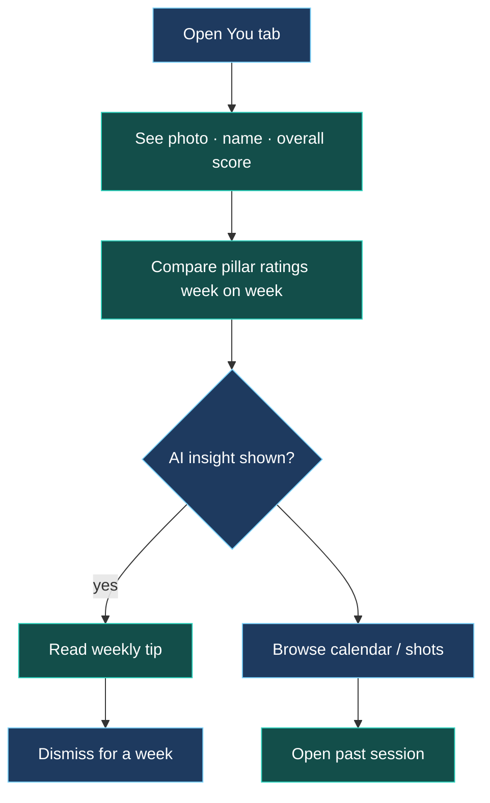

Composes hero + pillar ratings + optional weekly AI insight + **same calendar/list** as Activities via `ActivitiesCalendarFlow` (imported from `Activities.tsx`).

| UI block | Data source |
|----------|-------------|
| `ProfileHeroScoreBlock` | `SessionDataContext` (`profileName`, `overallPillarScore`, …) |
| `ProfileRatingDashboard` | `GET /profile/rating-by-category` → `technique_analysis` |
| `ProfileAiInsightBanner` | client `computeWeeklyInsightFromRatingRows(ratingCategories)`; dismiss → `AsyncStorage` (not DB) |
| Calendar / shots list | `SessionDataContext.activities` → `technique_analysis` |

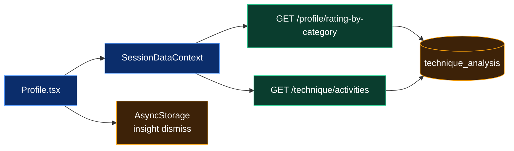

---

## Human Review — reviewer roster (`app/src/screens/MyCoachScreen.tsx`)

> **In plain terms:** The **human reviewer** dashboard. Each row is a linked player: avatar, name, **this week vs last week score**, and a badge if a new video is waiting at a **human review point**. Tapping a player opens a private chat (tab bar stays visible). Only accounts with the reviewer role flag see this tab.

**User flow:**

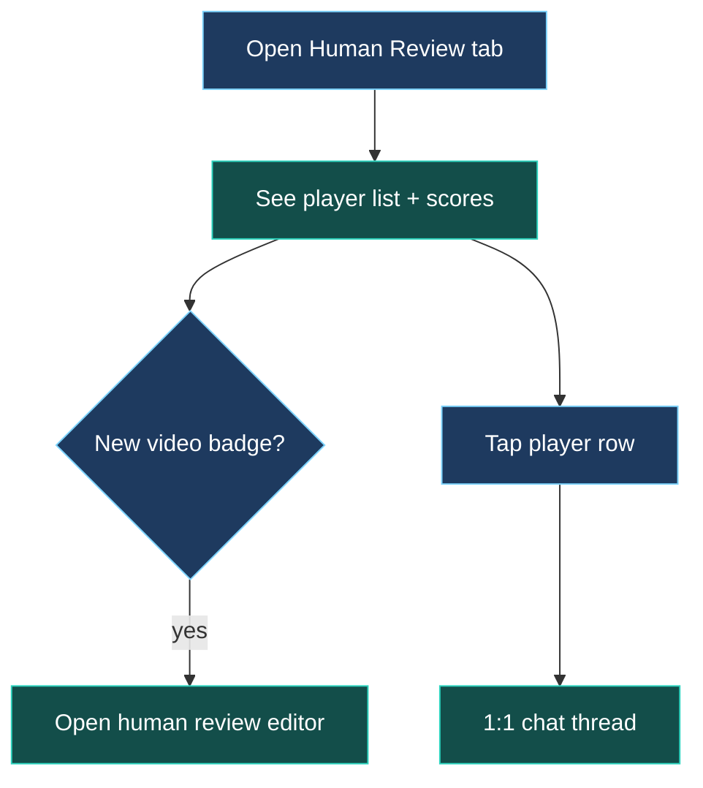

`GET /profile/coach-students` (reviewer role gate on server). Joins player `user` + `user_profile`, pending human review ids, weekly score rings from `technique_analysis`.

Nested stack (`MyCoachTabStackParamList`): `MyCoachMain` → `CoachStudentChat`.

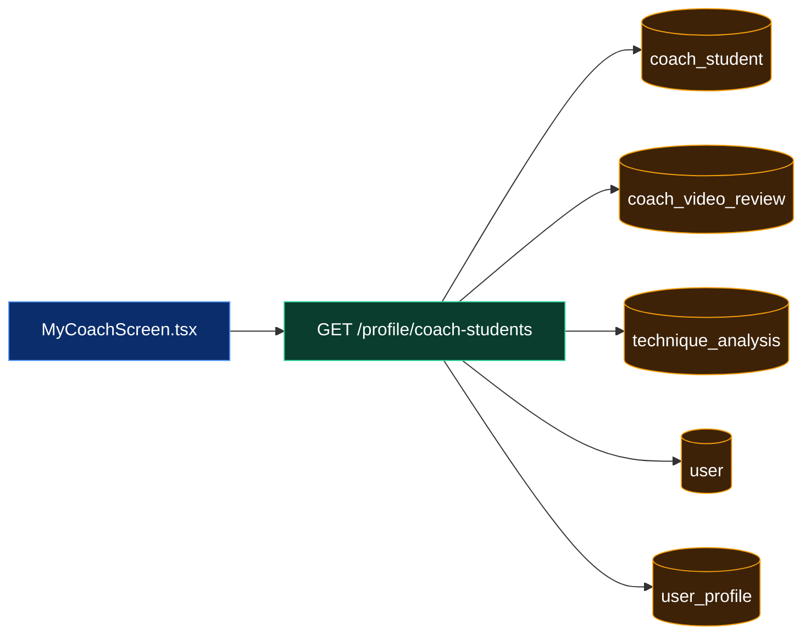

---

## Human reviewer ↔ player chat (`app/src/screens/CoachStudentChatScreen.tsx`)

> **In plain terms:** Simple WhatsApp-style thread between one **human reviewer** and one **player**. Messages are text only today; the thread is created automatically when the pair is linked. Loading history pulls the last ~200 messages; sending appends a row and bumps the thread’s “last message” timestamp.

**User flow:**

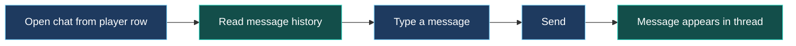

Tab stack screen (tab bar stays visible).

| Method | Route | DB |
|--------|-------|-----|
| `GET` | `/profile/coach-student-chat/:peerUserId/messages` | `coach_student` → `coach_student_chat` → `coach_student_chat_message` |
| `POST` | same | insert message + update `coach_student_chat.lastMessageAt` |

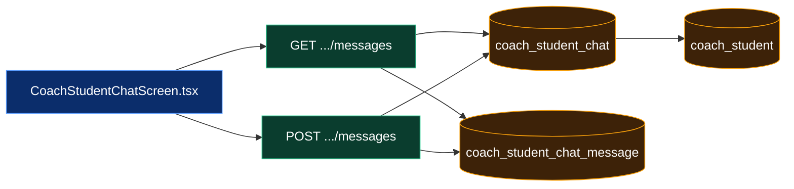

---

## Player human review — read-only (`app/src/screens/StudentCoachReviewScreen.tsx`)

> **In plain terms:** When a **human reviewer** finishes agency human input on a player’s upload, the player opens this screen (often from a notification). They watch the same video with the **written summary** and **frame-by-frame marks** (circles, arrows, comments on stills). Read-only for the player.

**User flow:**

```mermaid
flowchart TB
  classDef user fill:#1E3A5F,stroke:#7DD3FC,color:#fff
  classDef outcome fill:#134E4A,stroke:#2DD4BF,color:#fff
  Notif[Notification: human review ready]:::user
  Open[Open review]:::user
  Watch[Watch player video]:::user
  Summary[Read human written summary]:::outcome
  Frames[Step through marked frames]:::outcome
  Notif --> Open --> Watch --> Summary --> Frames
```

Stack route `StudentCoachReview` (often from notification deep link).

`GET /coach/review/:id` → `coach_video_review` + linked `technique_analysis` + `coach_review_annotation`.

```mermaid
flowchart LR
  classDef screen fill:#0B2D6B,stroke:#5B9DFF,color:#fff
  classDef api fill:#0A3D2E,stroke:#34D399,color:#fff
  classDef db fill:#3D2208,stroke:#F59E0B,color:#fff
  PlayerReviewScreen["StudentCoachReviewScreen.tsx"]:::screen
  GetReview["GET /coach/review/:id"]:::api
  HumanReviewQueue[(coach_video_review)]:::db
  TechniqueAnalysis[(technique_analysis)]:::db
  HumanMarks[(coach_review_annotation)]:::db
  PlayerReviewScreen-->GetReview-->HumanReviewQueue
  GetReview-->TechniqueAnalysis
  GetReview-->HumanMarks
```

---

## Human review editor (`app/src/screens/CoachReviewEditorScreen.tsx`)

> **In plain terms:** Where the **human reviewer** provides **agency human input**. They scrub through the player’s clip, pause on key frames, draw marks, add comments, write overall feedback, then **submit**. Submit closes the human review point and notifies the player.

**User flow:**

```mermaid
flowchart TB
  classDef user fill:#1E3A5F,stroke:#7DD3FC,color:#fff
  classDef outcome fill:#134E4A,stroke:#2DD4BF,color:#fff
  Open[Open pending human review point]:::user
  Scrub[Scrub through video]:::user
  Pause[Pause on key frame]:::user
  Mark[Draw mark + add comment]:::user
  Write[Write overall feedback]:::user
  Submit[Submit agency human input]:::user
  Done[Player notified]:::outcome
  Open --> Scrub --> Pause --> Mark
  Mark --> Write --> Submit --> Done
```

| Method | Route | DB |
|--------|-------|-----|
| `GET` | `/coach/review/:id` | load `coach_video_review` + analysis |
| `POST` | `/coach/review/:id/submit` | `coach_video_review.coachFeedbackText`, `submittedAt`, `status`; `coach_review_annotation` rows |

```mermaid
flowchart LR
  classDef screen fill:#0B2D6B,stroke:#5B9DFF,color:#fff
  classDef api fill:#0A3D2E,stroke:#34D399,color:#fff
  classDef db fill:#3D2208,stroke:#F59E0B,color:#fff
  HumanReviewEditor["CoachReviewEditorScreen.tsx"]:::screen
  Load["GET /coach/review/:id"]:::api
  Submit["POST /coach/review/:id/submit"]:::api
  HumanReviewQueue[(coach_video_review)]:::db
  HumanMarks[(coach_review_annotation)]:::db
  HumanReviewEditor-->Load-->HumanReviewQueue
  HumanReviewEditor-->Submit-->HumanReviewQueue
  Submit-->HumanMarks
```

---

## Link players for human review (`app/src/screens/CoachAddPeopleScreen.tsx`)

> **In plain terms:** A **human reviewer** searches the user directory by name/username and **links** someone as their player. That creates the roster row used by Human Review, chat, and the **request agency human input** toggle on upload.

**User flow:**

```mermaid
flowchart LR
  classDef user fill:#1E3A5F,stroke:#7DD3FC,color:#fff
  classDef outcome fill:#134E4A,stroke:#2DD4BF,color:#fff
  Open[Open add people]:::user
  Search[Search by name / username]:::user
  Pick[Pick a player]:::user
  Link[Confirm reviewer–player link]:::user
  Roster[Player appears on Human Review tab]:::outcome
  Open --> Search --> Pick --> Link --> Roster
```

`GET /profile/directory` (search users). `POST /profile/coach-students` → insert `coach_student`.

```mermaid
flowchart LR
  classDef screen fill:#0B2D6B,stroke:#5B9DFF,color:#fff
  classDef api fill:#0A3D2E,stroke:#34D399,color:#fff
  classDef db fill:#3D2208,stroke:#F59E0B,color:#fff
  AddPeople["CoachAddPeopleScreen.tsx"]:::screen
  Directory["GET /profile/directory"]:::api
  LinkApi["POST /profile/coach-students"]:::api
  User[(user)]:::db
  UserProfile[(user_profile)]:::db
  ReviewerLink[(coach_student)]:::db
  AddPeople-->Directory-->User
  Directory-->UserProfile
  AddPeople-->LinkApi-->ReviewerLink
```

---

## Header stack screens (not bottom tabs)

> **In plain terms:** Screens you reach from the top bar — not permanent tabs. Bell → notifications. Profile avatar / settings cog → account editing. Search icon (on some tabs) → invite friends or browse static reviewer/club cards.

**User flow:**

```mermaid
flowchart TB
  classDef user fill:#1E3A5F,stroke:#7DD3FC,color:#fff
  classDef outcome fill:#134E4A,stroke:#2DD4BF,color:#fff
  Header[Any tab — tap header control]:::user
  Bell[Bell icon]:::user
  Notifs[Notifications list]:::outcome
  Avatar[Profile avatar]:::user
  YouTab[Jump to You tab]:::outcome
  Cog[Settings cog]:::user
  Settings[Profile settings]:::outcome
  Search[Search icon]:::user
  Invite[Invite / browse reviewers & clubs]:::outcome
  Header --> Bell --> Notifs
  Header --> Avatar --> YouTab
  Header --> Cog --> Settings
  Header --> Search --> Invite
```

Pushed on `MainStackParamList` from `app/src/main.tsx` header / notifications.

### Notifications (`app/src/screens/NotificationsScreen.tsx`)

> **In plain terms:** In-app inbox — e.g. “your correction images are ready” or “agency human input submitted”. Tapping marks the item read so the badge clears.

**User flow:**

```mermaid
flowchart LR
  classDef user fill:#1E3A5F,stroke:#7DD3FC,color:#fff
  classDef outcome fill:#134E4A,stroke:#2DD4BF,color:#fff
  Bell[Tap bell]:::user
  List[See notification list]:::outcome
  Tap[Tap an item]:::user
  Read[Marked as read]:::outcome
  Go[Deep link to session or human review]:::outcome
  Bell --> List --> Tap --> Read --> Go
```

- `GET /profile/notifications` → `user_notification`
- `POST /profile/notifications/:id/read` → `user_notification.readAt`

```mermaid
flowchart LR
  classDef screen fill:#0B2D6B,stroke:#5B9DFF,color:#fff
  classDef api fill:#0A3D2E,stroke:#34D399,color:#fff
  classDef db fill:#3D2208,stroke:#F59E0B,color:#fff
  NotifScreen["NotificationsScreen.tsx"]:::screen
  List["GET /profile/notifications"]:::api
  Read["POST /notifications/:id/read"]:::api
  UserNotification[(user_notification)]:::db
  NotifScreen-->List-->UserNotification
  NotifScreen-->Read-->UserNotification
```

### Profile settings (`app/src/screens/ProfileSettingsScreen.tsx`)

> **In plain terms:** Edit account details — photo, display name, username, location (drives the flag on your card), phone, birth date, and padel-specific fields like level, ranking org, dominant hand, and preferred court side. Changes save to your user row and profile row on the server.

**User flow:**

```mermaid
flowchart TB
  classDef user fill:#1E3A5F,stroke:#7DD3FC,color:#fff
  classDef outcome fill:#134E4A,stroke:#2DD4BF,color:#fff
  Open[Open settings]:::user
  Edit[Edit photo · name · location · game info]:::user
  Save[Save changes]:::user
  Card[You tab card updates]:::outcome
  Open --> Edit --> Save --> Card
```

| API | Tables |
|-----|--------|
| `GET /profile/me` | `user`, `user_profile` |
| `POST /profile/avatar` | `user.image` |
| `POST /profile/basic` | `user`, `user_profile` (name, username, phone, area, birth date, …) |
| `POST /profile/game` | `user_profile` (level, ranking, dominant hand, court side, …) |

```mermaid
flowchart LR
  classDef screen fill:#0B2D6B,stroke:#5B9DFF,color:#fff
  classDef api fill:#0A3D2E,stroke:#34D399,color:#fff
  classDef db fill:#3D2208,stroke:#F59E0B,color:#fff
  Settings["ProfileSettingsScreen.tsx"]:::screen
  Me["GET /profile/me"]:::api
  Avatar["POST /profile/avatar"]:::api
  Basic["POST /profile/basic"]:::api
  Game["POST /profile/game"]:::api
  User[(user)]:::db
  UserProfile[(user_profile)]:::db
  Settings-->Me-->User
  Me-->UserProfile
  Settings-->Avatar-->User
  Settings-->Basic-->User
  Basic-->UserProfile
  Settings-->Game-->UserProfile
```

### Invite / search (`app/src/screens/InviteFriendScreen.tsx`)

> **In plain terms:** Marketing/discovery UI — three tabs (friends, human reviewers, clubs). **Friends** opens the phone’s share sheet with an invite message. **Human reviewers** and **clubs** show hard-coded cards that navigate to detail pages; there is no live search API on this screen yet.

**User flow:**

```mermaid
flowchart TB
  classDef user fill:#1E3A5F,stroke:#7DD3FC,color:#fff
  classDef outcome fill:#134E4A,stroke:#2DD4BF,color:#fff
  Open[Open search / invite]:::user
  Seg{Friends · Reviewers · Clubs?}:::user
  Share[Tap invite — OS share sheet]:::outcome
  Browse[Browse reviewer or club cards]:::user
  Detail[Static detail page]:::outcome
  Open --> Seg
  Seg -->|friends| Share
  Seg -->|reviewers or clubs| Browse --> Detail
```

Static segments (friends / reviewers / clubs). **No list API yet** — reviewer cards from `app/src/lib/coach-invite-data.ts`; clubs navigate to `ClubDetail` / `CoachDetail` (static). Friends segment uses OS share sheet only.

```mermaid
flowchart LR
  classDef screen fill:#0B2D6B,stroke:#5B9DFF,color:#fff
  Invite["InviteFriendScreen.tsx"]:::screen
  StaticData["coach-invite-data.ts<br/>(local)"]:::screen
  Share["OS Share API"]:::screen
  Invite-->StaticData
  Invite-->Share
```

---

## Admin (internal)

> **In plain terms:** Password-gated tools for the team — not part of the player journey. **Admin Train** uploads pro reference clips with shot labels; those become the library the AI compares against when classifying player videos. Other admin screens manage LoRA training jobs, accuracy test runs, and member lists.

**User flow:**

```mermaid
flowchart TB
  classDef user fill:#1E3A5F,stroke:#7DD3FC,color:#fff
  classDef outcome fill:#134E4A,stroke:#2DD4BF,color:#fff
  Unlock[Enter admin hub password]:::user
  Pick{Which tool?}:::user
  Train[Upload labeled pro clips]:::outcome
  Lora[Run LoRA training jobs]:::outcome
  Accuracy[Run accuracy test suite]:::outcome
  Members[Browse members by role]:::outcome
  Unlock --> Pick
  Pick --> Train
  Pick --> Lora
  Pick --> Accuracy
  Pick --> Members
```

| Screen | APIs | DB |
|--------|------|-----|
| `AdminTrain.tsx` | `POST /train/upload`, `GET /train/video/:id`, `GET /train/sample/:id`, `GET /train/admin/pose-landmarks-coverage` | `train_video`, `train_sample`, `train_sample_embedding` |
| `AdminFalLora.tsx` | `/train/fal-lora/*` | dataset metadata on disk + fal jobs |
| `AdminAccuracy.tsx` | `/admin/accuracy/*` | test run history (router-specific) |

Mesh / k-NN detail → [03-mesh-retrieval.md](./03-mesh-retrieval.md).
| `AdminMembersScreen.tsx` | profile/admin listing routes | `user`, `user_profile`, `coach_student` |

```mermaid
flowchart LR
  classDef screen fill:#0B2D6B,stroke:#5B9DFF,color:#fff
  classDef api fill:#0A3D2E,stroke:#34D399,color:#fff
  classDef db fill:#3D2208,stroke:#F59E0B,color:#fff
  AdminTrainScreen["AdminTrain.tsx"]:::screen
  TrainUpload["POST /train/upload"]:::api
  TrainSample["GET /train/sample/:id"]:::api
  TrainVideo[(train_video)]:::db
  TrainSampleTable[(train_sample)]:::db
  Embedding[(train_sample_embedding)]:::db
  AdminTrainScreen-->TrainUpload-->TrainVideo
  AdminTrainScreen-->TrainSample-->TrainSampleTable
  TrainSampleTable-->Embedding
```

---

## Neon-friendly analysis overview (SQL view)

> **In plain terms:** A database shortcut for developers. Instead of pulling the giant `metrics` JSON blob for every analysis, query this view in Neon to see status, feedback text, detected shot name, correction image URLs, and the latest “regenerate my corrections” user note — useful when debugging production submissions.

**User flow:**

```mermaid
flowchart LR
  classDef user fill:#1E3A5F,stroke:#7DD3FC,color:#fff
  classDef outcome fill:#134E4A,stroke:#2DD4BF,color:#fff
  Dev[Developer in Neon console]:::user
  Query[SELECT from technique_analysis_overview]:::user
  Scan[Scan scores · shots · feedback · urls]:::outcome
  Dev --> Query --> Scan
```

Query `public.technique_analysis_overview` to inspect `feedbackText`, shot label/preset, correction image urls, and latest regen feedback without downloading full `metrics` JSON.

Defined in `server/drizzle/0030_technique_analysis_overview_view.sql`.

```mermaid
flowchart LR
  classDef api fill:#0A3D2E,stroke:#34D399,color:#fff
  classDef db fill:#3D2208,stroke:#F59E0B,color:#fff
  NeonQuery["Neon SQL client"]:::api
  OverviewView[(technique_analysis_overview)]:::db
  TechniqueAnalysis[(technique_analysis)]:::db
  RegenFeedback[(technique_correction_regeneration_feedback)]:::db
  NeonQuery-->OverviewView
  OverviewView-->TechniqueAnalysis
  OverviewView-->RegenFeedback
```

---

## Core table index (player path)

> **In plain terms:** Quick glossary of where data lives. **Videos** and **analyses** are the core loop (upload → AI result). Tables prefixed `coach_*` in the schema are the **human review layer** — roster links, review queue, agency human input marks, and messaging. **Train_*** tables are reference material the AI retrieval step uses behind the scenes.

**User flow:**

```mermaid
flowchart LR
  classDef user fill:#1E3A5F,stroke:#7DD3FC,color:#fff
  classDef outcome fill:#134E4A,stroke:#2DD4BF,color:#fff
  Upload[Player uploads video]:::user
  AI[AI analysis stored]:::outcome
  History[Shows in Activities · Progress · You]:::outcome
  HumanOpt{Human reviewer linked?}:::user
  HumanLayer[Agency human input layer]:::outcome
  Upload --> AI --> History
  Upload --> HumanOpt
  HumanOpt -->|yes| HumanLayer
```

| Table | Role in app |
|-------|-------------|
| `user` / `user_profile` | auth identity, settings; `coachStudentRole` flags human reviewer vs player |
| `technique_video` | uploaded clip metadata + storage path |
| `technique_analysis` | AI run status, `metrics` JSON, `feedbackText` |
| `technique_correction_regeneration_feedback` | user text when re-generating correction images |
| `coach_student` | reviewer–player roster link |
| `coach_video_review` | pending/submitted human review per upload |
| `coach_review_annotation` | per-frame agency human input marks + comments |
| `coach_student_chat` / `coach_student_chat_message` | reviewer–player 1:1 messaging |
| `user_notification` | in-app notification feed |
| `train_video` / `train_sample` / `train_sample_embedding` | admin pro-library + k-NN retrieval |

---

## Next volumes (planned)

- [02-correction-images.md](./02-correction-images.md) — correction still pipeline (pose → Comfy → cache)
- [03-mesh-retrieval.md](./03-mesh-retrieval.md) — mesh enrichment + k-NN shot matching (Modal → pgvector)
- Per-screen component tree + step flows (upload wizard, analysis polling, human review UX)
- Sequence diagrams: `POST /technique/analyze` → Modal → LLM → DB
- `metrics` JSON field map (`ai_analysis`, `retrieval`, `pose_data`, `correction_images`)
