# Correction images — pipeline walkthrough

Vol. 2: how “your form vs suggested correction” stills are generated — app entry → `technique_analysis.metrics` → Comfy → `/uploads/technique-corrections/`.

**Primary route:** `POST /technique/correction-images` in `server/src/technique/techniqueRouter.ts`. Prompt/mask logic in `server/src/technique/correctionPrompt.ts` and `server/src/technique/comfyCorrection.ts`. Shot name for correction comes from **retrieval** (`resolveCanonicalShotFromMetrics`), not mesh geometry — see [03-mesh-retrieval.md](./03-mesh-retrieval.md).

> **In plain terms:** After AI Analysis scores a clip, the player can request **correction images** — side-by-side stills that show their real frame next to an edited version with improved pose. The app asks the server to generate (or return cached) PNGs. The server picks key frames from pose data, extracts stills from the original video, turns AI written feedback into **joint movement targets**, builds an inpaint mask around the player, runs a Comfy **Qwen image-edit** workflow, saves results to disk, and caches URLs back into `technique_analysis.metrics`. Optional **regeneration feedback** from the player is stored for product review.

**User flow:**

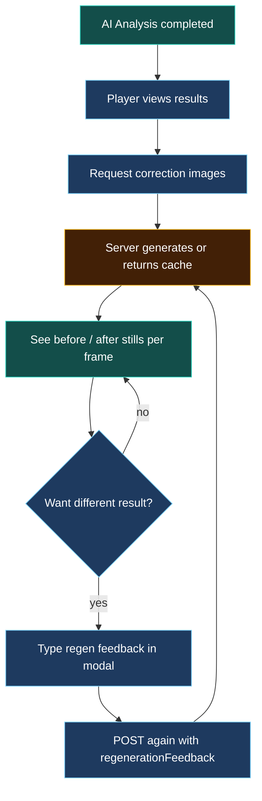

**Legend:** same colour scheme as [01-screens-routes-db.md](./01-screens-routes-db.md) — blue user, amber wait, teal outcome; green API, amber DB in technical diagrams.

---

## Entry (app → API)

> **In plain terms:** The app calls `POST /technique/correction-images` with an `analysisId`. The server loads that analysis’s `metrics`, generates or reuses Comfy correction stills, and writes URLs plus small context objects back into `metrics.correction_images_comfy` and `metrics.correction_context_comfy`. Regeneration feedback (if any) is saved separately for debugging.

**User flow:**

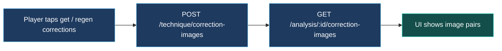

- **App → API:** `POST /technique/correction-images` with `analysisId` (optional `frameIndices`, `forceRegenerate`, `regenerationFeedback`).
- **Reads / writes:** `technique_analysis.metrics` → `metrics.correction_images_comfy` + `metrics.correction_context_comfy` (URLs + small context only).
- **Regen log:** `technique_correction_regeneration_feedback` when `regenerationFeedback` is sent.

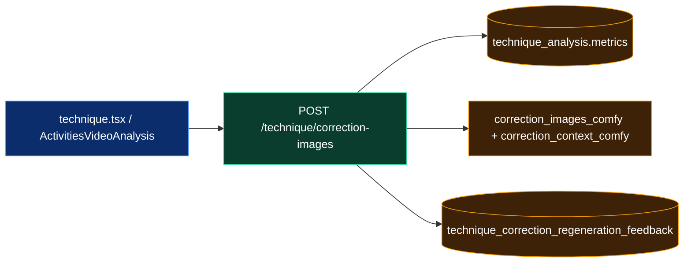

| Param | Role |
|-------|------|
| `analysisId` | required — which completed analysis to correct |
| `frameIndices` | optional — request specific frames only |
| `forceRegenerate` | bypass Comfy cache for those frames |
| `regenerationFeedback` | player note on regen → `technique_correction_regeneration_feedback` |

---

## Pose landmarks source

> **In plain terms:** Correction frames are chosen from **pose landmarks** already stored when the video was analyzed — one skeleton per video frame in `metrics.pose_data`. The server also uses clip windows (`user_clips`) and an **impact pose sequence** when available; if impact data is missing but clips exist, it rebuilds impact frames from pose rows inside the clip.

**User flow:**

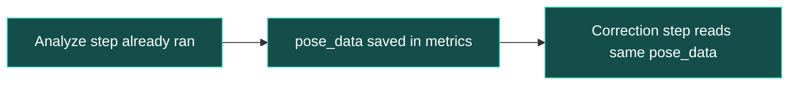

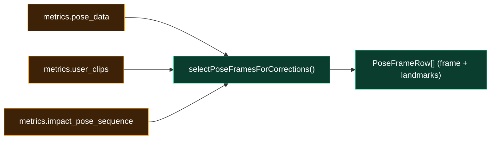

---

## Which frames get images

> **In plain terms:** The server does not edit every frame — it samples up to `XEVO_CORRECTION_MAX_FRAMES` across the motion, preferring frames near **impact** when that sequence exists. If the app passes explicit `frameIndices`, only those frames are considered; already-cached Comfy outputs are reused unless `forceRegenerate` is set.

**User flow:**

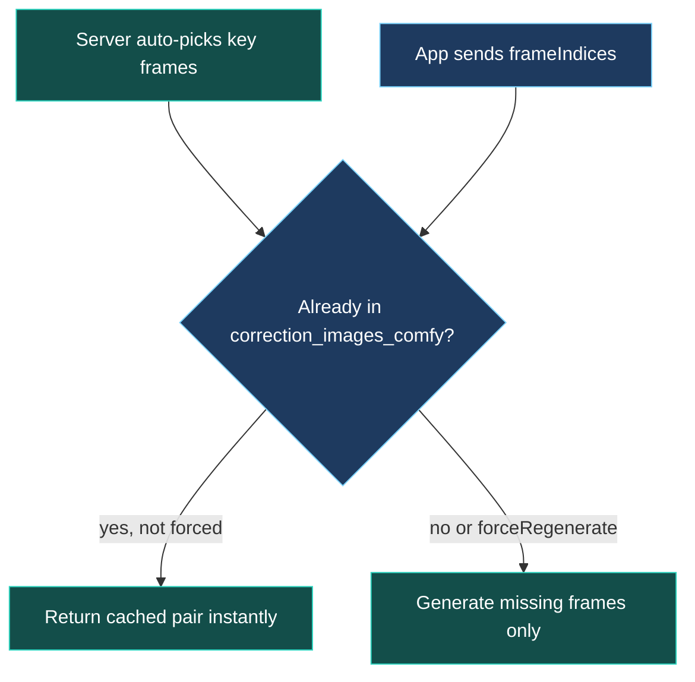

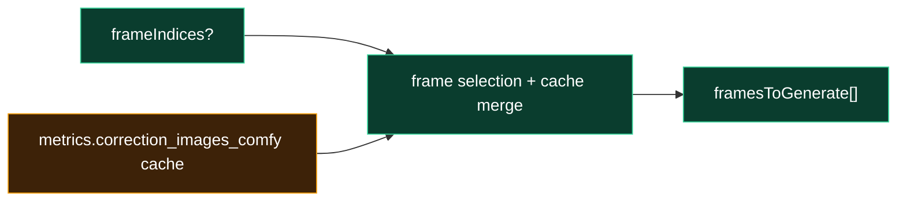

---

## Still extraction (video → PNG)

> **In plain terms:** For each frame number to correct, the server grabs a **real still** from the uploaded MP4 using ffmpeg. That PNG is the “before” image — the player’s actual appearance at that moment.

**User flow:**

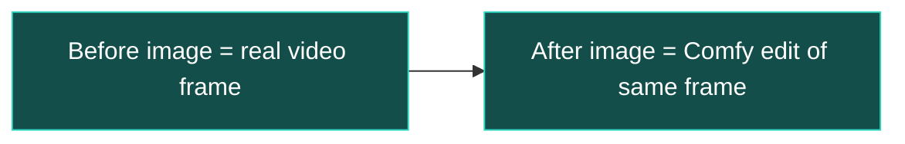

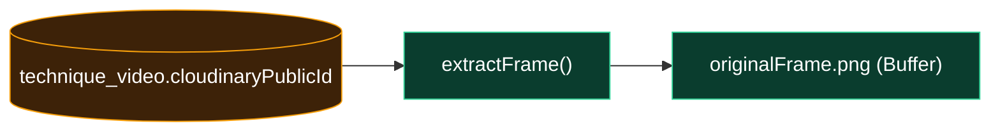

---

## AI suggestions → joint targets

> **In plain terms:** Written AI feedback (`diagnosis`, `recommendations`) is converted into **landmark deltas** — “move this joint from current → target”. The server computes a robust **impact-frame** delta set first, then tries per-frame deltas and falls back to impact deltas if a per-frame LLM call fails.

**User flow:**

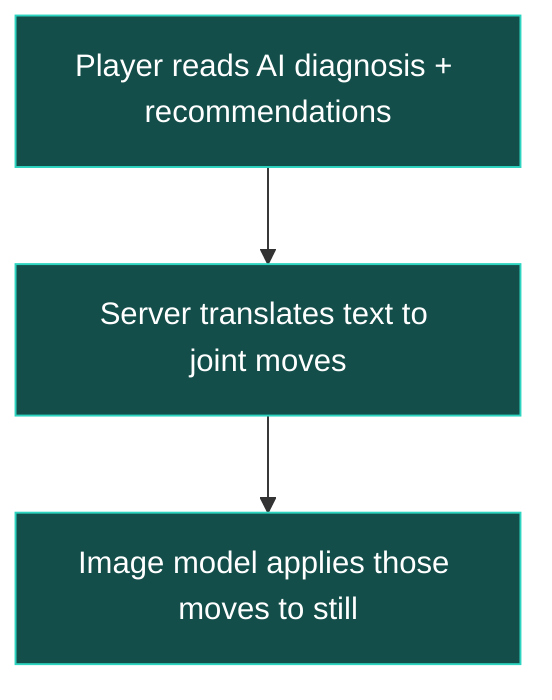

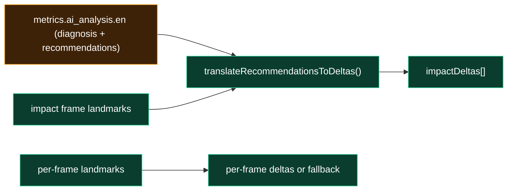

---

## Shot + handedness (prompt correctness)

> **In plain terms:** Corrections must not mirror the wrong side of the body. The server classifies **shot type** and **handedness** via LLM, then merges higher-trust signals: the player’s **dominant hand** from profile and a **racket-hand consensus** from pose geometry. The merged result drives prompts so edits match the real striker.

**User flow:**

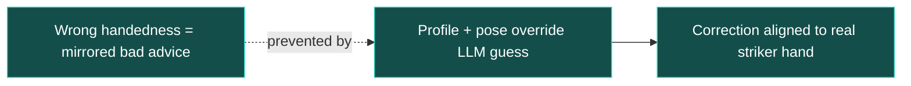

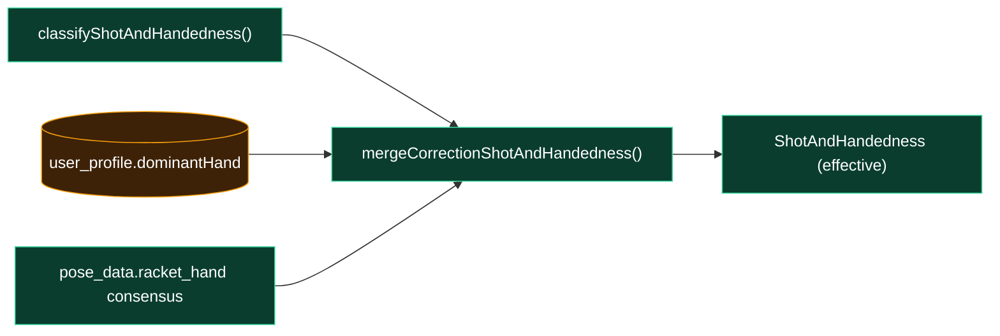

---

## Optional pro-library target

> **In plain terms:** When shot retrieval finds a close **pro-library neighbor**, the server can load that pro’s pose sequence and reference frame. **Pro gap deltas** (difference between player and pro landmarks) merge with AI-derived deltas so the edit nudges toward a real exemplar, not only text instructions.

**User flow:**

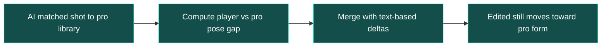

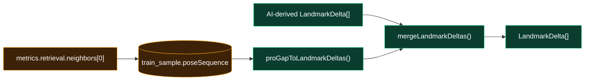

---

## Prompt (Qwen workflow)

> **In plain terms:** For Comfy **qwen** workflows, the server builds one long structured prompt: keep scene/identity fixed, list top-priority joint moves, include diagnosis and recommendations, shot/handedness, raw landmark JSON, and each joint’s `current → target` delta. This is the instruction layer that tells the image model *what* to change without redrawing the court.

**User flow:**

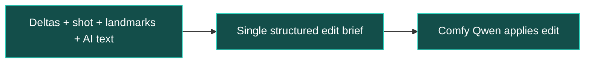

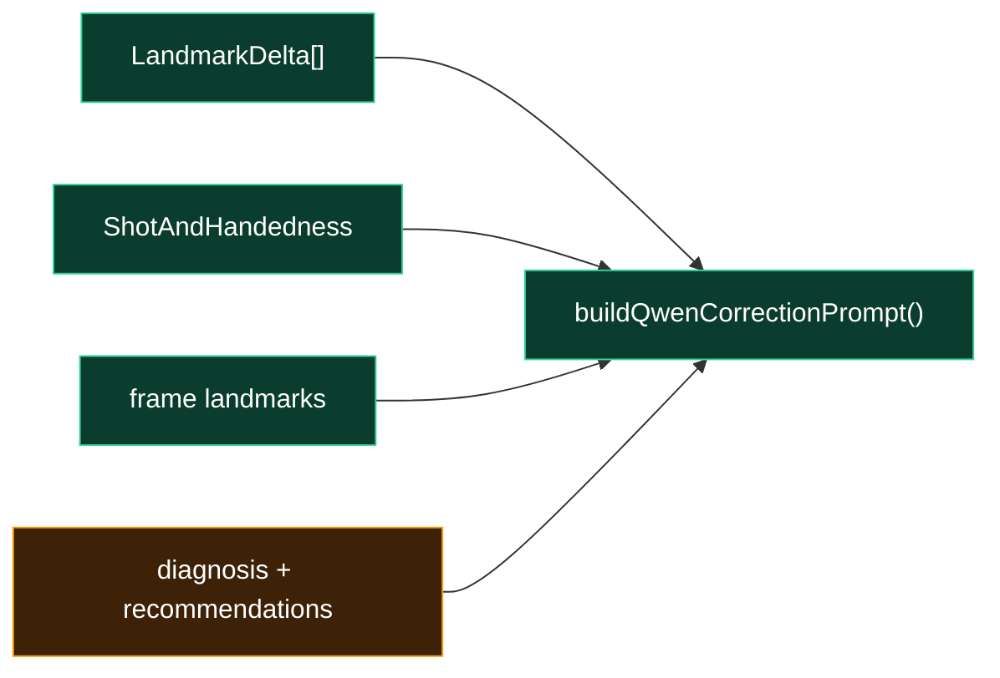

---

## Mask (where to inpaint)

> **In plain terms:** The edit should change the **player silhouette**, not the background. The server builds an inpaint mask from pose landmarks (convex hull → dilation → blur). Mask dimensions follow the workflow’s megapixel scaling so it lines up with Comfy’s latent resolution.

**User flow:**

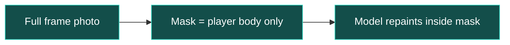

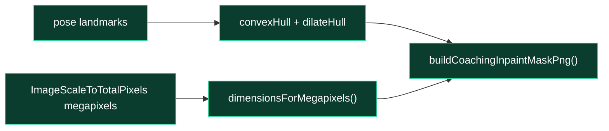

---

## Workflow template + node patching

> **In plain terms:** The server loads a Comfy **API workflow JSON** (e.g. `server/workflows/qwen_image_edit_plus_gguf_correction.api.json`), patches node IDs from env (load image, prompt, mask, controlnet strength, denoise, megapixels), uploads the frame + mask (+ optional ref) to Comfy, queues the job, and waits for the output image.

**User flow:**

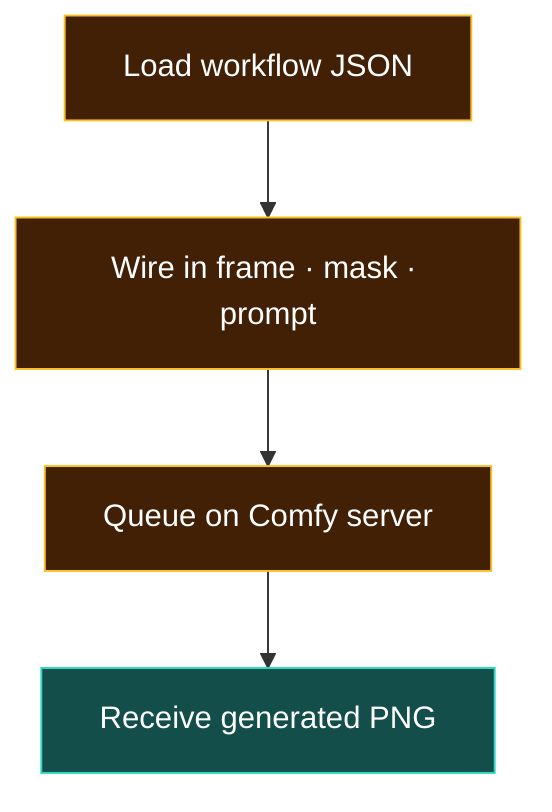

```mermaid
flowchart LR
  classDef api fill:#0A3D2E,stroke:#34D399,color:#fff
  ApiJson["*.api.json workflow template"]:::api
  Patch["patch nodes (ids + inputs)"]:::api
  Png["original frame buffer"]:::api
  Upload["comfyUploadImage()"]:::api
  MaskPng["mask PNG"]:::api
  UploadMask["comfyUploadImage(mask)"]:::api
  Prompt["Qwen prompt text"]:::api
  Queue["comfyQueuePrompt()"]:::api
  Wait["comfyWaitForOutputImage()"]:::api
  ApiJson-->Patch
  Png-->Upload-->Patch
  MaskPng-->UploadMask-->Patch
  Prompt-->Patch
  Patch-->Queue-->Wait
```

---

## Output handling + storage

> **In plain terms:** Comfy’s output is fetched, converted to a storable URI, written under `/uploads/technique-corrections/<analysisId>/...`, and the public URL pair (`originalImage`, `correctedImage`) is cached in `metrics.correction_images_comfy` so the next `GET` is instant.

**User flow:**

```mermaid
flowchart LR
  classDef user fill:#1E3A5F,stroke:#7DD3FC,color:#fff
  classDef outcome fill:#134E4A,stroke:#2DD4BF,color:#fff
  Gen[Server finishes Comfy job]:::outcome
  Save[PNG saved to uploads path]:::outcome
  Return[App GET returns URL pairs]:::outcome
  Player[Player sees before / after in UI]:::user
  Gen --> Save --> Return --> Player
```

```mermaid
flowchart LR
  classDef api fill:#0A3D2E,stroke:#34D399,color:#fff
  classDef db fill:#3D2208,stroke:#F59E0B,color:#fff
  Wait["comfyWaitForOutputImage()"]:::api
  Out["output filename / subfolder"]:::api
  Fetch["comfyImageToDataUri()"]:::api
  Persist["persistCorrectionImageUri()"]:::api
  Uploads["/uploads/technique-corrections/..."]:::db
  CacheBack["metrics.correction_images_comfy"]:::db
  Wait-->Out-->Fetch-->Persist-->Uploads
  Persist-->CacheBack
```

**Read path:** `GET /technique/analysis/:id/correction-images` returns cached `correction_images_comfy` (and legacy `correction_images` / `correction_images_fal` if present) without re-running Comfy.

---

## User feedback capture (regen)

> **In plain terms:** When the player regenerates corrections and types why the last result was wrong, that note is stored in `technique_correction_regeneration_feedback` with a **coaching snapshot** (diagnosis, shot context, recommendations, frame indices) for product review — not shown as a separate UI feed today.

**User flow:**

```mermaid
flowchart LR
  classDef user fill:#1E3A5F,stroke:#7DD3FC,color:#fff
  classDef outcome fill:#134E4A,stroke:#2DD4BF,color:#fff
  Unhappy[Player unhappy with correction still]:::user
  Modal[Regen modal — type feedback]:::user
  Submit[POST with regenerationFeedback]:::user
  Stored[Note saved for team review]:::outcome
  Unhappy --> Modal --> Submit --> Stored
```

```mermaid
flowchart LR
  classDef api fill:#0A3D2E,stroke:#34D399,color:#fff
  classDef db fill:#3D2208,stroke:#F59E0B,color:#fff
  AppFeedback["regenerationFeedback.message"]:::api
  Save[(technique_correction_regeneration_feedback)]:::db
  Link["techniqueAnalysisId → technique_analysis.id"]:::db
  AppFeedback-->Save-->Link
```

---

## End-to-end pipeline (technical)

```mermaid
flowchart TB
  classDef screen fill:#0B2D6B,stroke:#5B9DFF,color:#fff
  classDef api fill:#0A3D2E,stroke:#34D399,color:#fff
  classDef db fill:#3D2208,stroke:#F59E0B,color:#fff
  App["POST correction-images"]:::screen
  Metrics[(technique_analysis.metrics)]:::db
  Frames["selectPoseFramesForCorrections"]:::api
  Extract["extractFrame → PNG"]:::api
  Deltas["translateRecommendationsToDeltas + pro merge"]:::api
  Hand["mergeCorrectionShotAndHandedness"]:::api
  Prompt["buildQwenCorrectionPrompt"]:::api
  Mask["buildCoachingInpaintMaskPng"]:::api
  Comfy["Comfy queue + wait"]:::api
  Disk["/uploads/technique-corrections/"]:::db
  Cache["correction_images_comfy"]:::db
  App-->Metrics
  Metrics-->Frames-->Extract
  Metrics-->Deltas
  Metrics-->Hand
  Deltas-->Prompt
  Hand-->Prompt
  Extract-->Mask
  Prompt-->Comfy
  Mask-->Comfy
  Extract-->Comfy
  Comfy-->Disk-->Cache
```

---

## Related docs

- [01-screens-routes-db.md](./01-screens-routes-db.md) — AI Analysis tab entry, Activities detail `GET /correction-images`, `technique_correction_regeneration_feedback` in the table index
- Neon inspect: `technique_analysis_overview` exposes `correctionImagesComfy` without full `metrics` download

## Next volumes (planned)

- `metrics` field map for `pose_data`, `impact_pose_sequence`, `retrieval.neighbors`
- Env var reference for Comfy node IDs and `XEVO_CORRECTION_MAX_FRAMES`
- fal / legacy `correction_images_fal` path comparison
