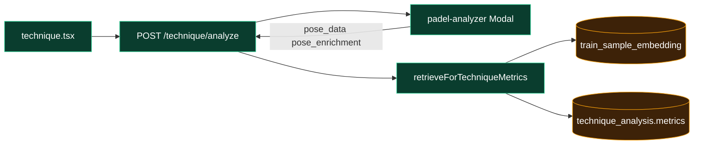

# Mesh retrieval — architecture

---

## Analyze path

| Stage | Code | Writes |
|-------|------|--------|
| Pose + mesh | `modal_app.py` → `enrich_impact_frames` | `pose_enrichment` (`spec_version: sam_v1`, `frames[].feature_vector`) |
| Impact frame | `resolveImpactFrame.ts` | `impact_frame_resolved`, `impact_frame_source` |
| k-NN | `trainRetrieval.ts` | `retrieval` (`neighbors`, `shot_hypothesis`, `embedding_source`, `mesh_used`) |
| Display | `trainShotDisplay.ts` | Activities title via `retrieval` (not raw `pose_enrichment`) |

Server order: Modal → YOLO normalize → impact sequence → retrieval → LLM (`techniqueRouter.ts`).

---

## Pro library path

| Storage | Field |
|---------|--------|
| `train_sample` | `pose_sequence`, `extraction_meta.pose_enrichment` |
| `train_sample_embedding` | `specVersion` `v2` (timeline MediaPipe), `sam_v1` (mesh) |

On upload success, `indexTrainSampleEmbeddingIfReady` upserts both specs when mesh JSON exists. `backfill_sam_v1_embeddings.ts` is only for bulk re-index without re-upload.

---

## Fallbacks

**Query** — `RETRIEVAL_EMBEDDING_MODE` on server (default `blended`):

| Mode | Vector |
|------|--------|
| `blended` | `RETRIEVAL_BLEND_MESH_WEIGHT` mesh + remainder MediaPipe when `mesh_confidence ≥ 0.4` (default `0.4` = 40% mesh) |
| `sam_v1` | mesh only |
| `mediapipe_v2` | mesh ignored |

Below confidence floor → mediapipe v2 query (`meshEmbedding.ts`).

**Library** — if `sam_v1` search returns no neighbors → retry with mediapipe v2 query against `v2` rows (`trainRetrieval.ts`).

**Label** — raw pgvector order; vote `shot_hypothesis` if confidence ≥ 0.35 and gap ≥ 0.02, else top neighbor, else category fallback (`trainShotDisplay.ts`). 

**Modal** — `MESH_ENRICHMENT_ENABLED` defaults on; `SAM3D_ENABLED=0` → `inference: mesh_proxy` per frame.

---

## Key `metrics` fields

| Path | Fields |
|------|--------|
| `pose_enrichment` | `frames[].feature_vector` (128), `mesh_confidence`, `inference` (`mesh_proxy` \| `sam3d`) |
| `retrieval` | `embedding_source`, `mesh_used`, `mesh_confidence`, `spec_version`, `shot_hypothesis`, `neighbors[]`, `eval` |

Train library mirrors `pose_enrichment` under `train_sample.extraction_meta`.

---

## Config

| Variable | Host |
|----------|------|
| `MODAL_WEBHOOK_URL`, `TRAIN_MODAL_WEBHOOK_URL`, `PUBLIC_VIDEO_BASE_URL` | Server |
| `RETRIEVAL_EMBEDDING_MODE` | Server (`blended` \| `sam_v1` \| `mediapipe_v2`) |
| `RETRIEVAL_BLEND_MESH_WEIGHT` | Server (`0`–`1`, default `0.4`; mesh share in blended mode) |
| `MESH_ENRICHMENT_ENABLED` | Modal secrets `xevo-analyzer-env`, `xevo-train-env` |
| `SAM3D_ENABLED`, `HF_TOKEN` | Modal (real SAM only) |

---

## `retrieval.eval` (analyze)

Written on each completed analyze: `predicted_shot`, `display_shot`, `llm_shot`, `top_k_neighbors`, `distance_gap`, `mesh_confidence`, `embedding_source`, `spec_version`, `blend_mesh_weight`, `blend_formula_id`, `llm_disagrees_retrieval`, `library_fallback`.

---

## Retrieval bench (admin)

**Admin hub → Retrieval bench** (or link from Training accuracy).

| Step | Title |
|------|--------|
| `1_library_ready` | Library ready |
| `2_loocv` | LOOCV |
| `3_blend` | Blend sweep (weights 0, 0.2, 0.4, 0.5, 0.6, 1) |
| `4_mesh_train` | Train mesh |
| `5_analysis_audit` | Analysis audit (pick submission) |
| `6_fallbacks` | Fallbacks |

API: `GET /train/admin/accuracy/bench/submissions`, `POST /train/admin/accuracy/bench/run/:stepId`.

