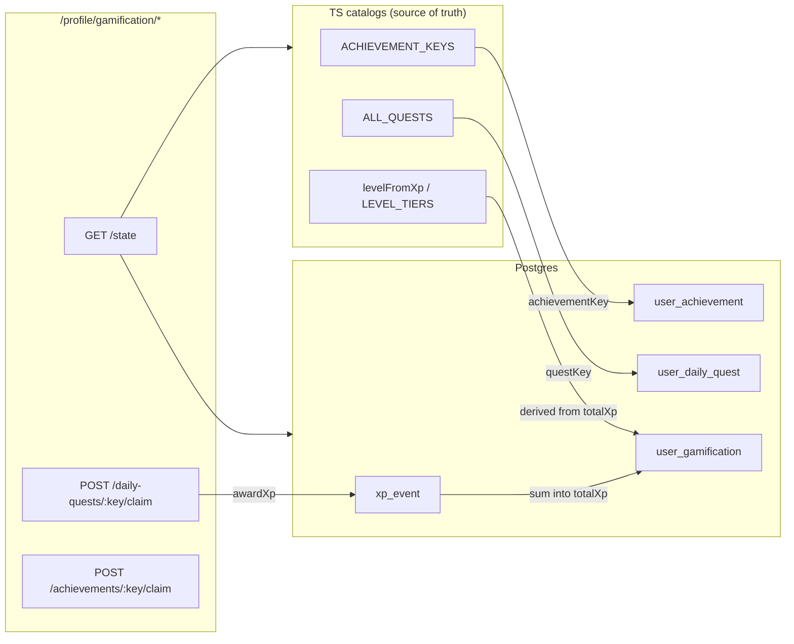

# Gamification — XP, achievements, quests, leaderboard

The single reference for everything reward-shaped in Xevo: how a player earns XP, levels up, unlocks achievement badges, completes daily/weekly/season quests, and ranks on the leaderboard. This is the catalog that does not otherwise exist anywhere — the live source of truth is TypeScript (`server/src/gamification/definitions.ts`), mirrored by the app catalogs.

> **In plain terms:** The only currency is **XP**. You earn XP by **claiming completed quests**. XP raises your **level** (every 2500 XP) and **tier** (Rookie → Legend). **Achievements** are badges that unlock automatically when you hit a stat; claiming a badge is cosmetic and gives **no XP**. The **leaderboard** ranks players by total XP. There are **no coins, no rewards shop, no redeem flow, and no "events."**

---

## 1. System map



Everything lives under `server/src/gamification/` plus 4 DB tables. The app reads one endpoint (`GET /state`) for all live progress and merges it against static display catalogs.

---

## 2. Data model

All four tables are in [server/src/db/schema.ts](../../server/src/db/schema.ts). There is **no catalog table** — achievement/quest definitions are hardcoded in TypeScript; the DB only stores per-user progress.

| Table | Export | Lines | Purpose |
|-------|--------|-------|---------|
| `user_gamification` | `userGamification` | 784-799 | One row per user: XP total, login streak, level bookkeeping |
| `user_achievement` | `userAchievement` | 801-822 | One row per unlocked badge (`unlockedAt`, optional `claimedAt`) |
| `user_daily_quest` | `userDailyQuest` | 824-847 | Per-period quest progress (daily **and** weekly **and** season) |
| `xp_event` | `xpEvent` | 849-870 | Append-only XP ledger, deduplicated |

### `user_gamification` (784-799)

| Column | Type | Default | Notes |
|--------|------|---------|-------|
| `userId` | text PK | — | FK → `user.id` cascade |
| `totalXp` | int | 0 | Running XP total |
| `loginStreak` | int | 0 | Consecutive login days |
| `lastLoginDate` | text | — | Local `YYYY-MM-DD` |
| `lastLevel` | int | 1 | Last computed level (for `reach-new-division`) |
| `dayStartDate` | text | — | Local date current day started |
| `dayStartLevel` | int | 1 | Level at start of `dayStartDate` |
| `updatedAt` | timestamp | now | |

### `user_achievement` (801-822)

Columns: `id` PK, `userId` (FK cascade), `achievementKey`, `unlockedAt`, `claimedAt` (nullable).
Indexes: unique `(userId, achievementKey)`, index `(userId)`.

### `user_daily_quest` (824-847)

Columns: `id` PK, `userId` (FK cascade), `dateKey`, `questKey`, `progress` (default 0), `goal` (default 1), `claimedAt` (nullable), `updatedAt`.
Indexes: unique `(userId, dateKey, questKey)`, index `(userId, dateKey)`.

> Despite the name, this table stores all three cadences. The cadence is encoded in `dateKey`: daily = `2026-06-23`, weekly = `W2026-23` (ISO week), season = `S2026-2` (4-month season). Period keys come from [server/src/gamification/questPeriods.ts](../../server/src/gamification/questPeriods.ts).

### `xp_event` (849-870)

Columns: `id` PK, `userId` (FK cascade), `amount`, `source`, `sourceRef`, `createdAt`.
Indexes: **unique `(userId, source, sourceRef)`** (the dedup guarantee), index `(userId)`.
Known `source` values: `daily_quest`, `weekly_quest`, `season_quest` (set in `service.ts`), and `manual_grant` (ops script). `sourceRef` is `{periodKey}:{questKey}`, e.g. `2026-06-23:complete-an-upload`.

---

## 3. Backend modules

All under [server/src/gamification/](../../server/src/gamification/):

| File | Purpose |
|------|---------|
| `definitions.ts` | Master catalog: `ACHIEVEMENT_KEYS`, `ALL_QUESTS` (xp/goal/cadence), level/tier math, deterministic quest-pool selection |
| `achievements.ts` | `meetsAchievement` thresholds + `unlockAchievements` DB insert |
| `stats.ts` | Aggregates user stats (videos, analyses, coach reviews, friends, streaks) used by achievements/quests |
| `dailyQuests.ts` | Per-quest progress computation + DB sync, period-scoped |
| `questPeriods.ts` | Daily/weekly/season period keys and bounds |
| `xp.ts` | `user_gamification` bootstrap + deduplicated XP award via `xp_event` |
| `service.ts` | Orchestration: refresh, event hooks, claim/track |
| `gamificationRouter.ts` | HTTP routes |
| `leaderboard.ts` | XP leaderboard by scope |

### HTTP routes

Mounted at `/profile/gamification` (and `/api/auth/profile/gamification`) via [server/src/profile/profileRouter.ts](../../server/src/profile/profileRouter.ts):30. Source: [server/src/gamification/gamificationRouter.ts](../../server/src/gamification/gamificationRouter.ts).

| Method | Path | What it does |
|--------|------|--------------|
| `GET` | `/state?dateKey=YYYY-MM-DD` | Full state; triggers a refresh + login-streak update |
| `GET` | `/leaderboard?scope=global\|country\|city\|friends` | Top 50 by XP |
| `POST` | `/daily-quests/:questKey/claim` | Validate complete → mark claimed → award XP. Body: `{ dateKey?, cadence?, periodKey? }` |
| `POST` | `/achievements/:achievementKey/claim` | Mark badge claimed (no XP) |
| `POST` | `/track` | Client-driven quest progress. Body: `{ questKey, dateKey? }` |

`service.ts` exports: `refreshGamification` / `getGamificationState`, hooks `onVideoUploaded`, `onAnalysisCompleted`, `onCoachReviewCompleted`, `onFriendLinked`, plus `trackClientQuest`, `claimDailyQuest`, `claimAchievement`.

---

## 4. Event hooks (what makes progress recompute)

Gamification has no background job; state recomputes whenever one of these fires (each calls `refreshGamification`):

| Hook | Call site | Trigger |
|------|-----------|---------|
| `onVideoUploaded` | [techniqueRouter.ts](../../server/src/technique/techniqueRouter.ts):690 | After `POST /technique/upload` |
| `onAnalysisCompleted` | [techniqueRouter.ts](../../server/src/technique/techniqueRouter.ts):1658 | After `POST /technique/analyze` completes |
| `onCoachReviewCompleted` | [coachRouter.ts](../../server/src/coach/coachRouter.ts):497 | After `POST /coach/review/:id/submit` |
| `onFriendLinked` | [profileRouter.ts](../../server/src/profile/profileRouter.ts):920 | After `POST /profile/coach-students` |
| Implicit login | `GET /profile/gamification/state` | Any app open / tab focus |

---

## 5. XP, levels & tiers

Defined in [definitions.ts](../../server/src/gamification/definitions.ts):359-411.

- `XP_PER_LEVEL = 2500`.
- `level = floor(totalXp / 2500) + 1` (minimum 1).
- `xpInLevel = totalXp % 2500`; `xpGoal = 2500`.
- Tier = `LEVEL_TIERS[min(level - 1, 7)]`. Level 8+ stays **Legend**.

| Level | XP range | Tier |
|-------|----------|------|
| 1 | 0–2499 | Rookie |
| 2 | 2500–4999 | Bronze |
| 3 | 5000–7499 | Silver |
| 4 | 7500–9999 | Gold |
| 5 | 10000–12499 | Platinum |
| 6 | 12500–14999 | Elite |
| 7 | 15000–17499 | Master |
| 8+ | 17500+ | Legend |

XP is awarded **only on quest claim** (`awardXp` in [xp.ts](../../server/src/gamification/xp.ts):44, called from `service.ts`), deduplicated by the unique `xp_event (userId, source, sourceRef)` index so a quest can never be double-claimed.

**Login streak** is separate from upload streaks: it increments if the last login was yesterday, resets to 1 otherwise, and is a no-op on same-day re-open (`service.ts` `recordDailyLogin`).

---

## 6. Achievements (22 badges)

Keys from `ACHIEVEMENT_KEYS` ([definitions.ts](../../server/src/gamification/definitions.ts):19-67); unlock thresholds from `meetsAchievement` ([achievements.ts](../../server/src/gamification/achievements.ts):7-60). Badges unlock automatically during refresh; claiming sets `claimedAt` and grants **no XP**.

| Key | Unlock condition |
|-----|------------------|
| `streak-3` | Login streak ≥ 3 |
| `streak-7` | Login streak ≥ 7 |
| `streak-30` | Login streak ≥ 30 |
| `first-upload` | ≥ 1 video uploaded |
| `upload-10` | ≥ 10 videos |
| `upload-20` | ≥ 20 videos |
| `upload-40` | ≥ 40 videos |
| `upload-full-week` | 7 consecutive upload days (all-time max) |
| `monthly-year` | An upload in each of 12 consecutive calendar months |
| `first-ai` | ≥ 1 completed AI analysis |
| `above-50` | Max AI score ≥ 50 |
| `above-80` | Max AI score ≥ 80 |
| `above-90` | Max AI score ≥ 90 |
| `the-goat` | Max AI score ≥ 95 |
| `above-60-defence` | Max defence/glass score ≥ 60 |
| `net-play-60` | Max net-play score ≥ 60 |
| `smash-60` | Max smash/overhead score ≥ 60 |
| `three-techniques-90` | ≥ 3 distinct strokes scored ≥ 90 |
| `first-coach-review` | ≥ 1 completed coach review |
| `coach-rate-100` | A coach mark of 100 (or linked analysis = 100) |
| `improve-shot` | A later analysis beat the prior best for the same stroke |
| `add-friend` | ≥ 1 coach-student link |
| `secret` | ≥ 5 **claimed** non-secret achievements |

> The display catalog in the app ([app/src/lib/achievementsCatalog.ts](../../app/src/lib/achievementsCatalog.ts)) lists 23 entries (badge art + i18n labels); the server has 22 functional keys. They must stay aligned (see §10).

---

## 7. Quests

Cadence is daily/weekly/season. Each period a deterministic, seed-shuffled subset of the pool is shown (same selection for all users in that period). XP is granted on claim only. Pools and counts from [definitions.ts](../../server/src/gamification/definitions.ts); progress logic in [dailyQuests.ts](../../server/src/gamification/dailyQuests.ts).

### 7a. Daily — 14 in pool, 4 active per day

| Key | XP | Goal | Trigger |
|-----|----|------|---------|
| `first-login-of-day` | 15 | 1 | Logged in today |
| `login-to-app` | 20 | 1 | Logged in today |
| `share-your-profile` | 20 | 1 | Client `POST /track` |
| `complete-3-before-midday` | 25 | 3 | 3 quest claims before 12:00 local |
| `complete-3-daily-quests` | 30 | 3 | 3 daily quests claimed today |
| `complete-an-upload` | 35 | 1 | Upload today |
| `watch-ai-replay` | 35 | 1 | Client `POST /track` |
| `get-over-70-score` | 40 | 1 | Today's analysis score ≥ 70 |
| `share-result` | 45 | 1 | Client `POST /track` |
| `improve-ai-score-yesterday` | 50 | 1 | Today's max score > yesterday's max |
| `upload-1-backhand` | 50 | 1 | Backhand analysis today |
| `get-ai-score-above-80` | 55 | 1 | Today's score ≥ 80 |
| `score-above-60-serves` | 55 | 1 | Serve/return category score ≥ 60 today |
| `complete-1-ai-analysis` | 60 | 1 | Any completed analysis today |

### 7b. Weekly — 10 in pool, 3 active per ISO week

| Key | XP | Goal | Trigger |
|-----|----|------|---------|
| `upload-3-volley-shots` | 180 | 3 | Up to 3 volley/net-play analyses this week |
| `upload-a-full-video` | 200 | 1 | Any upload this week |
| `hit-perfect-bandejas` | 220 | 1 | Bandeja stroke score ≥ 90 this week |
| `get-streak-50-points` | 250 | 3 | Up to 3 analyses scored ≥ 50 this week |
| `invite-a-friend` | 280 | 1 | Coach-student link created this week |
| `get-80-above-smashes` | 280 | 1 | Smash/overhead score ≥ 80 this week |
| `get-perfect-volleys` | 300 | 1 | Volley score ≥ 90 this week |
| `upload-analyze-full-video` | 320 | 1 | Upload + analysis both this week |
| `upload-3-consecutive-days` | 350 | 3 | Max consecutive upload days this week (cap 3) |
| `complete-all-daily-quests` | 380 | 1 | Every day this week: all that day's daily quests claimed |

### 7c. Season — 6 in pool, 2 active per 4-month season

| Key | XP | Goal | Trigger |
|-----|----|------|---------|
| `achieve-s-rank-ai` | 900 | 1 | S-rank rating or score ≥ 90 this season |
| `improve-shot-accuracy-15` | 1100 | 1 | Same stroke improved ≥ 15 vs prior best this season |
| `maintain-5-day-streak` | 1300 | 5 | Login streak (capped at 5) |
| `maintain-7-day-streak` | 1600 | 7 | Login streak (capped at 7) |
| `complete-perfect-week` | 1900 | 7 | Login streak (capped at 7) — see §11 |
| `reach-new-division` | 2400 | 1 | Current level > level at season start |

Seasons: Jan–Apr, May–Aug, Sep–Dec (`S{year}-{1|2|3}`). Client-trackable keys: `share-result`, `share-your-profile`, `watch-ai-replay` (`CLIENT_TRACKABLE_QUEST_KEYS`).

---

## 8. Leaderboard

Source: [leaderboard.ts](../../server/src/gamification/leaderboard.ts).

- Scopes: `global`, `country`, `city`, `friends` (friends = users linked via `coach_student`, both directions).
- Top **50**, filtered to `totalXp > 0`, sorted by `totalXp` desc → `updatedAt` → name.
- Each entry also carries `overallScore` = average of the user's completed-analysis AI scores.

---

## 9. Frontend map

State flows through [app/src/context/SessionDataContext.tsx](../../app/src/context/SessionDataContext.tsx), which calls `fetchGamificationState()` on boot and on tab focus. Client API helpers: [app/src/lib/gamificationApi.ts](../../app/src/lib/gamificationApi.ts) and [app/src/lib/leaderboardApi.ts](../../app/src/lib/leaderboardApi.ts).

```
Progress tab → ProgressMain (Achievements sub-view)
  ├─ AchievementsHeroBlock        (level, tier, XP bar, upload streak)
  ├─ AchievementsDailyQuestBanner (today's featured quest) → DailyQuest
  └─ AchievementsBadgesSection    (badge preview) → AllAchievements | Ranking
DailyQuest        → quest cards, claim XP
AllAchievements   → AchievementDetail (claim badge / share)
Ranking           → LeaderboardPlayer (public profile)
```

Static display catalogs: [app/src/lib/achievementsCatalog.ts](../../app/src/lib/achievementsCatalog.ts), [app/src/lib/dailyQuestsCatalog.ts](../../app/src/lib/dailyQuestsCatalog.ts).

---

## 10. Sync contract

The server keys and the app catalogs are two copies of the same truth and **must match**:

- `server/src/gamification/definitions.ts` `ACHIEVEMENT_KEYS` ↔ `app/src/lib/achievementsCatalog.ts`.
- `server/src/gamification/definitions.ts` `ALL_QUESTS` (key + xp + goal + cadence) ↔ `app/src/lib/dailyQuestsCatalog.ts`.
- The app quest catalog is generated by [app/scripts/generate-daily-quests-catalog.mjs](../../app/scripts/generate-daily-quests-catalog.mjs) from `app/assets/dailyquests/*.svg`.

If you add or rename a key on one side, update the other or the UI will show an unknown/blank entry or the claim will 400.

---

## 11. Known gaps / bugs

These are documented, not fixed:

- **Client-trackable quests can never complete.** `share-result`, `share-your-profile`, and `watch-ai-replay` only progress via `POST /track`, but the app never calls `trackGamificationQuest()` (it exists in `gamificationApi.ts` but is unused). These three daily quests are effectively dead until the app wires the calls.
- **`complete-perfect-week` is mislabeled.** The season quest reuses the 7-day-login-streak implementation (goal 7 on `loginStreak`) rather than a "perfect week of activity," so its name does not match its logic.
- **Newly-earned achievements are invisible.** `newlyEarnedAchievements` is returned by `GET /state` but never surfaced in the UI, and there are no gamification notifications (`user_notification` has no `achievement` / `level_up` / `quest` `kind`).
- **Achievement claim grants no XP** (current design — claim only sets `claimedAt`).
- **Duplicate migration numbering.** Gamification ships standalone `0032_user_gamification.sql` / `0033_user_achievement_claimed_at.sql` while the Drizzle journal separately tracks `0032_*` / `0033_hot_shadow_king`. The SQL is idempotent, but the numbering overlap is a footgun.

---

## 12. Intentionally absent

There is **no** coins/points currency, rewards shop, redeem flow, purchasable rewards, badge/quest catalog tables in the DB, or "events" system. XP is the only currency and badges are the only non-XP reward. If a coins + rewards economy is wanted, it is a new feature (new tables, earn rules, redeem flow, UI), not an extension of the current schema.
