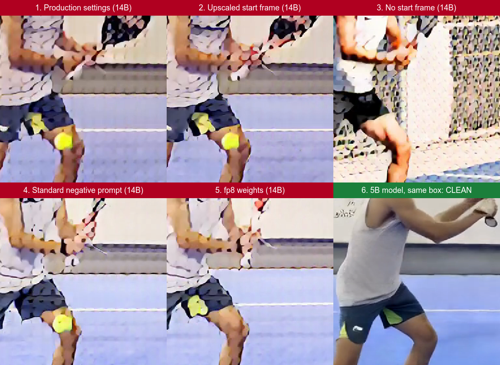
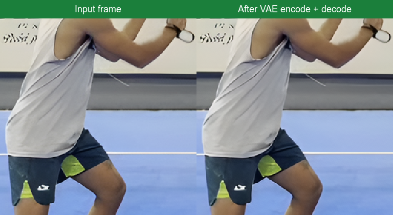

# Fun Control video texture investigation

**Resolved (2026-10-01): the 14B model files on the 5090 box were damaged.** After Kyle re-downloaded them, the same render on the box is clean. See [Resolution](#resolution) at the end.

Generated correction videos have a "stained glass" texture: skin, clothing, floor and walls break up into a regular lattice of blobs about 16 pixels across. That is one model token (8x VAE downsample times a patch size of 2), so the model is rendering each token separately instead of blending them.

**Finding:** on the RTX 5090 ComfyUI box, Wan 2.2 Fun Control 14B produces this texture whatever we feed it. The Wan 2.2 5B model on the same box, with the same start frame and prompt, renders cleanly. Our workflow, prompts and inputs are not the cause. The remaining suspects are the 14B model files on the box, or how this ComfyUI and PyTorch version runs the 14B model.

## Evidence

`comparison.mp4` shows the same six renders in motion, slowed to half speed and looped.

All tests started from the latest production render (768x768, 20 steps, cfg 3.5, shift 8, euler/simple, same seed and pose clip) and changed one thing at a time. Most used 17 frames to save GPU time.

| Change from production | Result |
|---|---|
| None (production settings, 33 frames) | Lattice |
| Start frame upscaled with Real-ESRGAN instead of a bilinear stretch from 368x368 | Lattice; colors slightly more faithful |
| 17 frames instead of 33 | Lattice |
| No pose clip | Lattice |
| No start frame at all (pose clip and text only) | Lattice, in a different invented scene |
| Wan's standard negative prompt instead of ours | Lattice |
| fp8 weights so both models fit in VRAM | Lattice; floor slightly cleaner |
| fp16 compute (`ModelComputeDtype`) | Lattice |
| Attention set explicitly to PyTorch (`ModelAttentionBackend`) | Lattice |
| 640x640 (ComfyUI template default) | Lattice |
| 832x480 | Lattice |
| `uni_pc` sampler instead of `euler` | Lattice |
| Shift 5 instead of 8 | Lattice |
| **Wan 2.2 5B image-to-video, same box, start frame and prompt** | **Clean** |

Also checked and ruled out:

- **Workflow wiring:** the high-noise model runs steps 0-10 and the low-noise model runs 10-20, as in ComfyUI's official template.
- **Model files swapped:** running either model alone for all 20 steps gives very different results (low-noise alone draws a line sketch; high-noise alone leaves unresolved noise), so the two files are different models in the right slots.
- **VAE:** encoding and decoding a clean frame with `wan_2.1_vae` returns it intact.

- **ComfyUI launch flags:** none beyond `--listen` and `--port`.

The same look is reported in [Wan-Video/Wan2.2#139](https://github.com/Wan-Video/Wan2.2/issues/139), where the cause was the high-noise model loaded in both slots. That is not the case here.

## Environment

- GPU: RTX 5090 (32 GB)
- ComfyUI 0.36.0, PyTorch 2.14.0 with CUDA 13.0
- Models: `wan2.2_fun_control_{high,low}_noise_14B_bf16.safetensors` from Comfy-Org/Wan_2.2_ComfyUI_Repackaged

## Next steps (need shell access to the box)

1. **Verify the model files.** Sizes match the official files (28,579,237,064 bytes each), but a corrupted download can keep the right size. Run `sha256sum` in `/home/shini/ComfyUI/models/diffusion_models/` and compare:
   - high noise: `e4be07ca25d67aaf3461ef87fbb5ad8762f602a5efa620aea9dc250ac2747a9d`
   - low noise: `d82bc21cd703e089eee4f6fabc25e90ebbd00965623fdc5e83d46d01dbeac2c3`
2. **Try an older ComfyUI.** If the checksums match, run the same workflow on the commit pinned in `comfyui-deploy/snapshot.video.json` (`0d90172`), or on a cloud GPU, to rule out a regression in 0.36.0 or PyTorch 2.14.
3. **Try the official fp8 files.** `wan2.2_fun_control_*_14B_fp8_scaled.safetensors` (URLs in `comfyui-deploy/models.video-fun-control-14b.json`) were packaged for 32 GB cards like the 5090.

Two comments in `BEXevo/src/technique/` no longer hold and should be updated once the cause is confirmed: 768x768 is not clean on this box, and a higher-resolution start frame does not remove the texture.

## Resolution

The production render (768x768, 17 frames, 20 steps, the `4491f6e9` start frame and pose clip) was run on RunPod with freshly downloaded official files, then on the box after Kyle re-downloaded its models. Workflow: `runpod-2026-10-01/wf_bf16.json`.

| Machine | ComfyUI | PyTorch | Result |
|---|---|---|---|
| A100 80GB | 0.38.0 | 2.14.1 + CUDA 13.0 | Clean (`a100_bf16.mp4`) |
| A100, `--reserve-vram 48` | 0.38.0 | 2.14.1 + CUDA 13.0 | Clean (`a100_cap32.mp4`) |
| RTX PRO 4500 Blackwell 32GB | 0.38.0 | 2.14.1 + CUDA 13.0 | Clean (`bw32_bf16.mp4`) |
| 5090 box, old model files | 0.36.0 | 2.14.0 + CUDA 13.0 | Lattice |
| 5090 box, re-downloaded files | 0.36.0 | 2.14.0 + CUDA 13.0 | Clean (`box_redownloaded.mp4`) |

The Blackwell run rules out the GPU architecture, and the box going clean with no software change rules out ComfyUI 0.36.0. The freshly downloaded files on RunPod matched the checksums in `kyle-checklist.md`.

### What actually drives quality

With the lattice gone, melted faces and missing fingers come from the input, not the model. Production sends a 368x448 start frame where the player is about 70 pixels wide, a handful of 16-pixel tokens for the whole face. A test on the same box with a 1024x1024 start frame cropped around the player, a full-body pose (face and hand keypoints), 30 steps and a shot-specific prompt gave a stable face, five fingers on the grip and an undistorted racket, with both Fun Control 14B (about 12 minutes on the box) and Wan 2.2 Animate (about 2 minutes).

To reproduce: crop the clip around the player with ffmpeg, then run `comfyui-deploy/make_pose_control.py` (with `--pro` for a corrected skeleton) and, for Animate, `comfyui-deploy/make_face_crops.py` with the same `--start/--frames/--fps`.
