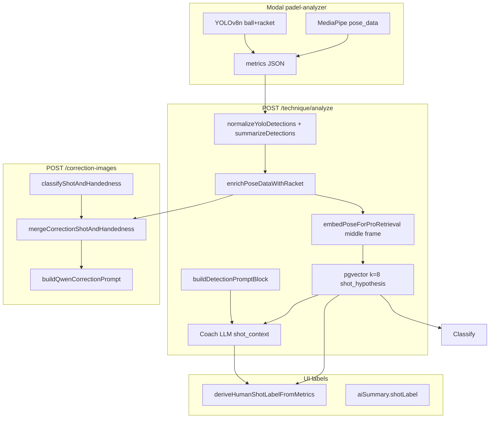
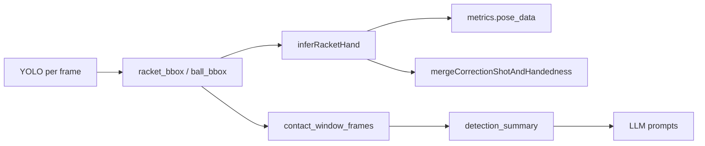
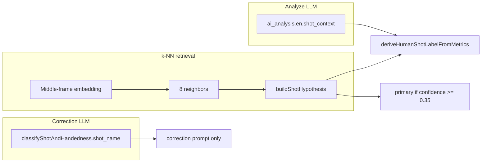

# v9 — Shot detection and label pairing

**Version:** v9  
**Date:** 2026-05-30  
**Status:** Implemented (server v9 shot labeling + embedding spec v2)  
**Environment verified:** Local server `localhost:3050`, Neon DB via `server/.env`

This document merges the **investigation plan** and **live verification findings** for YOLO shot detection, shot label pairing, and correction image mismatches.

---

## Table of contents

1. [Problem statement](#problem-statement)
2. [Investigation plan — scope and goals](#investigation-plan--scope-and-goals)
3. [System map (what actually runs)](#system-map-what-actually-runs)
4. [Area 1: YOLO → shot detection](#area-1-yolo--shot-detection)
5. [Area 2: Shot label pairing](#area-2-shot-label-pairing)
6. [Findings — executive summary](#findings--executive-summary)
7. [Findings — hypothesis verification](#findings--hypothesis-verification)
8. [Findings — case studies](#findings--case-studies)
9. [Local env snapshot](#local-env-snapshot)
10. [Verification runbook](#verification-runbook)
11. [Theory-first fix options](#theory-first-fix-options)
12. [What not to do yet](#what-not-to-do-yet)
13. [Success criteria](#success-criteria)
14. [Next steps](#next-steps)
15. [Related docs](#related-docs)

---

## Problem statement

Correction images and displayed shot titles sometimes disagree with what the user actually hit. Past fixes assumed the wrong layer was broken. This work documents the system, verifies failures on local env, and ranks hypotheses — **no implementation until evidence is collected**.

**Critical misconception:** YOLO does **not** classify stroke type (forehand, volley, smash, etc.). It only detects **ball (COCO 32)** and **racket (COCO 38)**. “Shot detection” in the product is actually **three independent label pipelines** that can disagree.

---

## Investigation plan — scope and goals

### Goals

- Map how YOLO and shot-label systems interact end-to-end.
- Catalog known failure modes with severity and user surfaces.
- Run live verification (SQL + curl/HTTP) on real `technique_analysis` data — not new unit tests.
- Rank theory-first fix options before coding.

### Out of scope (this phase)

- No code changes to YOLO thresholds, `buildShotHypothesis`, or correction prompts.
- No assumption-driven Comfy prompt tuning.
- Do not edit the Cursor plan file; this `v9.md` is the repo deliverable.

### Deliverable checklist

| Item | Status |
|------|--------|
| Architecture diagrams (mermaid) | Done |
| Issue catalog (Areas 1–2) | Done |
| Hypothesis table with pass/fail | Done |
| Verification runbook + SQL | Done |
| ≥3 concrete mismatch case studies | Done (A–D) |
| Ranked fix options tied to evidence | Done |

---

## System map (what actually runs)



### Source files

| Topic | Path |
|-------|------|
| YOLO ingest | `server/src/technique/techniqueRouter.ts` (~243–494) |
| k-NN + hypothesis | `server/src/technique/trainRetrieval.ts` |
| Embedding (middle frame) | `server/src/technique/poseEmbedding.ts` |
| Display label | `server/src/train/trainShotDisplay.ts` |
| Correction shot | `server/src/technique/correctionPrompt.ts` |
| Impact / clips | `server/src/technique/impactPoseContext.ts` |
| Comfy pipeline | `comfy-imagegen.md` |

---

## Area 1: YOLO → shot detection

### What YOLO contributes today

| Output | Where stored | Downstream use |
|--------|--------------|----------------|
| `racket_bbox` / `ball_bbox` per frame | `metrics.pose_data[]` | Overlay UI, `racket_hand` inference |
| `contact_window_frames` | `metrics.detection_summary` | LLM analyze prompt + correction hint text |
| Raw rows (optional) | `technique_detection_frame` | **Written but never read in TS** |

YOLO **does not** feed `shot_hypothesis`, k-NN neighbors, or `classifyShotAndHandedness` directly (only text hints and geometry).



### Known issues (plan)

| ID | Issue | Severity |
|----|-------|----------|
| I1 | YOLO ≠ shot classifier; fixes often target wrong layer | High |
| I2 | `contact_window_frames` vs user impact diverge on long videos | High |
| I3 | Env gate: Modal runs YOLO by default; server needs `YOLO_DETECTION_ENABLED=true` | Medium |
| I4 | Confidence threshold drift (code 0.25 vs `.env` 0.08/0.01/0.10) | Medium |
| I5 | COCO class 38 tennis-racket proxy for padel | Medium |
| I6 | `technique_detection_frame` write-only (no API read) | Low |
| I7 | Missing `docs/YOLO_*.md` referenced in `server/README.md` | Low |

### Hypotheses to verify (Area 1)

| # | Hypothesis | Verification signal |
|---|------------|---------------------|
| H1 | Local YOLO disabled → empty `detection_summary` | Compare `.env` vs metrics on recent analyses |
| H2 | YOLO contact frames diverge from impact by >N frames | `contact_window_frames` vs `impact_pose_sequence` |
| H3 | Sparse racket detection → weak `racket_hand` | Count pose rows with `racket_hand` |
| H4 | Thresholds cause false “no contact” | Detection counts vs empty contact list |

---

## Area 2: Shot label pairing

### Three label sources



### Known structural issues (plan)

| ID | Issue | Severity |
|----|-------|----------|
| I8 | `buildShotHypothesis` splits preset vs label votes | High |
| I9 | Middle-frame k-NN vs user trim / impact at clip end | High |
| I10 | Three pipelines: retrieval, analyze LLM, correction LLM | High |
| I11 | Coarse `strokePreset` buckets (many labels → one preset) | Medium |
| I12 | Overview view uses raw `stroke_label`, not derived title | Low |
| I13 | `correctLikelyFalseOverheadShotContext` only patches `shot_context` | Medium |

### Hypotheses to verify (Area 2)

| # | Hypothesis | Verification signal |
|---|------------|---------------------|
| H5 | Preset/label split → wrong Activities titles | `stroke_preset` vs `stroke_label` vs top neighbor |
| H6 | High conf but wrong label (middle-frame mismatch) | Neighbor distance spread vs visible wrong label |
| H7 | `shot_context` contradicts `shot_hypothesis` | Text diff on completed analyses |
| H8 | Correction classifier ≠ Activities `shotLabel` | `GET /correction-images` vs display label |

---

## Findings — executive summary

Correction images and Activities titles feel “off” because **three independent systems** assign shot meaning, and **YOLO is not one of them for stroke taxonomy**.

| System | What it classifies | Used for |
|--------|-------------------|----------|
| **YOLO (Modal)** | Ball + racket boxes only | `racket_hand`, overlay, LLM hints (`contact_window_frames`) |
| **k-NN retrieval** | Pro-library neighbor → `shot_hypothesis` | Activities `shotLabel`, analyze LLM primary hint |
| **Analyze LLM** | Free-text `shot_context` | Coach copy, fallback display label |
| **Correction LLM** | Structured `classifyShotAndHandedness` | Comfy/Gemini prompt only (third vote) |

### Root causes confirmed on real data

1. **Preset vs label split** in `buildShotHypothesis` — e.g. label “Por Cuatro Smash”, preset `half_volley`.
2. **YOLO contact frames ≠ user impact** on long clips — deltas of **300–986 frames** observed.
3. **Three label pipelines disagree** — Activities title, coach `shot_context`, correction classifier.
4. **YOLO does not fix shot type** — ~**30–44%** of pose frames have `racket_hand`; handedness falls back to profile/LLM.

**Theory before coding:** Do not tune Comfy prompts or YOLO thresholds until label source-of-truth and contact timing are aligned.

### Issue catalog (verified)

| ID | Issue | Severity | User surface |
|----|-------|----------|--------------|
| I1 | YOLO ≠ shot classifier | High | Misdirected fixes |
| I2 | Contact vs impact diverge on long videos | High | Wrong LLM + correction hints |
| I3 | Preset vs label split in `buildShotHypothesis` | High | Activities vs category vs neighbor |
| I4 | Middle-frame k-NN vs user trim | High | Wrong pro neighbor → wrong label |
| I5 | Three label pipelines | High | Title vs coach text vs image prompt |
| I6 | `racket_hand` on ~30–44% of frames | Medium | Profile fallback for handedness |
| I7 | `technique_detection_frame` write-only | Low | SQL-only debug |
| I8 | Missing YOLO rollout docs in repo | Low | Ops gap |
| I9 | Coarse preset buckets | Medium | Fine shots not separable in k-NN |
| I10 | Overhead fix one-way on `shot_context` only | Medium | Hypothesis unchanged |

---

## Findings — hypothesis verification

| # | Hypothesis | Result | Evidence |
|---|------------|--------|----------|
| H1 | Local YOLO disabled → empty detection | **FAIL** (not the issue locally) | All 30 recent rows: `yolo_enabled=true` |
| H2 | YOLO contact far from impact | **PASS** | Many clips 300–986 frames off |
| H3 | Sparse `racket_hand` | **PASS** | 30–44% coverage; corrections use profile |
| H4 | Thresholds → false “no contact” | **FAIL** (locally) | Wrong **frame region**, not empty YOLO |
| H5 | Preset/label split → wrong titles | **PASS** | Multiple contradictory preset/label rows |
| H6 | High conf but wrong label | **PARTIAL** | Low conf common; split vote still wins display |
| H7 | `shot_context` vs `shot_hypothesis` | **PASS** | e.g. half volley vs defence_glass |
| H8 | Correction vs Activities title | **PASS** | e.g. “Por Cuatro Smash” vs “Half-Volley” |

### YOLO contact vs impact frame (verified sample)

| Analysis ID | Impact frame | Nearest YOLO contact | Delta (frames) | Notes |
|-------------|-------------|----------------------|----------------|-------|
| `0d7313a7-b9ca-41ea-91ca-b9dc59775905` | 59 | 58 | **1** | Short clip — YOLO aligns |
| `7ff40f54-570a-4fb6-a26c-97a4a532bc28` | 355 | 0–23 | **332** | Long video — contact at start |
| `ee64a055-068e-4d43-a555-452f977f0d58` | 366 | 0–23 | **343** | Same pattern |
| `5a3c3f89-d5ef-44c5-902e-ca58468dabe3` | 839 | 3–39 | **800** | Impact at end |
| `80db424f-fc9c-4755-9cc9-96cd5140968d` | 1019 | 2–33 | **986** | Same pattern |
| `633c5cbb-019a-4ec3-9af6-709340f865f5` | 52 | 0–28 | **24** | Moderate drift |

On full-length uploads, YOLO “contact” reflects **early-rally** ball+racket co-detection, not user-marked impact. Those frame numbers are injected into analyze and correction LLM prompts as “likely contact.”

### Preset vs label split (verified sample)

| Analysis ID | `stroke_label` (display) | `stroke_preset` (hyp) | Top neighbor preset | LLM `shot_context` (abbrev) |
|-------------|---------------------------|------------------------|---------------------|----------------------------|
| `0d7313a7-…` | Por Cuatro Smash | `half_volley` | `forehand_lob` | “controlled net shot (half-volley)” |
| `ee64a055-…` | Forehand Half Volley | `back_wall_forehand` | `half_volley` | “defensive glass shot (defence_glass)” |
| `7ff40f54-…` | Forehand Half Volley | `back_wall_forehand` | `half_volley` | “net play … forehand half-volley” |
| `6534b76c-…` | Vibora | `forehand_drive` | `backhand_volley` | “groundstroke return … drive or chiquita” |
| `5a3c3f89-…` | Backhand Volley 1 | `backhand_volley` | `contrapared_boast` | “backhand volley” |

---

## Findings — case studies

### Case A — `0d7313a7-b9ca-41ea-91ca-b9dc59775905`

| Source | Value |
|--------|-------|
| Activities `shotLabel` | **Por Cuatro Smash** |
| `shot_hypothesis` | label Por Cuatro Smash, preset `half_volley`, conf **0.30** |
| `shot_context` | “controlled net shot (**half-volley**)” |
| Correction classifier | **Half-Volley** (Net Play) |
| YOLO contact delta | 1 frame |

**Diagnosis:** Label/preset split + low retrieval confidence. Image gen follows correction LLM, not Activities title.  
**Hypotheses:** H5, H7, H8.

### Case B — `ee64a055-068e-4d43-a555-452f977f0d58`

| Source | Value |
|--------|-------|
| Activities `shotLabel` | **Forehand Half Volley** |
| `shot_hypothesis` | preset `back_wall_forehand`, category `defence_glass`, conf **0.31** |
| `shot_context` | “**defensive glass shot** (defence_glass) … back wall” |
| YOLO contact delta | **343 frames** |

**Diagnosis:** Preset vote drives category; label vote keeps “Half Volley”. YOLO hints point at frames 0–23, not impact ~366.  
**Hypotheses:** H2, H5, H7.

### Case C — `5a3c3f89-d5ef-44c5-902e-ca58468dabe3`

| Source | Value |
|--------|-------|
| Activities `shotLabel` | **Backhand Volley 1** |
| `shot_hypothesis` | conf **0.022** |
| Top neighbor | **Drop Shot backhand** / `contrapared_boast` |
| YOLO contact delta | **800 frames** |

**Diagnosis:** k-NN untrusted (conf &lt; 0.35) but label still shown; LLM says volley.  
**Hypotheses:** H2, H6, H7.

### Case D — `6534b76c-d6f3-46f5-a91c-ce9ad4ee465e`

| Source | Value |
|--------|-------|
| Activities `shotLabel` | **Vibora** |
| Correction classifier | generic **forehand** |
| YOLO contact delta | **861 frames** |

**Diagnosis:** Correction LLM collapses stroke; Comfy prompt loses specificity.  
**Hypotheses:** H2, H5, H8.

### HTTP verification (2026-05-30)

- `GET /technique/analysis/:id` — **200** for Cases A–C; metrics match SQL.
- `GET /correction-images` — Case A returns correction shot **Half-Volley**.
- `GET /technique/activities` — filtered by user ownership; display labels verified via `server/scripts/_display_labels.ts`.

---

## Local env snapshot

| Variable | Value |
|----------|-------|
| Server | `http://localhost:3050` — HTTP 200 |
| `YOLO_DETECTION_ENABLED` | `true` |
| `YOLO_DETECTION_WRITE_ENABLED` | `true` |
| `YOLO_DETECTION_CONFIDENCE` | `0.08` |
| `YOLO_RACKET_CONFIDENCE` | `0.01` |
| `YOLO_BALL_CONFIDENCE` | `0.10` |
| `COMFYUI_BASE_URL` | `http://127.0.0.1:8188` |
| `XEVO_TEXT_PROVIDER` | `xevo` |

**DB:** 30 recent completed analyses all had YOLO enabled. `technique_detection_frame`: **108,378 rows** / **107 analyses** (write-only from app code).

---

## Verification runbook

### Prerequisites

- Server on `localhost:3050`
- `server/.env` loaded
- Bearer token from `session` table (non-expired)

### Re-run scripts

```bash
cd server
node scripts/_investigate_shot_yolo.mjs    # → scripts/_investigate_output_clean.json
node scripts/_curl_verify.mjs              # → scripts/_curl_verify.json
npx tsx scripts/_display_labels.ts         # Activities shotLabel simulation
```

### SQL — discover recent analyses

```sql
SELECT id, status,
  metrics->'retrieval'->'shot_hypothesis' AS hyp,
  metrics->'ai_analysis'->'en'->>'shot_context' AS shot_context,
  metrics->'detection_summary'->>'enabled' AS yolo_enabled,
  metrics->'detection_summary'->>'detected_frames' AS yolo_frames,
  jsonb_array_length(COALESCE(metrics->'pose_data','[]'::jsonb)) AS pose_count
FROM technique_analysis
WHERE status = 'completed'
ORDER BY "createdAt" DESC
LIMIT 30;
```

### SQL — mismatch discovery

```sql
SELECT id,
  metrics->'retrieval'->'shot_hypothesis'->>'stroke_label' AS hyp_label,
  metrics->'retrieval'->'shot_hypothesis'->>'stroke_preset' AS hyp_preset,
  (metrics->'retrieval'->'shot_hypothesis'->>'confidence')::float AS hyp_conf,
  metrics->'ai_analysis'->'en'->>'shot_context' AS llm_shot,
  metrics->'impact_pose_sequence'->1->>'frame' AS impact_frame,
  metrics->'detection_summary'->'contact_window_frames' AS yolo_contact
FROM technique_analysis
WHERE status = 'completed'
ORDER BY "createdAt" DESC
LIMIT 30;
```

Flag: preset-like `hyp_label`, empty YOLO when env enabled, or impact frame far from `contact_window_frames`.

### SQL — racket_hand coverage

```sql
SELECT id,
  (SELECT count(*)::int FROM jsonb_array_elements(ta.metrics->'pose_data') p
   WHERE p->>'racket_hand' IS NOT NULL) AS with_racket_hand,
  jsonb_array_length(ta.metrics->'pose_data') AS total_pose
FROM technique_analysis ta
WHERE status = 'completed'
ORDER BY "createdAt" DESC LIMIT 20;
```

### curl — API cross-check

```bash
curl -s -H "Authorization: Bearer TOKEN" \
  "http://localhost:3050/technique/activities" | jq '.[] | {id, shotLabel}'

curl -s -H "Authorization: Bearer TOKEN" \
  "http://localhost:3050/technique/analysis/ANALYSIS_ID" \
  | jq '{hyp: .metrics.retrieval.shot_hypothesis, neighbors: .metrics.retrieval.neighbors[0:3], shot_context: .metrics.ai_analysis.en.shot_context, detection: .metrics.detection_summary, impact: .metrics.impact_pose_sequence}'

curl -s -H "Authorization: Bearer TOKEN" \
  "http://localhost:3050/technique/analysis/ANALYSIS_ID/correction-images" \
  | jq '.correction_context_comfy.shot_and_handedness // .correction_context.shot_and_handedness'
```

---

## Theory-first fix options

Ranked by evidence strength and blast radius. **No code in v9 investigation phase** — pick one track for v9 implementation follow-up.

### 1. Unify shot label for display + correction (high impact)

Single resolved shot after analyze: prefer `shot_context` when retrieval conf &lt; 0.35; else retrieval label; pass into correction instead of re-classifying.  
**Validates:** Cases A, D.

### 2. Clip-local YOLO contact hints (high impact)

Filter `contact_window_frames` to `user_clips` window; or nearest contact to impact; omit hint when delta &gt; N.  
**Validates:** H2 — Cases B, C, D.

### 3. Joint preset+label in `buildShotHypothesis` (medium impact)

Preset and label from same neighbor cluster; confidence reflects label agreement.  
**Validates:** H5 — Cases A, B.

### 4. Impact or clip-window k-NN embedding (medium impact, higher risk)

Embed at impact or clip mean; re-index train consistently (`poseEmbedding.ts` warns about train trim parity).  
**Validates:** H6.

### 5. Gate Activities label on retrieval confidence (low effort)

If conf &lt; 0.35, prefer first sentence of `shot_context`.  
**Validates:** Case C.

### 6. YOLO for correction frame pick only (lower priority)

Prefer frames with racket bbox near impact — handedness/pixels, not stroke name.

### 7. Debug API for `technique_detection_frame` (ops)

Expose read path for overlay/debug without raw SQL.

### 8. Mesh enrichment + raw k-NN (no rerank nudges)

Impact-frame `pose_enrichment` ([`sam_mesh.py`](../sam_mesh.py)) feeds `sam_v1` pgvector queries ([`meshEmbedding.ts`](../server/src/technique/meshEmbedding.ts)). Bandeja/overhead distance rerank was **removed** — neighbors stay in raw pgvector order; see [SHOT-RETRIEVAL-INVESTIGATION.md](./SHOT-RETRIEVAL-INVESTIGATION.md).

---

## What not to do yet

- Do not raise/lower YOLO thresholds expecting better **shot names**.
- Do not tune Comfy/Qwen prompts until correction shot JSON aligns with resolved analyze shot.
- Do not substitute new unit tests for clip-level verification on Cases A–D.

---

## Success criteria

| Criterion | Met |
|-----------|-----|
| Plan + findings in `docs/v9.md` | Yes |
| Mermaid architecture diagrams | Yes |
| Hypothesis pass/fail from live data | Yes |
| ≥3 case studies with root-cause | Yes (A–D) |
| Ranked fix options tied to evidence | Yes |
| Verification runbook (SQL + curl) | Yes |

---

## Implementation notes (v9 code)

Shipped in server (2026-05-30):

| Track | Change |
|-------|--------|
| Label-only k-NN vote | `buildShotHypothesis` votes `stroke_label` only; preset is metadata from closest neighbor in the winning bucket ([`trainRetrieval.ts`](../server/src/technique/trainRetrieval.ts)) |
| Embedding spec **v2** | Impact/clip-end frame for technique query; last `pose_sequence` frame for train index ([`poseEmbedding.ts`](../server/src/technique/poseEmbedding.ts)); neighbors filtered `specVersion = v2` |
| Canonical shot | `resolveCanonicalShotFromMetrics` drives Activities title, analyze hint, and correction Comfy shot ([`trainShotDisplay.ts`](../server/src/train/trainShotDisplay.ts)) |
| Handedness only at correction | `classifyHandednessOnly` — shot text from retrieval, not GPT re-classify ([`correctionPrompt.ts`](../server/src/technique/correctionPrompt.ts)) |
| Clip-local YOLO | `contact_window_frames_prompt` on `detection_summary`; env `YOLO_CONTACT_MAX_IMPACT_DELTA` (default 60) ([`yoloContactHints.ts`](../server/src/technique/yoloContactHints.ts)) |

### Retrain / migration (required after deploy)

1. Ensure admin `strokeLabel` on train uploads is correct (preset remains DB taxonomy only).
2. Run **`POST /train/embeddings/backfill`** (admin) to repopulate **v2** vectors — until then, k-NN may return zero neighbors.
3. New technique analyses pick up v2 + label-only hypothesis; existing completed rows keep old metrics until re-analyzed.

### Post-deploy verification

Re-run scripts on Cases A–D ([Case studies](#findings--case-studies)):

```bash
cd server
pnpm db:migrate
pnpm exec tsx scripts/_run_backfill.ts
node scripts/_investigate_shot_yolo.mjs
node scripts/_curl_verify.mjs
pnpm exec tsx scripts/_display_labels.ts
```

On Windows Git Bash, use `pnpm exec tsx` instead of `npx tsx`. If videos are on Railway (`/app/uploads/...`), re-run v9 retrieval in-place:

```bash
pnpm exec tsx scripts/_reprocess_v9_metrics.ts
```

**Pass criteria:** `stroke_label` matches Activities title; `stroke_preset` must not drive UI; correction `shot_and_handedness.shot_name` matches Activities when retrieval conf ≥ 0.35; long-clip YOLO prompt contacts empty or near impact (not frames 0–23).

**2026-06-02 local validation (after migrate + 91× v2 backfill + reprocess):**

| Case | preset_label_split | spec_version | contact_prompt (long clips) |
|------|-------------------|--------------|-------------------------------|
| A | false | v2 | still has clip contacts (short clip) |
| B | false | v2 | null (filtered) |
| C | false | v2 | null (filtered) |
| D | false | v2 | null (filtered) |

Full `POST /technique/analyze` re-upload was not run locally (video files not on disk under `server/uploads/technique`). Correction images on old rows still reflect pre-v9 Comfy runs until regenerated.

---

## Impact frame resolution (server, no UI change)

**Problem:** k-NN used pose at `user_clips[0].endMs` (clip end), while YOLO ball contacts often sit earlier (e.g. frames 0–24 on a 3s clip). Full-video trim → impact at last frame → wrong shot neighbors.

**Fix:** [`server/src/technique/resolveImpactFrame.ts`](../server/src/technique/resolveImpactFrame.ts) + [`applyUserClipImpactToMetrics`](../server/src/technique/impactPoseContext.ts), wired in analyze **after** YOLO summary ([`techniqueRouter.ts`](../server/src/technique/techniqueRouter.ts)).

| Priority | Source | When |
|----------|--------|------|
| 1 | `yolo_median` | Contacts inside clip → median contact frame |
| 2 | `yolo_global_median` | No in-clip contacts, clip spans ≥85% of video |
| 3 | `clip_center` | Narrow clip (&lt;70% of video), no in-clip contacts |
| 4 | `clip_end` | Fallback (legacy) |

Persisted on metrics: `impact_frame_resolved`, `impact_frame_source`.

**Train index hygiene:** [`trainRetrievalHygiene.ts`](../server/src/technique/trainRetrievalHygiene.ts) drops mislabeled neighbors (e.g. Por Cuatro Smash on `forehand_lob` preset). [`trainShotDisplay.ts`](../server/src/train/trainShotDisplay.ts) uses `low_confidence_fallback` when label vote &lt; 0.35 and neighbor distance gap &lt; 0.02.

**Ops scripts:**

```bash
cd server
pnpm exec tsx scripts/audit_train_label_preset_mismatch.mjs
pnpm exec tsx scripts/audit_retrieval_coverage.mjs
pnpm exec tsx scripts/_dist_to_forehand_lob.mjs   # after re-analyze
```

**Data gap:** Only **one** canonical v2 `Forehand Lob` train clip today — lob may still lose to closer volley/return neighbors until more pro samples are indexed (no new uploads in this pass).

---

## Next steps

- Re-analyze or accept that historical analyses retain v1 metrics until backfill + new analyze.
- Optional: one-off re-analyze script for high-value clips after train library v2 index is full.
- i18n for server-driven shot strings remains a separate track.

---

## App language (i18n)

- **Stack:** `i18next`, `react-i18next`, `expo-localization`
- **Init:** [`app/src/i18n/index.ts`](../app/src/i18n/index.ts) imported from [`app/App.tsx`](../app/App.tsx)
- **Device detection:** Spanish if `expo-localization` reports `es`; otherwise English. Persisted in AsyncStorage (`xevo_app_language`).
- **Toggle:** Underlined **English | Español** at the bottom of Welcome, Sign up, Sign in, Account created, and **Profile setup** ([`LanguageToggle`](../app/src/components/LanguageToggle.tsx))
- **Locales:** [`app/src/i18n/locales/en.ts`](../app/src/i18n/locales/en.ts) / [`es.ts`](../app/src/i18n/locales/es.ts) — namespaces include `onboarding`, `profileSetup`, `tabs`, `technique`, `correctionModal`, `activities`, `analysis`, `notifications`, `invite`, `coachAccordions`, `coachFlow`, `profileSettings`, `commonAlerts`

### Coverage (deep flows)

| Area | Status | Notes |
|------|--------|--------|
| Onboarding + profile setup | Done | Welcome → account created + level/gender options |
| Main tabs | Done | `main.tsx` |
| AI Coach (`technique.tsx`) | Partial | Upload modal, clip alert, step-3 accordions, pose corrections, generate/regenerate; dev-only fal/Comfy buttons still English |
| Correction regenerate modal | Done | `CorrectionRegenerateModal.tsx` |
| Activities list + shot detail | Done | Shots tabs, empty states, `ActivitiesVideoAnalysis` metrics + coach accordions |
| Coach accordions (shared) | Done | `CoachAnalysisAccordions.tsx` — used in Activities + AI Coach |
| Notifications | Done | Title, empty, read suffix |
| Invite friends/coaches/clubs | Done | Search placeholders, segments, share message |
| Profile settings alerts | Done | Birthdate, password, location, game saves |
| My Coach flows | Partial | Add student, review editor, student review, chat send errors, coach hero upload alerts |
| Admin | English only | By design — not translated |
| Progress / You / My Coach / Profile settings | Done | Extended locales + `enExtended` / `esExtended` merge |
| Server-pushed copy | N/A | Notification `title`/`body` from API remain as returned |

Profile API values (level, gender, ranking org) stay **English in the database**; only UI labels are translated via [`profileOptionValues.ts`](../app/src/i18n/profileOptionValues.ts).

**Spanish rule:** All in-app UI copy should be Spanish when Español is selected. **Admin screens stay English.** Dynamic server text (notification title/body, AI feedback paragraphs, coach insight card bodies) may still arrive in English until the API localizes responses. Shot preset titles use [`trainStrokes.*`](../app/src/i18n/locales/esExtended.ts) when the stored label is a preset id.

Extended strings live in [`enExtended.ts`](../app/src/i18n/locales/enExtended.ts) / [`esExtended.ts`](../app/src/i18n/locales/esExtended.ts), merged in [`i18n/index.ts`](../app/src/i18n/index.ts). Taxonomy helpers: [`taxonomyLabels.ts`](../app/src/i18n/taxonomyLabels.ts).

To add strings: extend locale files, then `const { t } = useTranslation()` and `t('namespace.key')`.

---

## Related docs

- [SHOT-RETRIEVAL-INVESTIGATION.md](./SHOT-RETRIEVAL-INVESTIGATION.md) — **repeatable playbook** for latest-video shot lookup, scripts, lob case study, agent prompt  
- [comfy-imagegen.md](../comfy-imagegen.md) — correction image pipeline  
- [Workflows/IMAGE-GEN.md](../Workflows/IMAGE-GEN.md) — runtime image gen matrix  
- [arch.md](../arch.md) — screen → API → DB map  
- [SHOT-YOLO-LABEL-INVESTIGATION.md](./SHOT-YOLO-LABEL-INVESTIGATION.md) — detailed findings-only copy (same content as findings sections above)
