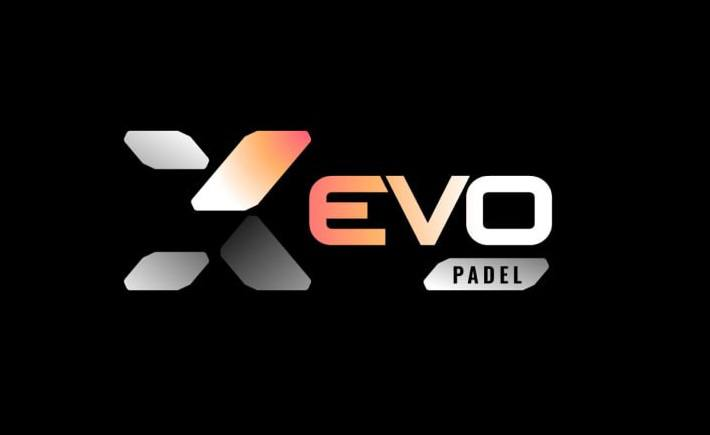

<p align="center">
  
</p>

<p align="center">
  <h1 align="center">Padel AInalyzer</h1>
  <p align="center">
    <strong>AI-powered video analysis for padel players</strong><br/>
    Upload your game footage. Get intelligent feedback on technique, posture, and personalized training recommendations — powered by computer vision and Claude AI.
  </p>
</p>

<p align="center">
  
  
  
  
  
</p>

---

## Overview

Padel AInalyzer transforms raw game footage into actionable coaching insights. The platform combines **Google MediaPipe** for real-time pose detection with **Claude AI** for expert-level technique analysis — delivering the kind of feedback that previously required a private coach.

### Key Features

| Feature | Description |
|---------|-------------|
| **Video Upload** | Drag & drop interface with progress tracking and format validation |
| **Pose Detection** | MediaPipe extracts 33 body landmarks per frame across the full skeleton |
| **AI Technique Analysis** | Claude evaluates form, posture, and movement patterns in context |
| **Numeric Score** | 0–10 score with animated SVG arc circle alongside qualitative rating |
| **Technique Rating** | Structured scoring: Excellent · Good · Needs Improvement · Poor |
| **Observations & Recommendations** | Specific, actionable feedback on form and personalized training drills |
| **Bilingual UI** | Full EN/ES language support with toggle and localStorage persistence |
| **Real-time Progress** | Live status updates throughout the analysis pipeline |

---

## Architecture

```
                        ┌──────────────────┐
                        │    Vercel CDN     │
                        │    (Next.js 15)   │
                        └────────┬─────────┘
                                 │  POST /api/analyze
                                 ▼
                        ┌──────────────────┐
                        │   Modal (GPU)     │
                        │                   │
                        │  ┌─────────────┐  │
                        │  │  MediaPipe   │  │  Step 1: Pose Detection
                        │  │  Pose API    │  │  33 landmarks per frame
                        │  └──────┬──────┘  │
                        │         │         │
                        │  ┌──────▼──────┐  │
                        │  │  Claude AI   │  │  Step 2: Technique Analysis
                        │  │  (Anthropic) │  │  Rating + Score + EN/ES Diagnosis
                        │  └──────┬──────┘  │
                        └─────────┼─────────┘
                                  │
                                  ▼
                        ┌──────────────────┐
                        │     Supabase      │
                        │  Storage + DB     │
                        │  (Videos + Data)  │
                        └──────────────────┘
```

**Pipeline flow:**
1. User uploads video → stored in **Supabase Storage**
2. Frontend triggers analysis via Next.js API route → **Modal** serverless function
3. **MediaPipe** processes video frames, extracting skeletal pose data
4. **Claude AI** interprets the pose data as an expert padel coach, returning bilingual results (EN + ES) with a numeric score
5. Results saved to **Supabase Database** → frontend polls and displays

---

## Getting Started

### Prerequisites

- **Node.js** 18+
- **Python** 3.11+
- [Supabase](https://supabase.com) account
- [Modal](https://modal.com) account
- [Anthropic](https://console.anthropic.com) API key

### Installation

```bash
# Clone the repository
git clone https://github.com/v3ctorbot/padel-analyzer.git
cd padel-analyzer

# Install frontend dependencies
npm install

# Set up environment variables
cp .env.local.example .env.local
```

### Environment Variables

Create a `.env.local` file with the following:

```env
NEXT_PUBLIC_SUPABASE_URL=your_supabase_project_url
NEXT_PUBLIC_SUPABASE_ANON_KEY=your_supabase_anon_key
MODAL_WEBHOOK_URL=your_modal_endpoint_url
ANTHROPIC_API_KEY=your_anthropic_api_key
```

### Run Locally

```bash
# Start the frontend
npm run dev
```

For the backend, see the **[Modal Backend Setup](#modal-backend-setup)** section below to deploy the serverless function and obtain your `MODAL_WEBHOOK_URL`.

---

## Supabase Setup

This app requires a Supabase project with one database table and one storage bucket.

### 1. Create a Project

1. Go to [supabase.com](https://supabase.com) → **New Project**
2. Name it (e.g. `padel-analyzer`), set a strong database password, choose a region
3. Wait for provisioning (~1 minute)

### 2. Create the `analyses` Table

Open the **SQL Editor** in your Supabase dashboard and run:

```sql
CREATE TABLE analyses (
  id            UUID        PRIMARY KEY DEFAULT extensions.uuid_generate_v4(),
  user_id       UUID,
  video_url     TEXT        NOT NULL,
  thumbnail_url TEXT,
  status        TEXT        NOT NULL DEFAULT 'uploading',
  metrics       JSONB,
  feedback_text TEXT,
  created_at    TIMESTAMPTZ NOT NULL DEFAULT now(),
  updated_at    TIMESTAMPTZ NOT NULL DEFAULT now(),
  CONSTRAINT analyses_status_check
    CHECK (status IN ('uploading', 'processing', 'completed', 'failed'))
);
```

The `metrics` JSONB column stores this structure when analysis completes:

```json
{
  "total_frames": 300,
  "analyzed_frames": 20,
  "pose_data": [
    {
      "frame": 0,
      "landmarks": {
        "NOSE": { "x": 0.5, "y": 0.2 },
        "LEFT_SHOULDER": { "x": 0.4, "y": 0.35 },
        "RIGHT_SHOULDER": { "x": 0.6, "y": 0.35 }
      }
    }
  ],
  "ai_analysis": {
    "score": 7,
    "rating": "good",
    "en": {
      "diagnosis": "Solid technique with good knee bend and weight transfer.",
      "observations": ["Good knee bend for power generation", "Weight transfers well"],
      "recommendations": ["Focus on shoulder alignment", "Complete the follow-through"]
    },
    "es": {
      "diagnosis": "Técnica sólida con buena flexión de rodillas y transferencia de peso.",
      "observations": ["Buena flexión de rodillas", "Buena transferencia de peso"],
      "recommendations": ["Mejorar alineación de hombros", "Completar el seguimiento del golpe"]
    }
  }
}
```

> `pose_data` stores the first 5 sampled frames (every 15th frame). Up to 10 frames are forwarded to Claude for analysis.

### 3. Enable Row Level Security (RLS)

Run this in the SQL Editor to allow the anonymous Supabase key to read and write analyses (suitable for development):

```sql
ALTER TABLE analyses ENABLE ROW LEVEL SECURITY;

CREATE POLICY "allow_insert" ON analyses
  FOR INSERT TO anon WITH CHECK (true);

CREATE POLICY "allow_select" ON analyses
  FOR SELECT TO anon USING (true);

CREATE POLICY "allow_update" ON analyses
  FOR UPDATE TO anon USING (true) WITH CHECK (true);
```

> For production, replace `TO anon` with `TO authenticated` and add user-scoped filtering (e.g. `USING (auth.uid() = user_id)`).

### 4. Create the `videos` Storage Bucket

1. In your Supabase dashboard, go to **Storage**
2. Click **New Bucket**
3. Set the name to exactly `videos` (case-sensitive)
4. Toggle **Public bucket** ON — required for in-browser video playback
5. Click **Save**

Then run in the SQL Editor to allow unauthenticated uploads and reads:

```sql
CREATE POLICY "allow_public_uploads" ON storage.objects
  FOR INSERT TO anon WITH CHECK (bucket_id = 'videos');

CREATE POLICY "allow_public_reads" ON storage.objects
  FOR SELECT TO anon USING (bucket_id = 'videos');
```

### 5. Copy Your API Keys

Go to **Settings → API** in your Supabase dashboard and copy:

- **Project URL** → `NEXT_PUBLIC_SUPABASE_URL`
- **anon / public key** → `NEXT_PUBLIC_SUPABASE_ANON_KEY`

Add both to your `.env.local` file.

---

## Modal Backend Setup

The Python backend runs as a serverless GPU function on [Modal](https://modal.com). No server to provision — Modal handles scaling and GPU allocation automatically.

### 1. Install Modal CLI

```bash
pip install modal
```

### 2. Authenticate

```bash
modal setup
```

This opens a browser window to log in or create a Modal account. Your token is saved locally.

### 3. Deploy the Backend

```bash
cd backend
modal deploy modal_app.py
```

Modal builds a Debian Slim container with Python 3.11 and installs all dependencies automatically. The deploy output includes your webhook URL:

```
Created web endpoint => https://YOUR-USERNAME--padel-analyzer-analyze-video.modal.run
```

### 4. Update Your Environment Variable

Copy the URL from the deploy output and set it in `.env.local`:

```env
MODAL_WEBHOOK_URL=https://YOUR-USERNAME--padel-analyzer-analyze-video.modal.run
```

Also add this to your Vercel project's environment variables under **Settings → Environment Variables**.

### Backend Dependencies

Installed automatically by Modal on deploy — no manual `pip install` needed locally:

| Package | Version | Purpose |
|---------|---------|---------|
| `mediapipe` | 0.10.14 | Pose landmark detection |
| `opencv-python-headless` | latest | Video frame extraction |
| `anthropic` | latest | Claude AI API client |
| `fastapi[standard]` | latest | HTTP endpoint framework |
| `numpy` | latest | Numerical frame processing |
| `requests` | latest | Supabase REST calls |
| `supabase` | latest | Supabase Python client |

System libraries: `libgl1`, `libglib2.0-0`, `libsm6`, `libxext6`, `libxrender1`, `libgomp1`

> API keys are passed securely from the Next.js API route via the request body at runtime — no Modal secrets configuration needed.

---

## Deployment

### Backend — Modal

```bash
cd backend
modal deploy modal_app.py
```

The backend runs on Modal's serverless GPU infrastructure with:
- **Python 3.11** runtime
- **MediaPipe 0.10.14** for pose detection
- **Anthropic SDK** for Claude AI analysis
- Auto-scaling from zero — no idle costs

### Frontend — Vercel

Connect your GitHub repository to [Vercel](https://vercel.com) and configure the environment variables listed above. Deployments are automatic on push to `main`.

**Production URL:** [padel-analyzer-lovat.vercel.app](https://padel-analyzer-lovat.vercel.app)

---

## Tech Stack

| Layer | Technology | Purpose |
|-------|-----------|---------|
| Frontend | Next.js 15, React 19, Tailwind CSS v4 | UI, routing, API proxy |
| Backend | Modal (Python 3.11) | Serverless GPU compute |
| Pose Detection | Google MediaPipe 0.10.14 | Skeletal landmark extraction |
| AI Analysis | Claude Sonnet (Anthropic) | Technique evaluation & coaching |
| Database | Supabase (PostgreSQL) | Analysis records & metadata |
| Storage | Supabase Storage | Video file hosting |
| Hosting | Vercel | Frontend CDN & edge functions |
| Animation | Framer Motion | UI transitions & progress indicators |

---

## Project Structure

```
padel-analyzer/
├── app/                         # Next.js app router
│   ├── page.tsx                 # Home — video upload
│   ├── analysis/[id]/           # Analysis results page
│   └── api/analyze/             # API route → Modal
├── backend/
│   └── modal_app.py             # Modal serverless function (MediaPipe + Claude)
├── components/
│   ├── VideoUpload.tsx          # Drag-drop upload component
│   └── LanguageToggle.tsx       # EN/ES language toggle
├── lib/
│   ├── supabase.ts              # Supabase client
│   ├── language-context.tsx     # React context for language state
│   └── translations.ts          # EN/ES static UI strings
└── public/                      # Static assets (logo, favicon, webclip)
```

---

## License

MIT License — © 2026 EVO. All rights reserved.

---

<p align="center">
  © 2026 <strong>EVO</strong> · Padel AInalyzer · All rights reserved.
</p>
