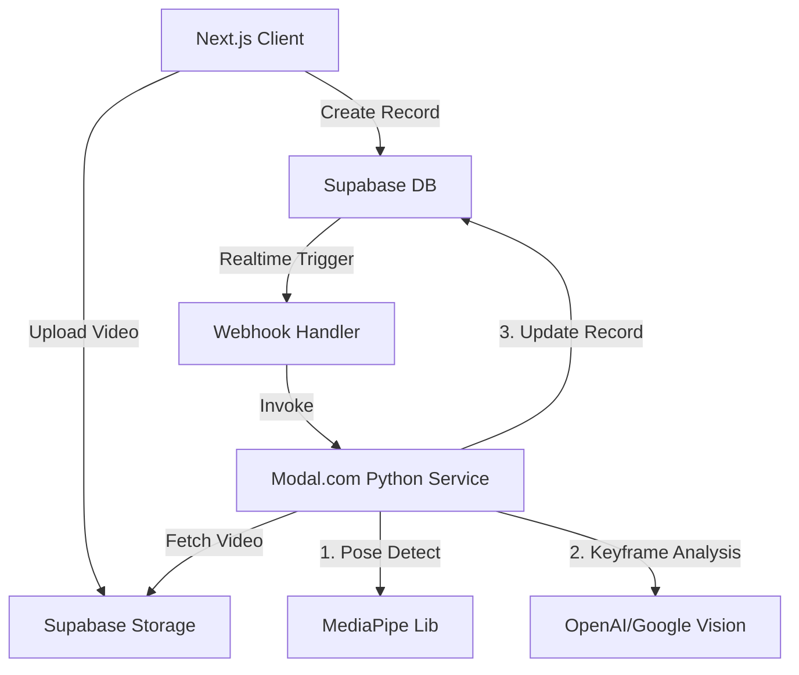

# BMad Phase 3: Solutioning - Padel Video Analyzer

## System Architecture



## Database Schema (SQL)

```sql
-- Enable UUID extension
create extension if not exists "uuid-ossp";

-- PROFILES
create table profiles (
  id uuid references auth.users on delete cascade,
  email text,
  skill_level text check (skill_level in ('beginner', 'intermediate', 'advanced')),
  handedness text check (handedness in ('left', 'right')),
  primary key (id)
);

-- ANALYSES
create table analyses (
  id uuid default uuid_generate_v4() primary key,
  user_id uuid references profiles(id),
  video_url text not null,
  thumbnail_url text,
  status text check (status in ('uploading', 'processing', 'completed', 'failed')) default 'uploading',
  
  -- Metrics (JSONB for flexibility)
  -- { "knee_bend": 45, "arm_extension": 170, "contact_height": "high" }
  metrics jsonb,
  
  -- AI Feedback
  feedback_text text,
  
  -- Timestamps
  created_at timestamptz default now(),
  updated_at timestamptz default now()
);
```

## Logic: The "Serve" Algorithm

To analyze a serve, the Modal function will calculate these specific vectors at the **Impact Frame**:

1.  **Toss Height**: Y-coordinate of ball vs. Y-coordinate of extended racket arm.
    *   *Rule:* Ball must be hit at or below waist height (Padel rule).
2.  **Knee Flexion**: Angle between (Hip-Knee) and (Knee-Ankle).
    *   *Goal:* > 15 degrees flexion for power.
3.  **Impact Zone**: X-coordinate of ball relative to body center.
    *   *Goal:* Slightly in front of body.

## Modal Function Signature

```python
@stub.function(gpu="any")
def analyze_serve(video_url: str, handedness: str):
    # 1. Download video
    # 2. Run MediaPipe Pose
    # 3. Detect "Impact Frame" (when ball velocity vector changes or minimal distance to racket)
    # 4. Extract landmarks at Impact Frame
    # 5. Evaluate against rules
    # 6. Return JSON result
```
